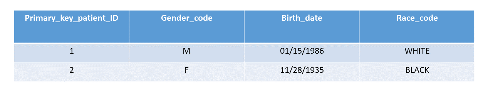
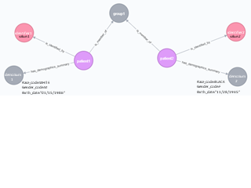
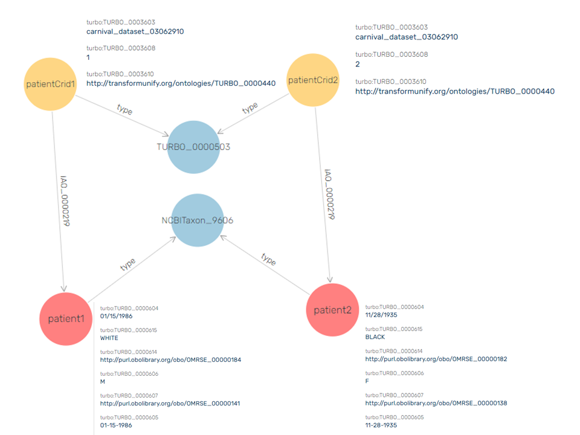

<h1>TURBO Data Pipeline</h1>

The PennTURBO system uses various technological components to transform data from its relational source in Penn Data Store into expanded and ontologized triples in our Ontotext GraphDB instance known as Drivetrain. The purpose of this document is to describe this pipeline in an understandable and up-to-date manner using a very small toy dataset of 2 patients and their demographic information (biological sex, date of birth, and racial identity). 

<h2>Step 1: Penn Data Store to Carnival Property Graph</h2>

<h3>What is Penn Data Store (PDS)?</h3>

Penn Data Store is Penn Medicine's Clinical Data Warehouse. It is an effort to bring critical data from various Penn Medicine systems together in an Oracle SQL database. Although useful, it can be difficult to execute multi-faceted queries against this database due to the complexity of the schema. Additionally, access to PDS is heavily restricted and in many cases researchers must rely on data brokers to execute specific queries for them, a process which can take several weeks.

More information on PDS, including the various table and field names, can be found here: https://www.med.upenn.edu/dac/penn-data-store-warehouse.html

<h3>What is Carnival?</h3>

Carnival is a data unification technology that aggregates disparate data into a unified property graph resource, and a critical piece of the PennTURBO technology stack.  It is an application written in the Groovy programming language which interacts with an embedded Neo4J graph instance. Carnival employs "vine methods" which tunnel data from relational sources and combine it using a custom data model designed for intuitive querying. At this point Carnival does not utilize biomedical ontologies in its data modeling, although there are plans to incorporate these concepts in the future.

The Carnival codebase is not currently available publically, but there are plans for the upcoming year to release it as an open-source project.

<h3>The PDS Vine</h3>

Carnival relies on querying PDS using SQL to populate its graph with data about patients, their demographics, their medications, and their diagnoses, among other fields. Below we see a mini version of PDS with just two patients and information about their demographics. 

When imported into Carnival's property graph, the same data is represented by two patient nodes, attached to a patient group. Each patient has an identifier and a demographics summary. The demographic information is provided as properties of each demographics summary. 

<h2> Step 2: Carnival Property Graph to Drivetrain Shortcuts</h2>

<h3>What is Drivetrain?</h3>

Drivetrain is an application developed by the TURBO group that provides core informatics components to load relational data into a fully ontologized RDF triple store. It reads data that have been mapped to the TURBO ontology as "shortcut" triples and expands them to meet the standards of our semantic model. It is written in the Scala programming language and interacts with an Ontotext GraphDB instance. Drivetrain can receive input from any application with a connection to the triplestore, or from local files containing shortcut triples.

Drivetrain is an open source project, and the code can be found here: https://github.com/PennTURBO/Drivetrain

<h3>The Drivetrain Vine</h3>

Currently, Carnival is the main source of input data for Drivetrain. The Drivetrain Vine, a component of the Carnival application, pulls data out of the Carnival property graph and maps it to TURBO ontology terms to create the shortcuts. In shortcut form, our two patient dataset now looks like this:

    pmbb:patient1 a obo:NCBITaxon_9606 ;
        turbo:TURBO_0000604 "01/15/1986" ;
        turbo:TURBO_0000605 "01-15-1986"^^xsd:Date ;
        turbo:TURBO_0000615 "WHITE" ;
        turbo:TURBO_0000614 "http://purl.obolibrary.org/obo/OMRSE_00000184"^^xsd:anyURI ;
        turbo:TURBO_0000606 "M" ;
        turbo:TURBO_0000607 "http://purl.obolibrary.org/obo/OMRSE_00000141"^^xsd:anyURI .
    pmbb:patientCrid1 a turbo:TURBO_0000503 ;
        obo:IAO_0000219 pmbb:patient1 ;
        turbo:TURBO_0003603 "carnival_dataset_03062910" ;
        turbo:TURBO_0003608 "1";
        turbo:TURBO_0003610 "http://transformunify.org/ontologies/TURBO_0000440"^^xsd:anyURI .
        
    pmbb:patient2 a obo:NCBITaxon_9606 ;
        turbo:TURBO_0000604 "11/28/1935" ;
        turbo:TURBO_0000605 "11-28-1935"^^xsd:Date ;
        turbo:TURBO_0000615 "BLACK" ;
        turbo:TURBO_0000614 "http://purl.obolibrary.org/obo/OMRSE_00000182"^^xsd:anyURI ;
        turbo:TURBO_0000606 "F" ;
        turbo:TURBO_0000607 "http://purl.obolibrary.org/obo/OMRSE_00000138"^^xsd:anyURI .
    pmbb:patientCrid2 a turbo:TURBO_0000503 ;
        obo:IAO_0000219 pmbb:patient2 ;
        turbo:TURBO_0003603 "carnival_dataset_03062910" ;
        turbo:TURBO_0003608 "2";
        turbo:TURBO_0003610 "http://transformunify.org/ontologies/TURBO_0000440"^^xsd:anyURI .
        
In order to create these triples, it is necessary that Carnival have some domain knowledge. The string texts of "BLACK" and "WHITE" for race and "M" and "F" for gender were automatically mapped to the appropriate ontology terms representing these concepts, which can be seen in the above example, as the corresponding ontology term appears one triple below the string in each case. Likewise, the identifier type (in this case primary key patient identifier) was mapped to an ontology term which corresponds with this specific registry. String dates are transformed into a standard date format. Whenever possible in these cases the original string is preserved and also imported into the triplestore along with the formatted datum or mapped concept.

Once inserted into an Ontotext repository, the triples can be visualized like this:

What we can see here is that there are two patient CRIDS (Centrally Registered Identifiers) which "denote" (obo:OBI_0000219) two intsances of type HomoSapiens (obo:NCBITaxon_9606). Each of the four instance level nodes has properties associated with it representing the values of the shortcuts. The two class level nodes representing the rdf:type of the instance level nodes are directly referenced in the TURBO ontology and thus can also be expanded to obtain more information on what these classes mean in reality.

<h2>Step 3: Drivetrain Shortcuts to Drivetrain Expanded Model</h2>
