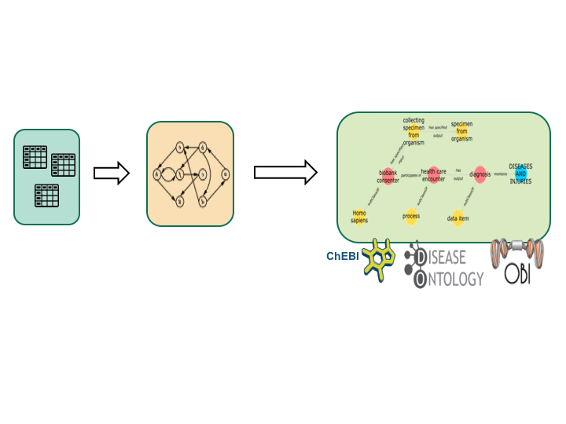

# [TURBO](http://upibi.org/turbo/)

*Transforming and Unifying Research with Biomedical Ontologies.*

PennTURBO accelerates the processes of finding and connecting key information from clinical records, via semantic modeling of the processes that generated the data. This makes the discovery of previously unappreciated relations between the data possible for research and for operational tasks. The PennTURBO Group uses ontologies, primarily from the [Open Biological and Biomedical Ontologies (OBO) Foundry](http://http://www.obofoundry.org/) to provide a common semantic framework for UPHS/PennMedicine data. Transforming clinical data in this way allows use of graph database technologies for navigating highly heterogeneous data.

PennTURBO uses shortcut reification to simplify the process of instantiating Electronic Heath Records from relational sources. The shortcuts are then expanded into triples following the principles of ontological realism. Documentation is available for the [current shortcut reification process and the resulting types of expanded axioms.](turbo_axiomization.md)

PennTURBO makes use of the [Carnival project](https://carnival-data.github.io/carnival/), a JVM Property graph data unification framework.

Additional reading:

- A [TURBO paper](http://ceur-ws.org/Vol-2285/ICBO_2018_paper_12.pdf) was presented at the ICBO 2018.
- A [TURBO poster](https://github.com/PennTURBO/Turbo-Documentation/blob/master/IBI_CIC_TURBO_MAM_20190102.pdf) was presented at the January 2019 Genomics and EHR workshop at Penn.
- David Birtwell, Heather Williams, Reed Pyeritz, Scott Damrauer, Danielle L. Mowery. [Carnival: A Graph-Based Data Integration and Query Tool to Support Patient Cohort Generation for Clinical Research. Stud Health Technol Inform 2019 Aug 21;264:35-39.](https://ebooks.iospress.nl/publication/51943)
- Hayden G.Freedman, Heather Williams, Mark A.Miller, David Birtwell, Danielle L.Mowery, Christian J.Stoeckert Jr. 
[A novel tool for standardizing clinical data in a semantically rich model. 
Journal of Biomedical Informatics: X 8, December 2020.](https://www.sciencedirect.com/science/article/pii/S2590177X20300214?via%3Dihub)

## Ontology

PennTURBO has its own [application ontology](turbo-ontology.md), which is based on the Ontology for Biobanking and uses OBO Foundry terms wherever possible.

Additionally, the the PennTURBO graph imports several OBO foundry ontologies are imported in their entirety.  That enables tasks such as [mapping ICD codes to disease classes](ICD_disease_associations.md).

____

## Technology

The PennTURBO group has developed a technology stack/pipeline that transforms tabular data into semantic triples, which are stored in a Resource Description Framework (RDF) triple store.  The subjects of those triples are instances of classes present in the TURBO Ontology.

PennTURBO also uses text analytics and machine learning for tasks like [mapping medication orders](medication_text_to_terms_to_roles.md) from an EHR to drug classes, along with the pharmaceutical roles of the mapped drugs.

### Overview of steps in the PennTURBO pipeline

#### We are now using the TURBO Cohort pipeline described [here](turbo_axiomization.md) which uses the TURBO Carnival server. The TURBO Semantic repository component of the TURBO Cohort pipeline is what used to be called Drivetrain.
