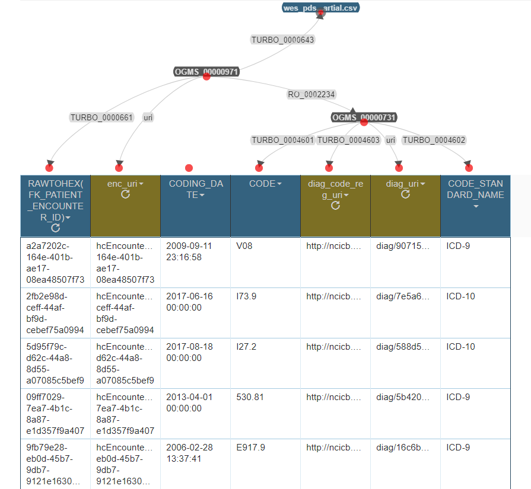
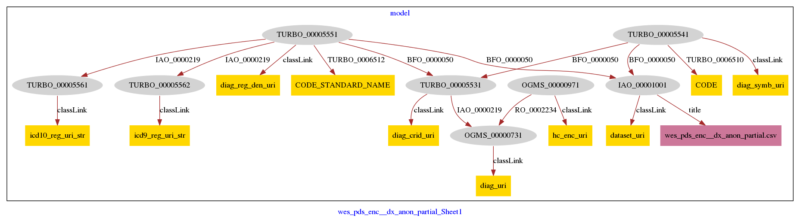
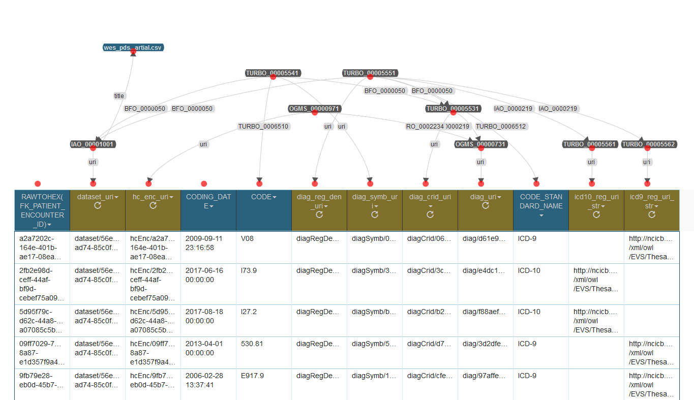

# Semantic Instantiation of Tabular Data

TURBO's back end is a graph database, specifically an [RDF](https://en.wikipedia.org/wiki/Resource_Description_Framework) triplestore following [realism-based ontology principles](https://www.ncbi.nlm.nih.gov/pmc/articles/PMC1839444/).  

The data ingested by TURBO's Drivetrain application are generally CSV files and JDBC  connections to relational databases.  Therefore, one phase of the TURBO workflow is semantic instantiation of the things that the data are about, using terms from a [user-specified ontology](https://github.com/pennbiobank/turbo/blob/master/docs/documentation/turbo-ontology.md).  Up to March, 2018, this instantiation is been performed by [Karma](http://usc-isi-i2.github.io/karma/).  

The TURBO team is currently developing a link between TURBO and the University Of Pennsylvania Biobank's **Carnival** Application. That link may decrease the dependence on Karma, and will be documented when in production.  TURBO users outside of the University of Pennsylvania will likely continue to find Karma a primary choice for semantic instantiation.

# Karma

Karma is an open source application, described by its authors as a data integration tool with the ability to learn from previous use.  The Karma application was deployed on the TURBO team's production server by [building from source with Maven](https://github.com/usc-isi-i2/Web-Karma/wiki/Installation%3A-Source-Code).  The team has also used the [one click installer](https://github.com/usc-isi-i2/Web-Karma/wiki/Installation%3A-Source-Code)  during development.  The documentation is good and idiosyncrasies experienced during installation and use have mostly been minor.

Karma offers a web-based, point and click interface that creates maps *from* data values *to* ontology terms, saved with an extended version of the [R2RML ](https://www.w3.org/TR/r2rml/) language.  The mappings are then executed, either in the same web interface or from the command prompt, to publish the data as RDF triples.

#### Readers who wish to work through the following examples should ensure that

* Karma (>= version 2.1) is installed and accessible via a web browser (typically on port 8080)
* the TURBO ontology has been loaded into Karma (either by placing it in the server's `~/karma/preloaded-ontologies` folder, or with `Import -> From File`... from the web interface)
* some relevant tabular data has been loaded (also with `Import -> From File` for CSV files, or one of the other `Import` options for connections to relational databases.)  The load configuration page imposes a limit of 10,000 rows by default.  That limit can be deactivated by entering a limit of `0`, or a limit greater than 0 but less than 10,000 could be entered to decrease processing time during development.

#### After that, the overall flow of using Karma as part of TURBO includes
- [data transformations](#data_trans), including the creation of URIs
- [instantiation](#instantiate_key) of key classes
- construction of [shortcut relations](#shortcut_rels)  between the key class and the columns of data
- [publishing semantic triples and optionally saving the mapping model](#publish_mod_rdf) 

# Fully-Worked Example:  Diagnosis Code Assignments

This page illustrates the semantic instantiation of one table from the University of Pennsylvania Health Care System's electronic healthcare records system:  diagnosis codes that were recorded as the output of health care encounters.  The instantiation is guided by the current version of the TURBO ontology.  Links to briefer summaries about the instantiation of other tables appears at the end of this section. 


## Input data:  anonymized excerpt from diagnosis table `wes_pds_enc__dx.csv`, with the following columns (from left to right)
- a column for identifying heath care encounters
- a (currently unused) column indicating when a diagnosis was coded
- a column of diagnosis/billing codes
- a column of "registries" or standards from which the codes were drawn

|  RAWTOHEX(FK_PATIENT_ENCOUNTER_ID)   |     CODING_DATE     |  CODE  | CODE_STANDARD_NAME |
|--------------------------------------|---------------------|--------|--------------------|
| a2a7202c-164e-401b-ae17-08ea48507f73 | 2009-09-11 23: 16: 58 | V08    | ICD-9              |
| 2fb2e98d-ceff-44af-bf9d-cebef75a0994 | 2017-06-16 00: 00: 00 | I73.9  | ICD-10             |
| 5d95f79c-d62c-44a8-8d55-a07085c5bef9 | 2017-08-18 00: 00: 00 | I27.2  | ICD-10             |
| 09ff7029-7ea7-4b1c-8a87-e1d357f9a407 | 2013-04-01 00: 00: 00 | 530.81 | ICD-9              |
| 9fb79e28-eb0d-45b7-9db7-9121e1630409 | 2006-02-28 13: 37: 41 | E917.9 | ICD-9              |
| 1eed543a-aefa-4c04-98fd-1337bbf525c4 | 2017-04-17 00: 00: 00 | M17.0  | ICD-10             |
| 8f6cc172-4ecd-451a-a663-5dbe5e2b93ca | 2017-05-15 00: 00: 00 | R07.89 | ICD-10             |
| 46f074c3-721b-4e5a-ac96-d252ec702d80 | 2017-05-15 00: 00: 00 | R06.00 | ICD-10             |

# <a name="data_trans">Data Transformations</a>

The TURBO project also draws upon Karma's ability to create new columns, potentially by transforming all of the values in a native column of the input file.  These transformations, like calculating a ratio between two numerical columns or mapping open-ended stings into a controlled vocabulary, are implemented in Python and are applied before the data are published as RDF triples.

Diagnosis table `wes_pds_enc__dx.csv` will continue to appear in this document, but with additional columns that were created with Python Transformations (PyTransforms).  For example, the things that these data are about are referred to with Uniform Resource Identifiers (URIs) within the semantic triplestore.  TURBO generally uses URIs that contain Universally Unique Identifiers, or UUIDs, which are genearted .  The URIs are constructed relative to some base URI like  `<http://localhost:8080/source/>`, with a Python snippet like 

``` python
import uuid
temp = uuid.uuid4().hex
return "diag/" + temp
```

Which might create an absolute URI like `<http://localhost:8080/source/diag/90715872c2264ff1a1a3ffa49ac7c9df>`.

Additional transformation example: the presence of the string "ICD-10" in some row of the tabular data could be taken to mean that there is some billing or diagnosis information in the same row, using codes from the `International Classification of Diseases, Tenth Revision`, which can be represented with the URL `<http://ncicb.nci.nih.gov/xml/owl/EVS/Thesaurus.owl#C71892>`  This precise mapping, plus a similar one for "ICD-9" can be made with the Python snippet shown below.  Note that this snippet doesn't understand that "ICD10" should also be mapped to `<http://ncicb.nci.nih.gov/xml/owl/EVS/Thesaurus.owl#C71892>`.  That would require additional conditionals or regular expression matching.  Collaboration with clinical informaticians or other biobank stakeholders may be required when composing some of the transformations.

``` python
codeType =  getValue("CODE_STANDARD_NAME")
if codeType == "ICD-9":
    return "http://ncicb.nci.nih.gov/xml/owl/EVS/Thesaurus.owl#C71890"
elif codeType == "ICD-10":
    return "http://ncicb.nci.nih.gov/xml/owl/EVS/Thesaurus.owl#C71892"
else:
    return
```

In order to enter a transformation, click on a column's name and select `PyTransform`.  

* The TURBO team typically uses transformations to create new columns, although there is an option for modifying an existing column in place.
* The PyTransform dialog can be expanded horizontally but not vertically.  
* The `View Errors` and `Preview results...` buttons are helpful for debugging.
* Most transformations will use a` getValue("some_column")` command early on in the script to import a vector of values form the imported data.  Library imports can be included before that.  A small number of basic libraries are included with Karma.  Directions for importing other libraries can be found elsewhere.
* All transformations should end with a `return` statement including and argument that was previously created in the script.
* Columns imported from the input data have blue headers; transformed columns have brown headers.

### <a name="shortcut_rels">Shortcut Relations</a> 

The following section describes proper shortcut usage for input data into Drivetrain.

Example: Biobank Consenter (TURBO_0000502)
Consenters can have as many CRIDs as needed to represent the identifiers which are to be modeled. This example shows 2 but can have 1 <= X >
    
    Required Shortcuts
    pmbb:consenter1 rdf:type turbo:TURBO_0000502 .
    pmbb:consenter1 obo:IAO_0000219 pmbb:consenterCrid1 .
    pmbb:consenter2 obo:IAO_0000219 pmbb:consenterCrid2 .
    pmbb:consenterCrid1 a turbo:TURBO_0000503 .
    pmbb:consenterCrid2 a turbo:TURBO_0000503 .
    pmbb:consenterCrid1 turbo:TURBO_0003603 ?dataset1 .
    pmbb:consenterCrid1 turbo:TURBO_0003608 ?consenterSymbol1 .
    pmbb:consenterCrid1 turbo:TURBO_0003610 ?consenterRegistry1 .
    pmbb:consenterCrid2 turbo:TURBO_0003603 ?dataset2 .
    pmbb:consenterCrid2 turbo:TURBO_0003608 ?consenterSymbol2 .
    pmbb:consenterCrid2 turbo:TURBO_0003610 ?consenterRegistry2 .

    Optional Shortcuts
    pmbb:consenter1 turbo:TURBO_0000604 ?dateOfBirthString .
    pmbb:consenter1 turbo:TURBO_0000605 ?dateOfBirthXsd .
    pmbb:consenter1 turbo:TURBO_0000606 ?genderIdentityDatum .
    pmbb:consenter1 turbo:TURBO_0000607 ?genderIdentityType .
    pmbb:consenter1 turbo:TURBO_0000615 ?raceIdentityDatum .
    pmbb:consenter1 turbo:TURBO_0000614 ?raceIdentityType .
    

| Object Variable Name | Description | Tagged Datatype | Example | Dependents |
| -------------------- |-------------| ---------| --------|------------|
| ?dataset  | a literal value representing the relational dataset from where this consenter came | None | "this_is_my_dataset.csv" |None|


* ?datasetTitle: 
	* example: "this_is_my_dataset.csv"
* ?consenterSymbol: a literal value representing the patient's identifier as it appears in the relational dataset
	* example: "3abc"
* ?consenterRegistry: a literal value representing the URI of the registry from where this information came, tagged as "anyURI"
	* example: "http://transformunify.org/ontologies/TURBO_0000403"^^<http://www.w3.org/2001/XMLSchema#anyURI>
* ?registryDenoter: a string description of the registry as it appears in the original dataset
	* example: "PDS"
* ?dateOfBirthString: a literal value representing the date of birth of the associated consenter as it appears in the original relational dataset
	* example: "1985-08-30"
* ?dateOfBirthXsd: a formatted literal value representing the date of birth of the associated consenter, tagged as "date" and formatted as yyyy-mm-dd
	* example: "1985-08-30"^^<http://www.w3.org/2001/XMLSchema#date>
* ?genderIdentityDatum: a literal value representing the biological sex of the associated consenter, as it appears in the original dataset
	* example: "M"
* ?genderIdentityType: a string representation of the URI of the OMRSE ontology class which properly designates this consenter's gender, tagged as "anyURI"
	* male: "http://purl.obolibrary.org/obo/OMRSE_00000141"^^<http://www.w3.org/2001/XMLSchema#anyURI>
	* female: "http://purl.obolibrary.org/obo/OMRSE_00000138"^^<http://www.w3.org/2001/XMLSchema#anyURI>

Additional usage notes: 
It is illegal for optional property ?dateOfBirthXsd to be present if optional property ?dateOfBirthString is not present.
It is illegal for optional property ?genderIdentityType to be present if optional property ?genderIdentityDatum is not present.


The TURBO ontology uses the [Basic Formal Ontology](https://github.com/BFO-ontology/BFO) as its upper ontology and is therefore reality-based.  That  means that, in its final state, data items in a TURBO triplestore should generally be modeled as being about entities that exist in time and or space.  To the greatest degree possible, the relationships or properties in the triplestore should connect those entities, using terms from the TURBO ontology, to reflect the ways in which they interact or relate to one another in reality.

Because these reality based models typically require instantiating classes that are only implicit in the input data, and because the resulting models can be quire complex, the TURBO team has created [shortcut relation properties](#shortcut_table).  These properties allow someone with biobanking domain knowledge but limited semantic web or ontology experience to contribute to a Karma model, especially the transformations for which they may be most familiar with the encoding of the data (0 or 1) and what it means (that some person identifies as male or female.)

The essence of TURBO shortcut relations is that they allow a minimal number of classes to be instantiated -- frequently just one.  All of the data items from the input data are connected to the one modeled class with shortcut properties, even when those data items are, strictly speaking, properties of something else.  For example, an input table nominally about health care encounters may include height, weight and body mass index values.  Those data items are not values of the encounters, but rather values of properties borne by the people who participated in the encounters.  Shortcut relation `TURBO_0000655` "shortcut health care encounter to BMI" eliminates the need to instantiate a class that represents the encounter participants and instead says that there is some path from the encounter to the BMI value.  The Drivetrain application contains all of the logic necessary to expand the shortcut into a semantically complete description of reality.

____

### Summary of Karma "shortcut" model `wes_pds_enc__dx_sc-model.ttl`
#### Showing the creation of "literal" singleton nodes, transformed columns, and links between nodes and columns

The conversion of the CSV contents to RDF triples is guided by a mapping file, which is documented here with an automatically generated summary, as opposed to its complex native format (Python, wrapped in JSON, wrapped in turtle-formatted RDF.) 

Ontology terms are indicated by the right-hand side of their URIs, like `OGMS_0000097`. To see the labels for the terms, visit the [TURBO ontology](turbo_merged.owl)

____

## Add Node/Literal
#### Literal Node: `wes_pds_enc__dx.csv`

## PyTransforms
#### _diag_uri_
From column: _CODE_
``` python
import uuid
temp = uuid.uuid4().hex
return "diag/" + temp
```

#### _diag_code_reg_uri_
From column: _CODE_
``` python
codeType =  getValue("CODE_STANDARD_NAME")
if codeType == "ICD-9":
    return "http://ncicb.nci.nih.gov/xml/owl/EVS/Thesaurus.owl#C71890"
elif codeType == "ICD-10":
    return "http://ncicb.nci.nih.gov/xml/owl/EVS/Thesaurus.owl#C71892"
else:
    return
```

#### _enc_uri_
From column: _RAWTOHEX(FK_PATIENT_ENCOUNTER_ID)_
``` python
encIdVal = getValue("RAWTOHEX(FK_PATIENT_ENCOUNTER_ID)")
return "hcEncounter/" + encIdVal

```

#### _RAWTOHEX(FK_PATIENT_ENCOUNTER_ID)_
From column: _RAWTOHEX(FK_PATIENT_ENCOUNTER_ID)_
``` python
return getValue("RAWTOHEX(FK_PATIENT_ENCOUNTER_ID)")
```


## Selections

## Semantic Types

| Column | Property | Class |
|  ----- | -------- | ----- |
| _CODE_ | `turbo:TURBO_0004601` | `obo:OGMS_00000731`|
| _CODE_STANDARD_NAME_ | `turbo:TURBO_0004602` | `obo:OGMS_00000731`|
| _RAWTOHEX(FK_PATIENT_ENCOUNTER_ID)_ | `turbo:TURBO_0000661` | `obo:OGMS_00000971`|
| _diag_code_reg_uri_ | `turbo:TURBO_0004603` | `obo:OGMS_00000731`|
| _diag_uri_ | `uri` | `obo:OGMS_00000731`|
| _enc_uri_ | `uri` | `obo:OGMS_00000971`|


## Links

| From | Property | To |
|  --- | -------- | ---|
| `obo:OGMS_00000971` | `obo:RO_0002234` | `obo:OGMS_00000731`|
| `obo:OGMS_00000971` | `turbo:TURBO_0000643` | `wes_pds_enc__dx.csv`|

____

### Node-edge graph, automatically generated by Karma
____

Gray ovals represent the instantiated classes, identified by the right-hand-side of their URIs (as opposed to their labels), plus a numerical suffix (since a class could be instantiated more than once in the Karma model.)  Thus, `OGMS_00000971` is the first use of `OGMS_0000097`, "health care encounter" http://purl.obolibrary.org/obo/OGMS_0000097 from the Ontology for General Medical Science

Yellow rectangles indicate columns that are mapped as (shortcut) properties of the modeled classes.  This view does not distinguish between columns present in the imported CSV vs. columns created by a Python transformation.  (See above.)

Pink rectangles represent literals, which are also (shortcut) properties of of the modeled classes.


____

### Screenshot of Karma Session
This screenshot is included here to emphasize 
- the contents of the columns that mapped as properties
- which columns are native to the CSV file (blue) and which are created by Python Transformations (brown)


____




____

### Shortcut triples published by Karma
Karma refers to these triples as being in turtle format, and saves them with the extension `.ttl` by default.  The first rows of the CSV input become the first two blocks of the published triples:

```
<http://localhost:8080/source/hcEncounter/a2a7202c-164e-401b-ae17-08ea48507f73> <http://transformunify.org/ontologies/TURBO_0000661> "a2a7202c-164e-401b-ae17-08ea48507f73" .
<http://localhost:8080/source/diag/90715872c2264ff1a1a3ffa49ac7c9df> <http://transformunify.org/ontologies/TURBO_0004601> "V08" .
<http://localhost:8080/source/hcEncounter/a2a7202c-164e-401b-ae17-08ea48507f73> <http://purl.obolibrary.org/obo/RO_0002234> <http://localhost:8080/source/diag/90715872c2264ff1a1a3ffa49ac7c9df> .
<http://localhost:8080/source/diag/90715872c2264ff1a1a3ffa49ac7c9df> <http://www.w3.org/1999/02/22-rdf-syntax-ns#type> <http://purl.obolibrary.org/obo/OGMS_0000073> .
<http://localhost:8080/source/diag/90715872c2264ff1a1a3ffa49ac7c9df> <http://transformunify.org/ontologies/TURBO_0004603> "http://ncicb.nci.nih.gov/xml/owl/EVS/Thesaurus.owl#C71890"^^<http://www.w3.org/2001/XMLSchema#anyURI> .
<http://localhost:8080/source/hcEncounter/a2a7202c-164e-401b-ae17-08ea48507f73> <http://transformunify.org/ontologies/TURBO_0000643> "wes_pds_enc__dx_anon_partial.csv" .
<http://localhost:8080/source/diag/90715872c2264ff1a1a3ffa49ac7c9df> <http://transformunify.org/ontologies/TURBO_0004602> "ICD-9" .
<http://localhost:8080/source/hcEncounter/a2a7202c-164e-401b-ae17-08ea48507f73> <http://www.w3.org/1999/02/22-rdf-syntax-ns#type> <http://purl.obolibrary.org/obo/OGMS_0000097> .

<http://localhost:8080/source/hcEncounter/2fb2e98d-ceff-44af-bf9d-cebef75a0994> <http://purl.obolibrary.org/obo/RO_0002234> <http://localhost:8080/source/diag/7e5a665987704220b70913e62cf573a8> .
<http://localhost:8080/source/diag/7e5a665987704220b70913e62cf573a8> <http://transformunify.org/ontologies/TURBO_0004603> "http://ncicb.nci.nih.gov/xml/owl/EVS/Thesaurus.owl#C71892"^^<http://www.w3.org/2001/XMLSchema#anyURI> .
<http://localhost:8080/source/hcEncounter/2fb2e98d-ceff-44af-bf9d-cebef75a0994> <http://www.w3.org/1999/02/22-rdf-syntax-ns#type> <http://purl.obolibrary.org/obo/OGMS_0000097> .
<http://localhost:8080/source/diag/7e5a665987704220b70913e62cf573a8> <http://www.w3.org/1999/02/22-rdf-syntax-ns#type> <http://purl.obolibrary.org/obo/OGMS_0000073> .
<http://localhost:8080/source/diag/7e5a665987704220b70913e62cf573a8> <http://transformunify.org/ontologies/TURBO_0004601> "I73.9" .
<http://localhost:8080/source/hcEncounter/2fb2e98d-ceff-44af-bf9d-cebef75a0994> <http://transformunify.org/ontologies/TURBO_0000661> "2fb2e98d-ceff-44af-bf9d-cebef75a0994" .
<http://localhost:8080/source/hcEncounter/2fb2e98d-ceff-44af-bf9d-cebef75a0994> <http://transformunify.org/ontologies/TURBO_0000643> "wes_pds_enc__dx_anon_partial.csv" .
<http://localhost:8080/source/diag/7e5a665987704220b70913e62cf573a8> <http://transformunify.org/ontologies/TURBO_0004602> "ICD-10" .
```

Despit the .ttl extension, there triples certainly don't take full advantage of turtle's benefits, like
- ellipsis of repeated subjects with `;` and predicates with `,` 
- prefix notation for URIs

A terser turtle respresntation of those first two blocks (corresponding to two rows of CSV) might look like: 

```
@prefix turbo: <http://transformunify.org/ontologies/> .
@prefix obo: <http://purl.obolibrary.org/obo/> .
@prefix xsd: <http://www.w3.org/2001/XMLSchema#> .

<http://localhost:8080/source/hcEncounter/a2a7202c-164e-401b-ae17-08ea48507f73>
  turbo:TURBO_0000661 "a2a7202c-164e-401b-ae17-08ea48507f73" ;
  obo:RO_0002234 <http://localhost:8080/source/diag/90715872c2264ff1a1a3ffa49ac7c9df> ;
  turbo:TURBO_0000643 "wes_pds_enc__dx_anon_partial.csv" ;
  a obo:OGMS_0000097 .

<http://localhost:8080/source/diag/90715872c2264ff1a1a3ffa49ac7c9df>
  turbo:TURBO_0004601 "V08" ;
  a obo:OGMS_0000073 ;
  turbo:TURBO_0004603 "http://ncicb.nci.nih.gov/xml/owl/EVS/Thesaurus.owl#C71890"^^xsd:anyURI ;
  turbo:TURBO_0004602 "ICD-9" .


<http://localhost:8080/source/hcEncounter/2fb2e98d-ceff-44af-bf9d-cebef75a0994>
  obo:RO_0002234 <http://localhost:8080/source/diag/7e5a665987704220b70913e62cf573a8> ;
  a obo:OGMS_0000097 ;
  turbo:TURBO_0000661 "2fb2e98d-ceff-44af-bf9d-cebef75a0994" ;
  turbo:TURBO_0000643 "wes_pds_enc__dx_anon_partial.csv" .

<http://localhost:8080/source/diag/7e5a665987704220b70913e62cf573a8>
  turbo:TURBO_0004603 "http://ncicb.nci.nih.gov/xml/owl/EVS/Thesaurus.owl#C71892"^^xsd:anyURI ;
  a obo:OGMS_0000073 ;
  turbo:TURBO_0004601 "I73.9" ;
  turbo:TURBO_0004602 "ICD-10" .

```

----

## Karma Model with Full Semantics: `wes_pds_enc__dx_full_no_enc_crid-model.ttl`

The shortcut model instantiates a minimal number of classes out of convenience.  In contrast, this full, or semantically complete instantiation of the same CSV input includes all of the classes necessary to model a healthcare encounter, with an identifier, as the output of a health care encounter,  The Drivetrain application is responsible for taking the shortcut triples and generating the full triples.  

----

## Add Node/Literal
#### Literal Node: `wes_pds_enc__dx_anon_partial.csv`


## PyTransforms
#### _hc_enc_uri_
From column: _RAWTOHEX(FK_PATIENT_ENCOUNTER_ID)_
``` python
temp =  getValue("RAWTOHEX(FK_PATIENT_ENCOUNTER_ID)")
return "hcEnc/" + temp
```

#### _dataset_uri_
From column: _RAWTOHEX(FK_PATIENT_ENCOUNTER_ID)_
``` python
return "dataset/" + "56e58cb4-2cb5-4ba8-ad74-85c0f38dcf65"
```

#### _diag_uri_
From column: _CODE_
``` python
import uuid
temp = uuid.uuid4().hex
return "diag/" + temp
```

#### _diag_crid_uri_
From column: _CODE_
``` python
import uuid
temp = uuid.uuid4().hex
return "diagCrid/" + temp
```

#### _diag_symb_uri_
From column: _CODE_
``` python
import uuid
temp = uuid.uuid4().hex
return "diagSymb/" + temp
```

#### _diag_reg_den_uri_
From column: _CODE_
``` python
import uuid
temp = uuid.uuid4().hex
return "diagRegDen/" + temp
```

#### _icd9_reg_uri_str_
From column: _CODE_STANDARD_NAME_
``` python
codeType =  getValue("CODE_STANDARD_NAME")
if codeType == "ICD-9":
    return "http://ncicb.nci.nih.gov/xml/owl/EVS/Thesaurus.owl#C71890"
else:
    return
```

#### _icd10_reg_uri_str_
From column: _CODE_STANDARD_NAME_
``` python
codeType =  getValue("CODE_STANDARD_NAME")
if codeType == "ICD-10":
    return "http://ncicb.nci.nih.gov/xml/owl/EVS/Thesaurus.owl#C71892"
else:
    return
```


## Selections

## Semantic Types

| Column | Property | Class |
|  ----- | -------- | ----- |
| _CODE_ | `turbo:TURBO_0006510` | `turbo:TURBO_00005541`|
| _CODE_STANDARD_NAME_ | `turbo:TURBO_0006512` | `turbo:TURBO_00005551`|
| _dataset_uri_ | `uri` | `obo:IAO_00001001`|
| _diag_crid_uri_ | `uri` | `turbo:TURBO_00005531`|
| _diag_reg_den_uri_ | `uri` | `turbo:TURBO_00005551`|
| _diag_symb_uri_ | `uri` | `turbo:TURBO_00005541`|
| _diag_uri_ | `uri` | `obo:OGMS_00000731`|
| _hc_enc_uri_ | `uri` | `obo:OGMS_00000971`|
| _icd10_reg_uri_str_ | `uri` | `turbo:TURBO_00005561`|
| _icd9_reg_uri_str_ | `uri` | `turbo:TURBO_00005562`|


## Links

| From | Property | To |
|  --- | -------- | ---|
| `obo:IAO_00001001` | `dc:title` | `wes_pds_enc__dx_anon_partial.csv`|
| `obo:OGMS_00000971` | `obo:RO_0002234` | `obo:OGMS_00000731`|
| `turbo:TURBO_00005531` | `obo:IAO_0000219` | `obo:OGMS_00000731`|
| `turbo:TURBO_00005541` | `obo:BFO_0000050` | `obo:IAO_00001001`|
| `turbo:TURBO_00005541` | `obo:BFO_0000050` | `turbo:TURBO_00005531`|
| `turbo:TURBO_00005551` | `obo:BFO_0000050` | `obo:IAO_00001001`|
| `turbo:TURBO_00005551` | `obo:IAO_0000219` | `turbo:TURBO_00005561`|
| `turbo:TURBO_00005551` | `obo:IAO_0000219` | `turbo:TURBO_00005562`|
| `turbo:TURBO_00005551` | `obo:BFO_0000050` | `turbo:TURBO_00005531`|


----

### The additional complexity of the full model(and the motivation for TURBO's shortcut approach) is evident in the illustrations below:






```
@prefix obo: <http://purl.obolibrary.org/obo/> .
@prefix dc11: <http://purl.org/dc/elements/1.1/> .
@prefix turbo: <http://transformunify.org/ontologies/> .

<http://localhost:8080/source/diagCrid/e0eccc6e898447149d0827419bebd299>
  a <http://transformunify.org/ontologies/TURBO_0000553> ;
  obo:IAO_0000219 <http://localhost:8080/source/diag/2b5a38c64d7b45f28119daf1caa1192b> .

<http://localhost:8080/source/hcEnc/a2a7202c-164e-401b-ae17-08ea48507f73>
  a obo:OGMS_0000097 ;
  obo:RO_0002234 <http://localhost:8080/source/diag/2b5a38c64d7b45f28119daf1caa1192b> .

<http://localhost:8080/source/dataset/56e58cb4-2cb5-4ba8-ad74-85c0f38dcf65>
  dc11:title "wes_pds_enc__dx_anon_partial.csv" ;
  a obo:IAO_0000100 .

<http://localhost:8080/source/diagRegDen/73d92f5382704f65bf9eaa7fe996fb52>
  obo:IAO_0000219 <http://ncicb.nci.nih.gov/xml/owl/EVS/Thesaurus.owl#C71890> ;
  obo:BFO_0000050 <http://localhost:8080/source/diagCrid/e0eccc6e898447149d0827419bebd299>, <http://localhost:8080/source/dataset/56e58cb4-2cb5-4ba8-ad74-85c0f38dcf65> ;
  turbo:TURBO_0006512 "ICD-9" ;
  a turbo:TURBO_0000555 .

<http://localhost:8080/source/diag/2b5a38c64d7b45f28119daf1caa1192b> a obo:OGMS_0000073 .
<http://localhost:8080/source/diagSymb/f8422bc603264149ad4408bb41145d00>
  turbo:TURBO_0006510 "V08" ;
  a turbo:TURBO_0000554 ;
  obo:BFO_0000050 <http://localhost:8080/source/dataset/56e58cb4-2cb5-4ba8-ad74-85c0f38dcf65>, <http://localhost:8080/source/diagCrid/e0eccc6e898447149d0827419bebd299> .

<http://ncicb.nci.nih.gov/xml/owl/EVS/Thesaurus.owl#C71890> a turbo:TURBO_0000556 .
<http://localhost:8080/source/diagRegDen/cd9ad19b8083407e925f87a41f5e4055>
  obo:BFO_0000050 <http://localhost:8080/source/diagCrid/101ee1f141b644eab0e43eda46e8e029>, <http://localhost:8080/source/dataset/56e58cb4-2cb5-4ba8-ad74-85c0f38dcf65> ;
  obo:IAO_0000219 <http://ncicb.nci.nih.gov/xml/owl/EVS/Thesaurus.owl#C71892> ;
  turbo:TURBO_0006512 "ICD-10" ;
  a turbo:TURBO_0000555 .

<http://localhost:8080/source/diagSymb/6cf31974f52b4678a7f60b9c59012088>
  obo:BFO_0000050 <http://localhost:8080/source/dataset/56e58cb4-2cb5-4ba8-ad74-85c0f38dcf65>, <http://localhost:8080/source/diagCrid/101ee1f141b644eab0e43eda46e8e029> ;
  turbo:TURBO_0006510 "I73.9" ;
  a turbo:TURBO_0000554 .

<http://ncicb.nci.nih.gov/xml/owl/EVS/Thesaurus.owl#C71892> a turbo:TURBO_0000556 .
<http://localhost:8080/source/diagCrid/101ee1f141b644eab0e43eda46e8e029>
  obo:IAO_0000219 <http://localhost:8080/source/diag/b0b889abffd1496da1207558badb9a93> ;
  a turbo:TURBO_0000553 .

<http://localhost:8080/source/hcEnc/2fb2e98d-ceff-44af-bf9d-cebef75a0994>
  obo:RO_0002234 <http://localhost:8080/source/diag/b0b889abffd1496da1207558badb9a93> ;
  a obo:OGMS_0000097 .

<http://localhost:8080/source/diag/b0b889abffd1496da1207558badb9a93> a obo:OGMS_0000073 .
<http://localhost:8080/source/diagRegDen/b6751a7c1dbe449fbd1f9aab9b54f681>
  a turbo:TURBO_0000555 ;
  turbo:TURBO_0006512 "ICD-10" ;
  obo:BFO_0000050 <http://localhost:8080/source/dataset/56e58cb4-2cb5-4ba8-ad74-85c0f38dcf65>, <http://localhost:8080/source/diagCrid/28077e3156624d20bee27c0c5a1c2209> ;
  obo:IAO_0000219 <http://ncicb.nci.nih.gov/xml/owl/EVS/Thesaurus.owl#C71892> .

<http://localhost:8080/source/diagSymb/f7359d7d292343abacb6d4176ef85402>
  obo:BFO_0000050 <http://localhost:8080/source/diagCrid/28077e3156624d20bee27c0c5a1c2209>, <http://localhost:8080/source/dataset/56e58cb4-2cb5-4ba8-ad74-85c0f38dcf65> ;
  turbo:TURBO_0006510 "I27.2" ;
  a turbo:TURBO_0000554 .
```


### Duplicated identifiers and missing data

TURBO has no rigid, global policy that addresses the presence of duplicated identifiers or missing data (blank cells) during the Karma phase.  Data quality *can* be addressed with Karma data transformations to some degree, but in practice, it is primarily addressed by the Drivetrain application.

In general, missing data is considered a reflection of some meaningful reality.  If the `gender identity datum` is missing in one row of a participant table, it could mean that the study participant wasn't asked about their gender identity or that they declined to answer for some reason.  It does not mean that the participant has no gender identity, and it does not mean that the remaining data items on that row shouldn't be modeled.  

It is also entirely possible that the same patient identifier value (e.g. `PK_PATIENT_ID`) could appear in multiple rows.  That could indicate an error, but it could also mean that there are, in reality, multiple participants with "the same" identifier value.  In that case, it may be beneficial to modify the mapping, adding or substituting other ontology terms, like [`centrally registered identifier`](http://www.ontobee.org/ontology/IAO?iri=http://purl.obolibrary.org/obo/IAO_0000578) and it's component parts, `centrally registered identifier symbol` and `centrally registered identifier registry`.

In the routine TURBO workflow, each row from the tabular input triggers the instantiation of one or two classes from the TURBO ontology, and each instances from most classes are [identified with a Universally Unique Identifier](#part_uri_xform).  After that, the Referent Tracking phase of the Drivetrain application can identify multiple instances that model the same individual in reality, based on arbitrarily complex patterns of shared data.

### *Lightweight* Referent Tracking *in Karma*

Instances of class OGMS_0000073 (diagnosis) are denoted by centrally registered identifiers, with symbols and registry denoters as parts.  The symbols take a ICD diagnosis code, from the `CODE` column, as their literal value.  The registry denoters take values from `CODE_STANDARD_NAME` as their textual value, which is then transformed within Karma to the URI for a particular instance of class TURBO_0000556 (diagnosis code registry).  Then it is asserted that the registry denoters denote the transformed registries.  The URIs for the diagnoses, the CRIDs, the symbols and the denoters all end whit a UUID.

However, no identifier is modeled for the health care encounters, even in the full model.  Furthermore, the URIs for each health care encounter instance don't end in a UUID, but rather the value of column `RAWTOHEX(FK_PATIENT_ENCOUNTER_ID)`.  Unlike the diagnoses, no attempt is being made to say that the encounter represented by each row in the CSV input is presumed to be distinct.  When all instances implied by all values in all rows of a table are assumed to be unique from all other instances of the same class, formal referent tracking must be performed, to exclude the possibility that two or more rows of the CSV aren’t just multiple mentions of the same instance.

In the case of a diagnosis-to-encounter table, it is expected that individual encounters will be mentioned multiple times, on multiple different rows, because a health care encounter could, in reality, reasonably have multiple diagnoses as its output.  The absence of CRIDs for each encounter, with symbol and registry denoter parts, is explained by the fact detailed information for each encounter appears in a separate table, which also has a `RAWTOHEX(FK_PATIENT_ENCOUNTER_ID)` column.  It is that column that becomes the literal value of the health care encounter CRID symbols.  It is also used as the right-hand side of the URIs for the encounter URIs, just as it is in the diagnosis table `wes_pds_enc__dx.csv`.  Because the triples (either full or shortcuts) created for the two input files will be loaded into the same repository of the same triplestore, there will be a route of triples from the diagnosis instance, through the encounter instance with its symbol-embedded URI, to the CRID identifying the encounter.  All of this reasoning is built on the assumption that the diagnosis CSV file and the detailed encounter file were dumped from the same relational database, at nominally the same point in time. 


### Multiple-Column Technique for Conditionally Modeling Different Things based on Different Values


Note that two transformed columns (TURBO_00005561 and TURBO_00005562) are used to implement the conditional mapping from strings like "ICD-9" or "ICD-10" to the URIs http://ncicb.nci.nih.gov/xml/owl/EVS/Thesaurus.owl#C49474 (International Classification of Diseases, Ninth Revision) or http://ncicb.nci.nih.gov/xml/owl/EVS/Thesaurus.owl#C71892 (International Classification of Diseases).    Therefore, it might appear that each registry denoter denotes (IAO_0000219) two different registries (TURBO_0000556).  However, based on the if statements in the Python transformations for `icd9_reg_uri_str` and `icd10_reg_uri_str` one of the two columns should be blank for each row.

### All Additional Mappings (other than diagnoses, addressed in detail above)

- Medication orders: [documentation](karma_models/mapped_orders_csv_of_wes_pds_enc__med_order_sc4pdf-model.md.sedded.md) ; [illustration](karma_models/mapped_orders_csv_of_wes_pds_enc__med_order_sc4pdf-model.dot.png)

In order to keep the patient and encounter tables as brief as possible, TURBO uses join tables to capture which participant participated in which encounter.  Separate files of the same basic format are used for biobank and health care encounters. Transformations are used to create URIs, but shortcuts are not used, and the mapping model does not actually say anything about people participating in encounter processes.  Unlike the other mappings, the join mapping is only concerned with data values, not the things they are about in reality.  These models don't say a participant participated in en encounter, they say that a patient identifier was linked, by appearing in the same row,with an encounter identifier. That allows Drivetrain to skip instantiation of study participants or encounter processes that were not already present in the triplestore before the join triples were loaded.


- Joins between biobank encounters and patients: [documentation](karma_models/wes_pmbb_enc_patient_lookup_sc-model.md.sedded.md) ; [illustration](karma_models/wes_pmbb_enc_patient_lookup_sc-model.dot.png)

- Joins between health care encounters and patients: [documentation](karma_models/wes_pds__encounter_by_pkpatid_as_join_uuid_uris_sc-model.md.sedded.md) ; [illustration](karma_models/wes_pds__encounter_by_pkpatid_as_join_uuid_uris_sc-model.dot.png)

- Biobank care encounters: [documentation](karma_models/wes_pmbb__enc_remove_reused_props_flexyeardigs_sc-model.md.sedded.md) ; [illustration](karma_models/wes_pmbb__enc_remove_reused_props_flexyeardigs_sc-model.dot.png)

- Health care encounters: [documentation](karma_models/wes_pds__encounter_by_pkpatid_enc_only_sc-model.md.sedded.md) ; [illustration](karma_models/wes_pds__encounter_by_pkpatid_enc_only_sc-model.dot.png)

- Patients (casually referred to as study participants or even **consenters**, as the defining characteristic of people in this table is that they haven entered into some consent relationship with the biobank):   [documentation](karma_models/wes_pds__patient_by_pkpatientid_sc-model.md.sedded.md) ; [illustration](karma_models/wes_pds__patient_by_pkpatientid_sc-model.dot.png)


## <a name="shortcut_table">Table of TURBO Shortcut Properties</a>


|      Property       |                                            Label                                            |    Description |
|---------------------|---------------------------------------------------------------------------------------------|----------------|
| turbo:TURBO_0000601 | biobank consenter to data shortcut                                                          |                |
| turbo:TURBO_0000602 | shortcut biobank consenter to biological sex URI string                                     |                |
| turbo:TURBO_0000603 | shortcut biobank consenter to dataset title                                                 |  A textua descriptor for the dataset that is serving as the input into Karma. Preferably a filename like "penn_biobank_encs-2017.csv"          |
| turbo:TURBO_0000604 | shortcut biobank consenter to textual date of birth text                                    |                |
| turbo:TURBO_0000605 | shortcut biobank consenter to xsd-formatted date of birth                                   |                |
| turbo:TURBO_0000606 | shortcut biobank consenter to gender identity datum text                                    |                |
| turbo:TURBO_0000607 | shortcut biobank consenter to gender identity datum URI string                              |                |
| turbo:TURBO_0000608 | shortcut biobank consenter to biobank consenter CRID symbol                                 |                |
| turbo:TURBO_0000609 | shortcut biobank consenter to biobank consenter registry denoter                            |                |
| turbo:TURBO_0000610 | shortcut biobank consenter to biobank consenter identifier registry URI string              |                |
| turbo:TURBO_0000621 | shortcut biobank encounter to data                                                          |                |
| turbo:TURBO_0000623 | shortcut biobank encounter to data set title                                                |                |
| turbo:TURBO_0000624 | shortcut biobank encounter to textual encounter date                                        |                |
| turbo:TURBO_0000625 | shortcut biobank encounter to xsd-formatted  encounter date                                 |                |
| turbo:TURBO_0000626 | shortcut biobank encounter to height in cm                                                  |                |
| turbo:TURBO_0000627 | shortcut biobank encounter to weight in kg                                                  |                |
| turbo:TURBO_0000628 | shortcut biobank encounter to encounter CRID symbol                                         |                |
| turbo:TURBO_0000629 | shortcut biobank encounter to encounter registry denoter                                    |                |
| turbo:TURBO_0000630 | shortcut biobank encounter to encounter identifier registry URI string                      |                |
| turbo:TURBO_0000635 | shortcut biobank encounter to BMI                                                           |                |
| turbo:TURBO_0000641 | shortcut health care encounter to data                                                      |                |
| turbo:TURBO_0000643 | shortcut health care encounter to data set title                                            |                |
| turbo:TURBO_0000644 | shortcut health care encounter to textual encounter date                                    |                |
| turbo:TURBO_0000645 | shortcut health care encounter to xsd-formatted encounter date                              |                |
| turbo:TURBO_0000646 | shortcut health care encounter to height in cm                                              |                |
| turbo:TURBO_0000647 | shortcut health care encounter to weight in kg                                              |                |
| turbo:TURBO_0000648 | shortcut health care encounter to encounter ID symbol                                       |                |
| turbo:TURBO_0000649 | shortcut health care encounter to encounter registry denoter                                |                |
| turbo:TURBO_0000650 | shortcut health care encounter to encounter identifier registry URI string                  |                |
| turbo:TURBO_0000655 | shortcut health care encounter to BMI                                                       |                |
| turbo:TURBO_0000661 | shortcut health care encounter to diagnosis code symbol                                     |                |
| turbo:TURBO_0000662 | shortcut health care encounter to diagnosis code registry denoter                           |                |
| turbo:TURBO_0000663 | shortcut health care encounter to diagnosis code registry URI string                        |                |
| turbo:TURBO_0000670 | instantiation hybrid shortcut                                                               |                |
| turbo:TURBO_0001600 | shortcut biobank encounter CRID to data                                                     |                |
| turbo:TURBO_0001601 | shortcut health care encounter CRID to data                                                 |                |
| turbo:TURBO_0001603 | shortcut biobank encounter CRID to dataset title                                            |                |
| turbo:TURBO_0001608 | shortcut biobank encounter CRID to biobank encounter CRID symbol                            |                |
| turbo:TURBO_0001609 | shortcut biobank encounter CRID to biobank encounter registry denoter                       |                |
| turbo:TURBO_0001610 | shortcut biobank encounter CRID to biobank encounter identifier registry URI string         |                |
| turbo:TURBO_0001641 | shortcut health care encounter to drug prescription text                                    |                |
| turbo:TURBO_0001642 | shortcut health care encounter to drug prescription CRID symbol                             |                |
| turbo:TURBO_0002603 | shortcut health care encounter CRID to dataset title                                        |                |
| turbo:TURBO_0002608 | shortcut health care encounter CRID to health care encounter CRID symbol                    |                |
| turbo:TURBO_0002609 | shortcut health care encounter CRID to health care encounter registry denoter               |                |
| turbo:TURBO_0002610 | shortcut health care encounter CRID to health care encounter identifier registry URI string |                |
| turbo:TURBO_0003600 | shortcut biobank consenter CRID to data                                                     |                |
| turbo:TURBO_0003603 | shortcut biobank consenter CRID to dataset title                                            |                |
| turbo:TURBO_0003608 | shortcut biobank consenter CRID to biobank consenter CRID symbol                            |                |
| turbo:TURBO_0003609 | shortcut biobank consenter CRID to biobank consenter registry denoter                       |                |
| turbo:TURBO_0003610 | shortcut biobank consenter CRID to biobank consenter identifier registry URI string         |                |
| turbo:TURBO_0004600 | shortcut diagnosis to data                                                                  |                |
| turbo:TURBO_0004601 | shortcut diagnosis to diagnosis code symbol                                                 |                |
| turbo:TURBO_0004602 | shortcut diagnosis to diagnosis code registry denoter                                       |                |
| turbo:TURBO_0004603 | shortcut diagnosis to diagnosis code registry                                               |                |
| turbo:TURBO_0005600 | shortcut prescription to data                                                               |                |
| turbo:TURBO_0005601 | shortcut prescription to prescription CRID symbol                                           |                |
| turbo:TURBO_0005611 | shortcut prescription to prescription fullname/order_name                                   |                |
| turbo:TURBO_0005612 | shortcut prescription to drug uri string                                                    |                |
