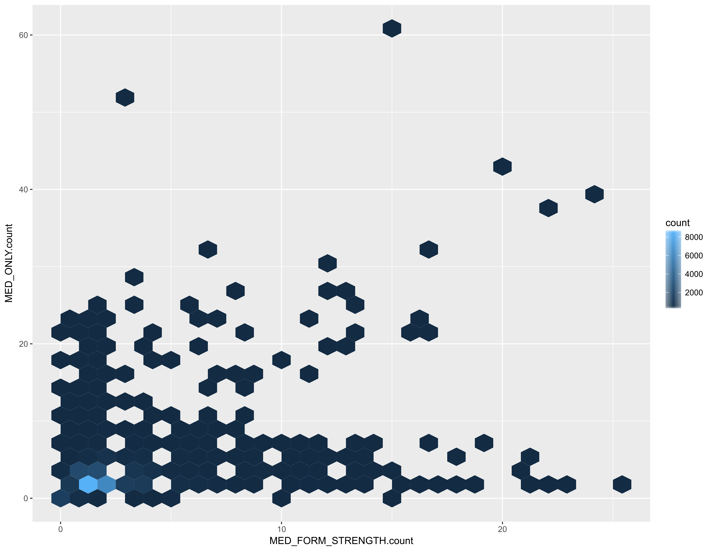
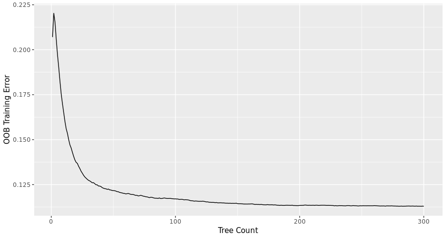
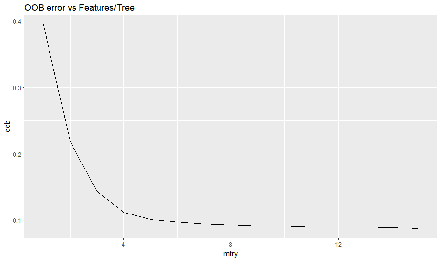
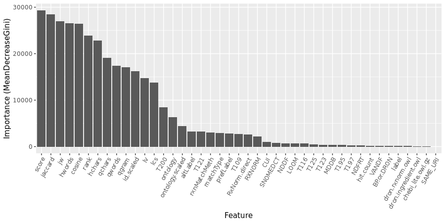
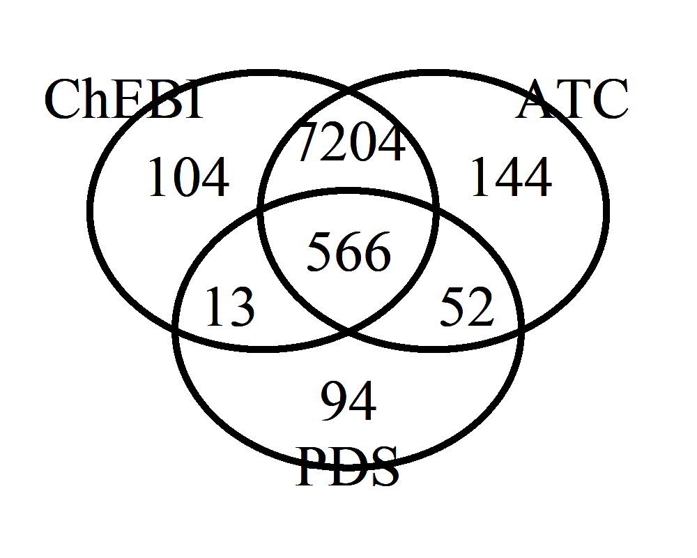

# TURBO:  Mapping Medication Text to Semantic Terms and Pharmacological Roles

## Background

[TURBO](https://pennturbo.github.io/Turbo-Documentation/) (Transforming and Unifying Research with Biomedical Ontologies) is an initiative based in the University of Pennsylvania's [Institute for Biomedical Informatics](http://upibi.org/turbo/).  It includes automated reconciliation of data from multiple sources (via [referent tracking](http://www.referent-tracking.com/RTU/?page=reftrackparadigm)), modeling data values as well as the things that the data are about ([ontological realism](https://www.ncbi.nlm.nih.gov/pmc/articles/PMC3104413/)), and the generation of rule-based conclusions despite missing and contradictory data.  Current applications include 

- assessing quality of care by monitoring the pharmaceutical roles of drugs prescribed subsequent to procedures
- generation of case/control cohorts for pure data research, or transnational research utilizing samples form the [Penn Medicine Biobank](http://www.itmat.upenn.edu/biobank/)

## Glossary

- **Medication text:**  a string representing something a health care provider could prescribe to a patient.  Generally a substance with a potential therapeutic function, but diagnostics and devices are also present in TURBO's sources.  Therapeutic substances may be referred to by their active ingredient (acetaminophen) or a trade name (Tylenol), with or without dose and route indicators.  Medication texts may include content that is noise in this context, like "please fax results to Dr. Doctor at 215-555-1212."  The PDS database uses the column name "FULL_NAME", and `EPIC medication hierarchy.xlsx` uses the column name "MedicationName".


## Problem

Questions frequently arise in biomedical- and healthcare informatics along the lines of "how many of our patients received a prescription for an antiarrhythmic dug?" or "of the patients who received intervention A vs B, which group received more prescriptions for analgesics?"

Unfortunately, the prescription records currently used by TURBO (which come from the University of Pennsylvania Healthcare System) do not consistently utilize terms from an ontology or controlled vocabulary like [RxNorm](https://www.nlm.nih.gov/research/umls/rxnorm/).  Furthermore, the classification of these medications into pharmaceutical classes appears incomplete, exclusive, and overfly flat.  Presumably, this limitation affects other EHR systems and biomedical data sets.

The TURBO team has access to prescription orders for ~ 50k patients with Penn Medicine Biobank consent and can pull them directly from the [Penn Data Store](https://www.med.upenn.edu/dac/penn-data-store-warehouse.html) relational database (PDS).  Specifically, a ~ 11k whole-exome-sequenced sub-cohort is especially well characterized within TURBO at this time.  In additional to this patient-centric medication information, the TURBO team can also pull all general reference knowledge about medications from PDS.  This is important because the textual part of medication orders is noisy and variable, but each order is keyed to a row in the medication reference table, narrowing the search space.  

For example, just among the 11k whole-exome cohort, there are five order names for the medication named "HYDROMORPHONE PCA 30 MG/30ML (CNR)":

- HYDROMORPHONE (DILAUDID) 30 MG IN NSS 30 ML (1 MG/ML) PCA
- HYDROMORPHONE PCA 30 MG/30ML (CNR)
- HYDROMORPHONE PCA 1 MG/ML SYRINGE
- HYDROMORPHONE (DILAUDID) PCA SYRINGE 30MG/30ML NSS (ADS)
- HYDROMORPHONE (DILAUDID) 30 MG IN NSS 30 ML PCA SYRINGE

This document specially addresses methods for examining the textual "full name" of a medication and determining a matching term from RxNorm using lexical and machine learning techniques.  Having done that, it is possible to decisively link to a large semantic universe of knowledge about those medications, including their (structural) classes, capabilities and roles.

----

Beyond PDS, the TURBO team can also obtain prescription and medication knowledge from UPHS' [EPIC](https://www.med.upenn.edu/ocr/about-pennchart.html) system via collaborators with credentials for [Clarity](https://www.med.upenn.edu/dac/epic-clarity-data-warehousing.html), a SQL-accessible reshaping of EPIC's MUMPS database. PDS and EPIC have different scopes, in terms of when and where a patient received care.  Both of these sources contain RxNorm classifications for a subset of the records, but the two resources do not use the same text-to-RxNorm mapping methods.  EPIC mappings come from the EPIC system itself; PDS mappings come from [3M Health Information Systems](https://www.3m.com/3M/en_US/health-information-systems-us/)

## Generalizability 

Many of the techniques mentioned here would be applicable to mapping any minimally constrained (but generally topical) free-text phrases to ontology terms.  (This method is not intended for mining multiple concepts out of long narratives.)  

A method is provided for extracting term labels to a [Solr](http://lucene.apache.org/solr/) index and searching the free text against that index.  One should keep in mind that Solr will return multiple hits that it finds to be relevant from a [TF-IDF](https://en.wikipedia.org/wiki/Tf%E2%80%93idf) perspective.  

While Solr provides a [score](https://lucene.apache.org/core/2_9_4/scoring.html), there's no static threshold that differentiates a good match from a poor match.  Therefore, methods are also provided for training a machine learning algorithm, specifically a [random forest](https://en.wikipedia.org/wiki/Random_forest) classifier, to distinguish the correct hits from noise.  While the method is distinguished by not requiring any negative training data, it does require some positive training data.  Furthermore, the algorithm doesn't actually pick one term match for each input medication text.  Rather, it assumes that the input medication text denotes some unknown medication which can be modeled with semantic term `X` and then classifies the terms returned by each Solr result as 
- identical to `X`
- sharing a common superclass with `X`
- separated from `X` by one permissible link (has-ingredient, tradename-of, etc.) 
- separated from `X` by two permissible links

Out of the 30 results returned for each medication text fed to Solr, there could be 0, 1 or more classifications of each type.  Each classification comes with a probability, and each type of classification has a different level of usefulness, so even though the algorithm doesn't pick one result as exclusively correct, it is possible to weight and prioritize the results. 

Since this method is able to align free text with semantic terms, it is obviously possible to project the properties of those terms onto whatever things are represented by the text.  For example, the text "500 mg Tylenol po tabs" might be mapped to http://purl.obolibrary.org/obo/DRON_00073395, with the label "Acetaminophen 500 MG Oral Tablet [Tylenol]".  DrOn knows that this is a subclass of "Acetaminophen 500 MG Oral Tablet", which is a subclass of the anonymous axiom:

```
has_proper_part some (scattered molecular aggregate and 
     (is bearer of some active ingredient) and 
         (is bearer of some (mass and (has measurement unit label value milligram) and 
             (has specified value value ))) and (has granular part some Acetaminophen))
```

Where "Acetaminophen" is modeled as http://purl.obolibrary.org/obo/CHEBI_46195, and ChEBI asserts that Acetaminophen has an analgesic role.

Here, ChEBI is being used as a value-added authority on the pharmacological and therapeutic roles borne by drugs.  EPIC does provide role-like classifications, but they are sparse (22% coverage) and exclusive (one classification per drug.)  Nonetheless, when an EPIC classification is available, it can be reconciled against the ChEBI role(s).  Furthermore, TURBO has already been designed with the option of including alternative drug-role knowledge from additional public sources, or knowledge provided by local clinical experts.

## EPIC as a medication knowledge source

The most recent source of EPIC medication knowledge comes from a 25,182,649 byte file `EPIC medication hierarchy.xlsx`, created on 2018-09-18.

This file is not unique by `MedicationName`, as each `MedicationName` can be assigned to zero or more RxNorm codes from two predominant categories.  (If no assignment is available, the `RXNORM_CODE` is `-`.)


    > table(EPIC_medication_hierarchy$RXNORM_CODE_LEVEL)
    
                    - MED_FORM_STRENGTH          MED_ONLY      MED_STRENGTH 
               120264            118121            143264                 1 


In other words, there are 381,650 rows, 170,093 unique `MedicationName`s, 261,386 total rows with a RxNorm annotation from EPIC, and 58,282 unique medications with at least one RxNorm annotation.

`EPIC medication hierarchy.xlsx` includes records that are deprecated in various ways.  For the subsequent per-medication RxNorm annotation counts, only the 196356 records with an active state (not deleted or hidden or inactive) are considered.

> Additionally, the RxNorm codes used by EPIC may have been retired by RxNorm as an organization.  That is independent of whether EPIC has deprecated the record or not, and it can't be determined without checking non-EPIC references (like the interactive [RxNav](https://mor.nlm.nih.gov/RxNav/) web site.

----

While it isn't unusual for an RxNorm-annotated EPIC medication to have a single RxNorm annotation, there are EPIC medications with over 20 RxNorm MED_FORM_STRENGTH annotations and/or over 40 MED_ONLY annotations.



For example, `MULTI PRENATAL 27-0.8 MG PO TABS` is annotated with 17 different MED_ONLY RxNorm codes, in order to represent each of the vitamin and mineral components.  It's also annotated with RxNorm term 802792, which models the combination product.  Vaccines are also among the medications with a high number of RxNorm annotations.

Because of these complex, irregular relationships between EPIC medications and RxNorm terms, EPIC RxNorm assertions were not used to train this project's machine learning classifier.

## PDS as a medication knowledge source

PDS medication knowledge was obtained with SQL queries against the master data management (MDM) and operational data store (ODS) schemas and then dumped to the files `mdm_r_medication_180917.csv` and `ods_r_medication_source_180917.csv`.  The two files both had 937,084 rows, and neither used any primary key values that weren't present in the other.  The MDM file contains all of the columns present in the ODS file, except for an indicator of the upstream source of medication knowledge.  Therefore they were merged by primary key into a single R data frame.

`FULL_NAME` medication text values were available for 99.7% of the rows.  There are only 3260 records lacking medication `FULL_NAME` values, all of which come form the `THERADOC` upstream source.  Those 3260 do have strings in the `SOURCE_ORIG_ID` column that could probably be used as if they were `FULL_NAME`s. All of the medication `FULL_NAME`s were identical between the MDM or ODS sources, with the minor exception of 15 rows containing non-ASCII or non-printable characters that were tidied with different rules. 

### RxNorm terms in PDS

There are 833,999 unique MDM `FULL_NAME`s in the 937,084 rows.  RxNorm annotations are present on 48,020 rows  representing 41,970 unique `FULL_NAME`s.  In contrast with the EPIC medication file, 99% (41,501) of those medications have only one single RxNorm annotation.  

In summary:  PDS has a slightly smaller set of medications annotated with RxNorm terms, but the PDS medications are much more likely to have a single RxNorm annotation.

## Methods

### Overview


----

- PDS and EPIC have already been discussed as authoritative sources of UPHS-based knowledge about medications.  To begin, [**public** sources of medication knowledge](medication_graphs.md) were loaded into the [TURBO graph database](turbo_triplestore.md) and into a Solr document collection.  These public sources serve as targets in the process of mapping medication texts to semantic medication terms, and on to pharmacological roles.
- The triplestore was also loaded with with cross-ontology term mappings from the NCBO BioPortal.  RxNorm terms are the preferred results from submitting PDS medication texts to Solr, but the search space can be increased dramatically by including other medication knowledgebases in addition to RxNorm.  The cross-ontology mappings enable normalizing back to RxNorm terms.  
- [SPARQL](https://en.wikipedia.org/wiki/SPARQL) statements in `med_map_sparql_utils.R` were run to create derived graphs, in support of subsequent steps in the workflow
    - Determination of which medications appear to have multiple ingredients.  This is determined by counting has-ingredient, has-part, has-component statements, etc. from Solr, so it only applies to RxNorm terms themselves, or terms form other ontologies that can be mapped to RxNorm.  As of November 2018, the machine learning phase assumes that any drug with unknown combination status is a single-ingredient drug.  Only the single-ingredient drugs are used for training as discussed above in the EPIC background section.
    - Re-materialization of valid DrOn-provided mappings from DrOn terms to RxNorm terms. As of November 2018, the public DrOn download uses a large number of retired RxNorm IDs.  In these cases, this materialization substitutes the RxNorm annotation from a term's (DRON) parent class, if that one is still active.
- In order to reconcile idiosyncrasies of the language used in PDS with the language used in RxNorm and the additional knowledgebases, a `med_name_expansions` graph was populated with previously created "expansion statements."  There are certain patterns in the UPHS/PDS medication texts that consistently differentiate them from the composition of medication term labels in sources like RxNorm.  For example, "po tabs" in PDS always corresponds to "oral tablet" in RxNorm.  Also, some PDS mediation names contain tokens like "wrapper" that never appear in RxNorm etc.  The `med_name_expansions` graph defines or [rules for replacing or dropping tokens like those](uphs_term_expansions.md). 


### Number of Medication Texts per PDS source

| PDS Source        | Medication Count               |
|----------|--------------------:|
| EMTRAC   | 424637 |
| SCM      | 245922 |
| EPIC     | 178629 |
| THERADOC | 87896  |

### Number of Medication Texts with useful RxNorm assertions, by PDS source

```
    > table(complete.uphs.with.current.rxnorm[, "source"])
    
     EPIC   SCM 
     7340 29573 
```

- 36913 rows of SPARQL results became 32381 acceptable, RxNorm-associated medication texts, which became 26903 "expanded" queries
- The "expanded" PDS medication texts were submitted to the Solr search engine described above.

- 925 of the submitted medication texts [retrieved 0 Solr hits](training_solr_dropouts.txt).

### Random sample of medication texts with 0 Solr hits

```
> print(sort(sample(solr.dropouts, 10)))
 [1] "abilif"            "brovanna"          "chlorohexadine"    "cholistmethate"    "coenzymeq"         "fosomax"          
 [7] "hydroxychoroquine" "kenalo"            "midod"             "tylen"     
```


### Number of Solr results

```
> nrow(result.frame)
[1] 932297
```

932297 Solr results is roughly (36913 - 925) * 26 results/query (out of 30 requested).

- The Solr results were merged back with the PDS medication knowledge.  
- An `rxnifavaialble` field was created using the mapped RxNorm values from Solr or the `id` field's value when the ontology field contained `http://data.bioontology.org/ontologies/RXNORM/submissions/15/download`

### Number of Solr results with a direct or mapped RxNorm term available

```
> table(is.na(result.frame$rxnifavailable))

 FALSE   TRUE 
643 729 288 568 
```

- Combination drug flags of `NA` were  replaced with `FALSE` as only 5.5% of the successfully categorized drugs were found to be combination products.

```
> table(result.frame$combo_likely, useNA = 'always')

 FALSE   TRUE   <NA> 
607884  35845 288568 
> result.frame$combo_likely[is.na(result.frame$combo_likely)] <- FALSE
> table(result.frame$combo_likely, useNA = 'always')

 FALSE   TRUE   <NA> 
896452  35845      0 
```

- At this point, Solr results were discarded if there was no RxNorm term available or if the RxNorm term was indicative of a combination drug. 

```
> nrow(result.frame)
[1] 932297
> nrow(result.frame.rxnavailable)
[1] 607884

```

- Similar to the expansion of abbreviations in UPHS/PDS medication texts, the labels returned by Solr were lightly tidied:

    - Some NDDF term labels use @ as a word delimiter instead of " ", like "acetaminophen with codeine phosphate@300 mg-30 mg@oral@tablet" for http://purl.bioontology.org/ontology/NDDF/004165. The @ characters were replaced with " ".
    - The words "product" and "containing" were removed

- Additional features were engineered for machine learning:
    - number of characters and space-delimited words in the query (medication text form PDS)
    - number of characters and space-delimited words in the term label returned by Solr
    - number of Solr results coming from the ontology mentioned on each row
    - number of Solr results mentioning the term mentioned on each row
    - Boolean multi-column recast of the single column of rxnMatchMeth string values

```
    > table(result.frame.rxnavailable$rxnMatchMeth)
    
       BP or DRON           CUI          LOOM RxNorm direct      SAME_URI 
            16177        182230         66105        343313            59 
```

    - Boolean multi-column recast of the matchType string values

```
    > table(result.frame.rxnavailable$matchType)
    
     altLabel     label prefLabel 
       231602     19926    356356 
```

    - Boolean multi-column recast of the single column of concatenated UMLS TUI semantic types.  Columns were only retained for TUIs which appeared in at least 1% of the rows.
    - Boolean multi-column recast of the source ontology string column.  Columns were only retained for TUIs which appeared in at least 1% of the rows.
    - Four sting distance measures between the expanded PDS medication text and the term label returned by Solr
        - Levenshtein
        - longest common substring
        - qgram
        - cosine
        - jaccard
        - Jaro-Winkler

- A table was created with unique pairs of RxNorm terms obtained via Solr and corresponding RxNorm values asserted by PDS

```
    pairs.for.graph <-
      unique(result.frame.rxnavailable[, c("rxnifavailable", "RXNORM_CODE_URI")])
    > dim(pairs.for.graph)
    [1] 120585      2
```

- Those RxNorm **values** were converted to URIs for RxNorm terms, and a three-triple reification of each pair was created

```
X a <http://example.com/resource/uphs_vs_solr_result> ;
    <http://example.com/resource/rxnifavailable>  <http://purl.bioontology.org/ontology/RXNORM/10760>;
    <http://example.com/resource/RXNORM_CODE_URI>  <http://purl.bioontology.org/ontology/RXNORM/1085728>.
```

```
    > tripleCount(temp.rdf)
    [1] 361795
```

- The RxNorm pairing reifications were saved to the GraphDB server's filesystem.  (Specifically, the monitored graphdb-import folder.)   The http://example.com/resource/uphs_nonobsolete_rxn_vs_solr graph was cleared if necessary, and a a JSON directive was submitted via CURL to trigger an import of the triples file.

- Next, the RxNorm pairs were assessed, within the graph, for semantic relatedness:  the two terms in each pair can be either  

    - identical
    - siblings, i.e. subclasses of a common superclass
    - separated from one another by one permissible link (has-ingredient, tradename-of, etc.) 
    - separated from one another by two permissible links
    - not related at any of those four levels (not instantiated or returned by any queries)

- For each pair, those levels of semantic relatedness were materialized as an attribute of the previously mentioned reifications.

- Since there are four binary levels of relatedness, there are theoretically 16 possible combinations.  However, some of those combination are not actually possible:  two terms can't be identical and related to one another over one semantic hop.  In fact, only eight of the combinations were observed.  They can be represented in a pasted style with using this template:  identical-siblings-onehop-twohops

| pasted relatedness      | count  |
|-------------------------|-------:|
| FALSE-FALSE-FALSE-FALSE | 244051 |
| FALSE-TRUE-FALSE-FALSE  | 91251  |
| TRUE-TRUE-FALSE-FALSE   | 87212  |
| FALSE-FALSE-TRUE-FALSE  | 60528  |
| FALSE-FALSE-FALSE-TRUE  | 54066  |
| FALSE-FALSE-TRUE-TRUE   | 32843  |
| TRUE-FALSE-FALSE-FALSE  | 29816  |
| FALSE-TRUE-FALSE-TRUE   | 8030   |

- It was taken for granted that `TRUE-FALSE-FALSE-FALSE` and `TRUE-TRUE-FALSE-FALSE` are the most desirable states.  `TRUE-TRUE-FALSE-FALSE` means that not only are the Solr-determined RxNorm term and the PDS asserted RxNorm terms identical, but that RxNorm also asserts a parent term, like

> '500 mg Tylenol oral tablet' `is-a` '500 mg acetaminophen oral tablet'

- These `is-a` relationships are not asserted for all terms, thus explaining the presence of the `TRUE-FALSE-FALSE-FALSE` relatedness class.  `FALSE-FALSE-FALSE-FALSE` is of no use in understanding the relatedness of the Solr results and the PDS gold standard, so it was not generally included in any downstream analyses.

- The paired terms and their relatedness levels were then pulled back out of the graph with SPARQL, and merged into the table of Solr results, PDS knowledge, additional features, etc.  Subsequently, the relatedness levels were used as the targets of a machine learning algorithm.

- The potential training features were clarified as having one of two types:
    - numeric
    - factor, with levels that are enumerated in a fixed order, even though they are not considered ranked

- A 10% random sample of the medication texts associated with valid, single-ingredient RxNorm terms was collected.  All Solr results returned for those medications were set aside, to be used for calculating coverage.  In this context, coverage is the number of medication texts that result in at least one non-FALSE-FALSE-FALSE-FALSE classification.  Even if a medication text can retrieve hits from Solr, if all of those hits are classified as FALSE-FALSE-FALSE-FALSE, then the classifier has failed to cover that medication name with an RxNorm term.

- An entirely random 10% sample from the remaining 90% of Solr results was set aside for validation, i.e. calculating accuracy of the trained machine learning algorithm.

## Random Forest optimization
- The process of leaning semantic relatedness as a function of a Solr score, string distance, etc. was implemented with the randomForest function form the R library of the same name.  In this application, a random forest was found to result in somewhat higher accuracy and dramatically faster training time compared to a  SVM (support vector machine) learning strategy.  Since random forests consist of an ensemble of decision trees, they have the additional benefits of not generally requiring scaled numeric data, and accepting un-recoded categorical features as input.
- An initial round of random forest training was run with all features described above, and generous (i.e. slow) settings on the two main numerical parameters:  300 trees, each constructed from a random selection of 8 of the features.  In this case, the algorithm was also told to determine the importance of the input features.

The training error doesn't improve much beyond 200 trees, so that choice was imposed in all subsequent steps.



- The random forest was also run (at 200 trees) across a range of features/tree, or "mtry" settings.  Considering the potential of over-training, mtry=10 was selected, even though the OOB error continued to slowly decrease past that point.



- Features whose [importance](feature_importance_table.md) was at least 5% of the most important feature were retained.  The Solr score was the most important feature, with a MeanDecreaseGini of  29307.  Therefore, RXNORM (2149 or 7.3% of max) was retained but CUI (1036, 3.5%) was not.
     



```
> sort(important.features)
 [1] "altLabel"        "cosine"          "hchars"          "hwords"          "id.scaled"       "jaccard"         "jw"             
 [8] "lcs"             "lv"              "matchType"       "ontology"        "ontology.scaled" "prefLabel"       "qchars"         
[15] "qgram"           "qwords"          "rank"            "rxnMatchMeth"    "RXNORM"          "RxNorm.direct"   "score"          
[22] "T109"            "T121"            "T200"        
```

Training the random Forrest with these settings took 744 seconds on a modern server with 32 GB RAM and can be summarized like this:

```
Call:
 randomForest(formula = my.form, data = trainframe, ntree = my.ntree, mtry = my.mtry, get.importance = get.importance.Q) 
               Type of random forest: classification
                     Number of trees: 200
No. of variables tried at each split: 10

        OOB estimate of  error rate: 9.16%
```

[The accuracy, assessed with the 10% validation set, is similar.](all_train_and_validate_quality.md)

```
Confusion Matrix and Statistics

                         Reference
Prediction                FALSE-FALSE-FALSE-FALSE FALSE-FALSE-FALSE-TRUE FALSE-FALSE-TRUE-FALSE FALSE-FALSE-TRUE-TRUE
  FALSE-FALSE-FALSE-FALSE                   20130                    556                    361                    66
  FALSE-FALSE-FALSE-TRUE                      225                   4034                     48                    21
  FALSE-FALSE-TRUE-FALSE                      200                     54                   4916                    25
  FALSE-FALSE-TRUE-TRUE                        31                     53                     10                  2437
  FALSE-TRUE-FALSE-FALSE                      419                     16                     10                     2
  FALSE-TRUE-FALSE-TRUE                        10                      1                      3                     3
  TRUE-FALSE-FALSE-FALSE                       57                      6                     16                    78
  TRUE-TRUE-FALSE-FALSE                       402                     48                      1                     4
                         Reference
Prediction                FALSE-TRUE-FALSE-FALSE FALSE-TRUE-FALSE-TRUE TRUE-FALSE-FALSE-FALSE TRUE-TRUE-FALSE-FALSE
  FALSE-FALSE-FALSE-FALSE                    643                    35                     85                   587
  FALSE-FALSE-FALSE-TRUE                      18                     1                      7                    55
  FALSE-FALSE-TRUE-FALSE                      19                    11                      8                     8
  FALSE-FALSE-TRUE-TRUE                        1                     2                     66                     1
  FALSE-TRUE-FALSE-FALSE                    7267                    10                      3                   239
  FALSE-TRUE-FALSE-TRUE                       10                   656                      1                    15
  TRUE-FALSE-FALSE-FALSE                       0                     0                   2417                     1
  TRUE-TRUE-FALSE-FALSE                      203                     7                      4                  6822

Overall Statistics
                                          
               Accuracy : 0.9108          
                 95% CI : (0.9084, 0.9132)
    No Information Rate : 0.4018          
    P-Value [Acc > NIR] : < 2.2e-16       
                                          
                  Kappa : 0.8836          
 Mcnemar's Test P-Value : < 2.2e-16       

Statistics by Class:

                     Class: FALSE-FALSE-FALSE-FALSE Class: FALSE-FALSE-FALSE-TRUE Class: FALSE-FALSE-TRUE-FALSE
Sensitivity                                  0.9374                       0.84606                       0.91631
Specificity                                  0.9270                       0.99230                       0.99324

                     Class: FALSE-FALSE-TRUE-TRUE Class: FALSE-TRUE-FALSE-FALSE Class: FALSE-TRUE-FALSE-TRUE
Sensitivity                               0.92451                        0.8905                      0.90859
Specificity                               0.99677                        0.9846                      0.99918

                     Class: TRUE-FALSE-FALSE-FALSE Class: TRUE-TRUE-FALSE-FALSE
Sensitivity                                0.93284                       0.8828
Specificity                                0.99689                       0.9854
```	


## High level summary of lexical mapping results

- 75.5% of the PDS `FULL_NAME`s were confidently mapped to a semantic term
- 59.9% were specifically mapped to an RxNorm term

### Random sample of PDS `FULL_NAME`s solely mapped to terms outside of RxNorm:

```
 [1] "Basic Metabolic Panel and Mg on Wednesday, 3/12/14 with results faxed to Dr. Smith (215) 349-8309 (Fax)"                                                                                              
 [2] "ALLO TRANSPLANT LABS EVERY MONDAY & FRIDAY"                                                                                                                                                           
 [3] "Saline Enema"                                                                                                                                                                                         
 [4] "LABS EVERY MONDAY AND THURSDAY. PLEASE DRAW CMP, CBC, MAGNESIUM, FERRITIN, PT/INR, PTT, FIBRINOGEN AND D-DIMER."                                                                                      
 [5] "u-500 regular insulin 0.15 ml subcutaneous each evening with DINNER"                                                                                                                                  
 [6] "CT Lumbar Spine without Contrast"                                                                                                                                                                     
 [7] "NEUTROGENA AGELESS INTENSIVES EX"                                                                                                                                                                     
 [8] "NEBULIZER ALBUTEROL AND ATROVENT X 3"                                                                                                                                                                 
 [9] "IFE-PG20 INTRACAVER"                                                                                                                                                                                  
[10] "Labs: CBC w/diff, CMP, PT/INT/PTT, Mg, Phos every Monday and Thursday starting 10/27/14.  Please fax results to Dr. Selina Luger at 215-662-4064.  Please call with critical results to 215-614-1847."  
```

`FULL_NAME` #6 is mapped to <http://purl.bioontology.org/ontology/SNOMEDCT/702488002>,"Computed tomography of thoracic and lumbar spine with contrast"

`PDS_meds_to_turbo_terms_and_roles_17col.csv` contains the The best match-per-medication-text.  It provides no mapping at all for 1,493 of the 833,999 PDS `FULL_NAME`s.  That could theoretically happen if the `FULL_NAME` results in zero Solr search results, but it appears that in this case, it was always the results of a successful Solr search but the failure of the random forest to classify any of the Solr results as semantically acceptable.

For example, consider these `FULL_NAME`s randomly selected from the group of 1,493:

```
 [1] "CARDIZEM 10 MG IV\r\n  INTRAVENOUS"                                                                    
 [2] "CONTINUOUS: 0\r\nBOLUS: 1\r\nINTERVAL: 10 MINUTES  INTRAVENOUS"                                        
 [3] "PREMARIN 25MG IN 5ML NORMAL SALINE\r\nINJECTED OVER 2 MINUTES  INTRAVENOUS"                            
 [4] "COMPAZINE 10 PO NOW\r\n"                                                                               
 [5] "0.3 MG  CLONIDINE PO \r\n  PER MOUTH"                                                                  
 [6] "LABETALOL 20 MG\r\nLABETALOL 40 MG\r\nLABETALOL 80 MG"                                                 
 [7] "DC DECADRON\r\n"                                                                                       
 [8] "TORADOL 30MG IM X 1\r\n  INTRAMUSCULAR"                                                                
 [9] "US PREGNANCY MULTI 1ST TRIMESTER TRANSABDOMINAL TRANSVAGINAL\r\n\r\n"                                  
[10] "PERCOCET 5/325 PO X4\r\nSEND PT HOME WITH 4 TABLETS TO BE TAKEN EVERY 3-4 HOURS AS NEEDED FOR PAIN  PE"
```

The best Solr hit for #10 is <http://purl.bioontology.org/ontology/SNOMEDCT/9771000175109>, "every 3-4 hours as needed", and the lower ranking hits have similar labels.  One of the features used to train the random forest is the string similarity between the `FULL_NAME` and the label of the Solr match, so it's no surprise that this match was classified as semantically unrelated and therefore omitted from `PDS_meds_to_turbo_terms_and_roles_17col.csv`.

## Methods for linking RxNorm terms to pharmacological roles

At this point, PDS medication texts have been lexically mapped to RxNorm terms that model mediation products and ingredients.  RxNorm was selected due to the availability of RxNorm training data within PDS and to the extensive links to RxNorm via DrOn and the UMLS.

ChEBI was selected as an authority on medication roles, due to its comprehensiveness and its commitment to [BFO](http://basic-formal-ontology.org/) ontological realism.

Having said that, there is no one general semantic path to ChEBI terms from the various RxNorm terms returned from the lexical mapping.  Therefore, SPARQL insert statements were used to [materialize shortcut relationships from any RxNorm term to those RxNorm terms that are best aligned with ChEBI compounds](whitelisted_role_inheritance_sparql_template.md).  

These statements build chains of up to three predicates from a white-list:

- `rxnorm:consists_of`
- `rxnorm:contains`
- `rxnorm:form_of`
- `rxnorm:has_form`
- `rxnorm:has_ingredient`
- `rxnorm:has_ingredients`
- `rxnorm:has_part`
- `rxnorm:has_precise_ingredient`
- `rxnorm:isa`
- `rxnorm:tradename_of`

`rxnorm:form_of` and `rxnorm:has_form` describe relationships like those between a base (dextromethorphan) and a salt form (dextromethorphan hydrochloride).  Otherwise, all of those predicates describe `s p o` relationships in which the subject is more inclusive than the object.  For example, we say that since 

`'cough and cold combo' rxnorm:has_ingredient acetaminophen`

therefore

`'cough and cold combo' inherits-roles-from acetaminophen`

however, we don't say that dextromethorphan has an analgesic role, despite these short semantic paths:

```
dextromethorphan rxnorm:ingredient-of 'cough and cold combo'
'cough and cold combo' rxnorm:has_ingredient acetaminophen
acetaminophen has-role analgesic
```

or

```
Coughatussin `rxnorm:brandname-of` dextromethorphan
Coughatussin `rxnorm:brandname-of` acetaminophen
acetaminophen `has-role` analgesic
```

Having inserted the role inheritance statements, it becomes possible to construct a semantic path all the way from a patient's prescription, to a PDS medication (based on its medication text), to a RxNorm term (thanks to Solr and the random forest), on to RxNorm ingredients (the sources of role inheritance), a ChEBI compound, and finally a ChEBI role or class.  If PDS says a patient received a prescription for "500 mg Tylenol po tabs", the semantic graph will say that they received a prescription for an analgesic drug.

Alternatively, there are RDF-formatted linked data sets about medications which make assertions about the capabilities and therapeutic classes of medications in a way that requires only a single hop to an RxNorm term, although the semantics of this hop is usually the somewhat vague "shares concept unique identifier"

There is always some degree of disagreement between these authorities.  PDS provides one exclusive pharmaceutical classification for a small subset of its medications, so that can provide one form of confirmation when the graph provides contradictory roles information, or fails to assign a particular role to a particular medication.

## Count of PDS medications with the antipsychotic role, by semantic authority



In this case, the antipsychotic role assignments in PDS are small in number (631) but largely in agreement with ChEBI and the WHO's Anatomical and Therapeutic Classification (with 566 in the intersection of all three authorities.)  Therefore it would seem entirely reasonable to confirm the antipsychotic role of the additional 7204 PDS medications appearing in the intersection of the ChEBI and ATC sets, for a greater than 10-fold increase in the number of PDS medications linked to an antipsychotic role.

When there's less agreement between authorities, that can be an indicator that subject matter expertise from a clinician might be useful.

## Discussion

### Alternative approaches


- [NCBO BioPortal Mapping API](http://data.bioontology.org/documentation#Mapping)
    - Like Solr **in its default configuration**, not tolerant of spelling errors
    - TURBO's Solr processes 30 searches per second.  Bioportal processes one per second.
    - The use of BioPortal would not eliminate the need for a multi-results filtering step (like the random forest)
- [MedEx](https://sbmi.uth.edu/ccb/resources/medex.htm)
    - Command line tool with low overhead.  Results qualitatively look good, but not assessed quantitatively yet.
    - Executable code and embedded RxNorm knowledgebase have not been updated in several years.
    - Intended for scanning clinical narratives.  Therefore scans for medications that span across linefeeds, whereas a text file of the PDS medication texts would be strictly one medication per line.  MedEx reports the boundaries of a span containing a medication in terms of the document-wide start and stop characters, not according to line numbers.  Workarounds include submitting one medication per file and then collating (slow), or writing code to reconcile global character counts between input and output, taking into consideration character encoding and platform-specific EOLs.  
- [CLAMP](https://clamp.uth.edu/)
    - Replacement for MedEx.  Nice GUI, but with low ceiling on usable RAM.  A CLI mode is available for higher performance but requires assembling a jar and embedding  a license.  Scans clinical narratives by default but can be configured to understand one-medication per line (i.e. without sentence splitting.)
    - Still tied to a specific, dated version of RxNorm

- TURBO Medication Mapping
    - Expansion rules can be tuned to understand the idiosyncratic language of prescriptions from a particular source like PDS/UPHS
    - Easy to swap in the latest RXNORM, along with other medication ontologies, although a path from non-RxNorm terms to RXNORM is required, at least for training.  For predictions, will report matched RXNORM terms if available.  Otherwise will report terms form other ontologies like "wheelchair" or  "normal saline" when no RXNORM term is available.  This mitigates situations in which other mappers would provide a false positive or no mapping at all for many terms in the set of medication text inputs.


## Future opportunities

### Quality of Results

- Roughly 3% of the PDS medications with valid RxNorm assertions don't hit anything in the TURBO Medication Solr collection.  Postfixing a tilde `~` after single word Solr queries allows for some misspelling-like variations.


For example, the miss-spelled medication text "hydroxychoroquine" retrieves zero Solr hits on its own, but when modified with the `~` operator

`http://18.232.185.180:8983/solr/medmappers_20181109/select?fl=id,anyLabel,score&q=anyLabel:hydroxychoroquine~&wt=csv`

It does retrieve Solr hits, with a generally reasonable score of 13.9, from multiple ontologies

| id                                                      | anyLabel           | score     |
|---------------------------------------------------------|--------------------|----------:|
| http://purl.obolibrary.org/obo/DRON_00010111            | hydroxychloroquine | 13.968817 |
| http://purl.bioontology.org/ontology/NDDF/004906        | hydroxychloroquine | 13.968817 |
| http://purl.bioontology.org/ontology/SNOMEDCT/373540008 | hydroxychloroquine | 13.968817 |
| http://purl.bioontology.org/ontology/SNOMEDCT/83490000  | hydroxychloroquine | 13.968817 |
| http://purl.bioontology.org/ontology/VANDF/4019780      | hydroxychloroquine | 13.968817 |
| http://purl.bioontology.org/ontology/NDFRT/N0000147871  | hydroxychloroquine | 13.968817 |


- Consider removing highly correlated features.  Improve consistency in whether numeric features are Z scaled or not.

- Use DrOn's more long-winded has-ingredient semantics to classify a greater number of medications as single-ingredient vs. combination product (compared to one one can do with RxNorm has-ingredient statements alone.)

- Better characterize the consequences of substituting a parent class' RxNorm term for a DrON term when the child term has a retired RxNorm term:    This practice increases the size of the training set, but at least partially confounds the training:  if medication text T retrieves DrOn term D1 from Solr and D1 inherits D2's RxNorm term, the the machine learning phase will assess the semantic similarity from T to D2 based partially on the lexical similarity between T and D1.  Participation of TURBO team member in the DrOn community may accelerate the replacement of retired RxNorm terms within DrOn and therefore make this less of an issue.

- Ontologies (like DrOn) can import terms from one another (like ChEBI).  This may introduce some redundancy into TURBO's Solr collection, which would then be propagated through the rest of the workflow.  Needs better characterization.

### Performance, code quality and consistency

- Based on a precedent form BioPortal, `id` is beings used as the name of the Solr field that contains ontology term URIs.  `id` appears to be a reserved word in Solr, so it should probably be  globally replaced in the R code and the Solr configuration with something else like `termId` or `termUri`.

- It may be possible to do Solr collection creation, emptying, and document loading in R using the new features of Solrium, instead of doing those steps form the command line.  Could R+Solrium handle the large dataframes that would provide the input to new collections?

- The ontology and term count features were Z scaled.  No other numerical features are being scaled, as scaling is not required by random forests.

- Try `party` as an alternative to R's `randomForest` library?

