# The TURBO Ontology

[//]: # (this mangled link notation is used for comments that should be invisible to any markdown or html renderer)

## Audience and goals

It isn't necessary to know every term in the TURBO ontology in order to execute the [Drivetrain application](drivetrain.md) as-is.  A deep understanding of the [RDF](https://en.wikipedia.org/wiki/Resource_Description_Framework) and [OWL2](https://en.wikipedia.org/wiki/Web_Ontology_Language) languages isn't required in that specific use case, either.  However, users who wish to make modifications to the TURBO ontology or to the Drivetrain code should at least familiarize themselves with the [Class Relations Diagrams](#clrds), along with [the concepts behind them](#clrd_concept), specifically:

- [distinguishing relations permitted by the ontology from those that have actually been used in a given data set](#perm_vs_obs)
- visualizing abstracted relations between classes, based on those instance-to-instance relations that are actually present in the semantic repository

The TURBO ontology is still being refined.  The TURBO team welcomes suggestions for term additions or modifications.

## Background

The TURBO ontology is an [OWL2 ontology](https://www.w3.org/TR/owl2-overview/) that describes the classes and properties that can be used by the Drivetrain application.  It is accessible via two different URLs, `https://cbil-dev-web01.pmacs.upenn.edu/ontology/turbo_merged.owl` and `https://github.com/pennbiobank/turbo/blob/master/ontologies/turbo_merged.owl`, although neither is open to the public yet.  TURBO imports many of its classes from the [Ontology for Biobanking](http://www.obofoundry.org/ontology/obib.html), the [Ontology for Biomedical Investigations](http://www.obofoundry.org/ontology/obi.html) and other [OBO Foundry](http://www.obofoundry.org/) ontologies.  TURBO's native classes and properties are, to a great extent, used to describe the [shortcut expansion](drivetrain.md#sc_exp), [referent tracking](drivetrain.md#reftracking) and [conclusionating processes](drivetrain.md#conclusionating) carried out by the Drivetrain application.

## <a id="term_id_lab">Term IDs vs labels</a>

As is the case for most OBO foundry ontologies, class and property terms are represented with URIs that are not necessarily intended to have any mnemonic value.  In this document, the terms will be mentioned by way of their textual labels.  For terms that have multiple labels, one has been chosen as the preferred term within the scope of this document.  

A [table of all TURBO terms](#termTable2) appears at the end of this section, with the term URIs, the locally preferred labels, and all alternative labels.  All labels have been normalized by lowercasing, replacing underscores with whitespace, and removing all unnecessary/redundant whitespace.

## <a id="perm_vs_obs">Permitted relations vs observed relations</a>

The TURBO ontology describes all classes and properties that **may** be used in a TURBO repository.  Building upon that, the Drivetrain application contains checker methods that ensure no other terms are used, and that property terms are only used to link instances of classes that fall within a property's range and domain, or subclasses thereof. However, not all of the TURBO terms are currently instantiated by Drivetrain, and there are certainly aren't s-p-o triples representing all of the permissible subject class-property-object class permutations.  

Having said that, SPARQL queries (https://en.wikipedia.org/wiki/SPARQL) can be written to transform all of the instance-to-instance triples that actually do appear in a TURBO repository into class-to-class prototypes, which can then be visualized with something like GraphDB's built-in graph visualizer (see below), GraphViz (https://www.graphviz.org/) or igraph (http://igraph.org/).  The following examples are based on data about 5000 real PennBiobank patients and the encounters they participated in.

## <a id="about_triples">Triples, Classes and Instances</a>
Fundamentally, RDF is used to make triples, or semantic statements with subjects, predicates and objects, each of which is considered a resource and is represented with a Universal Resource Identifier (URI.)  For example, the TURBO ontology knows that adipose tissue is something that exists in reality.  That term is imported from the Uber Anatomy Ontology, and goes by the URI <http://purl.obolibrary.org/obo/UBERON_0001013>.  

OWL2 ontologies can be serialized to text files in a number of formats, several of which also function as serializations of the RDF Resource Description Format.  A representative RDF triple from the TURBO ontology could be written out in the "n-triples" style as follows:

    <http://purl.obolibrary.org/obo/UBERON_0001013> <http://www.w3.org/2000/01/rdf-schema#label> "adipose tissue" .

Here, the triple's subject is the URI <http://purl.obolibrary.org/obo/UBERON_0001013>, the predicate is <http://www.w3.org/2000/01/rdf-schema#label>, and the object is the literal value "adipose tissue".  (While literals are legal as subjects in RDF, they are generally not used that way in OWL2 ontologies.  Literals can never be used as predicates.)

RDF triples can be used to communicate what classes and properties are modeled in an ontology like TURBO, and the ways in which instances of those classes can be related by the properties.  That's a matter of defining terminology.  The bulk of the work specifically done by Drivetrain is not defining terminology, but rather making specific assertions about things in reality, each of which is an instance of some TURBO class.  

_The following TURBO instance-to-instance triples are written in RDF's terser Turtle syntax.  One characteristic of Turtle syntax is the use of a prefix notation for URIs, in which `obo:UBERON_0001013` is identical with <http://purl.obolibrary.org/obo/UBERON_0001013>.  These instance-to-instance triples also follow Drivetrain's practice of referring to individual things in reality with URLs that end in a Universally Unique Identifier, or UUID.  Finally, this example introduces another class: Homo sapiens, or  <http://purl.obolibrary.org/obo/NCBITaxon_9606>, and another property: <http://purl.obolibrary.org/obo/BFO_0000050>, or is_part_of._

_In conclusion, these triples say that some particular `adipose tissue` instance is part of some particular `Homo sapiens` instance._

    prefix obo: <http://purl.obolibrary.org/obo/> .
    prefix turbo: <http://transformunify.org/ontologies/> .

    turbo:3aa16df5-d0a5-427c-af0d-c9e053b1e21d a obo:UBERON_0001013 .
    turbo:68c2f7d9-a393-4022-af63-d5a3e94b902d a obo:NCBITaxon_9606 .
    turbo:3aa16df5-d0a5-427c-af0d-c9e053b1e21d obo:BFO_0000050 turbo:68c2f7d9-a393-4022-af63-d5a3e94b902d .

_Collections of RDF triples are stored in databases called RDF triplestores.  Drivetrain uses the RDF4J library to communicate with a triplestore containing the TURBO triples.  OntoText GraphDB satisfies the requirement of a RDF4J triplestore that supports OWL2 reasoning.  It also provides [several nice visualization tools](#graphviz) and an IDE-like environment for composing SPARQL queries of the triples.  Some other OWL2-reasoning RDF4J compliant triplestore could be theoretically be substituted._

Technically speaking, one GraphDB installation can contain multiple repositories that are for the most part segregated.  The same is true for most other RDF4J triplestores.  One collection of TURBO triple takes exactly one repository.  Later in this document, the use of named graphs (https://en.wikipedia.org/wiki/Named_graph) for the segregations of conclusions will be discussed.  TURBO repositories contain multiple named graphs.  SAPRQL queries can be scoped only one or more enumerated named graphs, but their default behavior is to consider all named graphs in a repository.

## <a id="clrd_concept">Class Relations Diagrams: The Concept </a>

The key to understanding the upcoming Class Relations Diagrams is that they generalize instance to instance relations (like `turbo:3aa16df5-d0a5-427c-af0d-c9e053b1e21d` is a part of `turbo:68c2f7d9-a393-4022-af63-d5a3e94b902d`) into prototypes that say things like "there are some `adipose tissue` instances that are parts of some instances of `Homo sapiens`.  The TURBO ontology may not specifically say that.  In fact, the main points it currently makes about adipose tissue and Homo sapiens are

    prefix obo: <http://purl.obolibrary.org/obo/> .

    obo:UBERON_0001013 rdfs:subClassOf obo:UBERON_0000479
    obo:NCBITaxon_9606 rdfs:subClassOf obo:NCBITaxon_9605

Which says that `adipose tissue` is a subclass of `obo:UBERON_0000479` ("tissue", in a general sense) and that the class `Homo sapiens` is a subclass of `obo:UBERON_0000479` (the genus "Homo"). 

----

Starting at this point in the documentation, Class Relation Diagrams will be interspersed with text, in order to further illustrate the terms used in the TURBO ontology, along with the supporting technologies.

[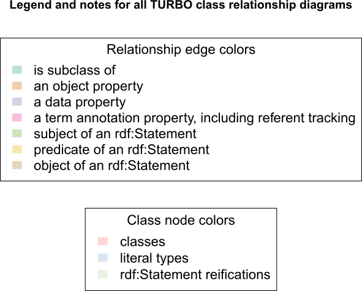](images/i2i2c2c_legend.png)

## Example:  <a id="diagEncViz">All relations involving `healthcare encounter`</a>

There are instances of class `biobank consenter` that participate in instances of class `healthcare encounter` (http://purl.obolibrary.org/obo/OGMS_0000097 from the Ontology for General Medical Science), which is in turn a subclass of `process`.   The following illustration takes class `health care encounter` as its hub.  Classes with at least one instance having a relationship with at least one instance of `healthcare encounter` (like `biobank consenter`) are considered satellites in this diagram.  In summary, the diagram shows the hub, all of the observed relations between instances of the hub and instances of the satellites, and all relationships between instances of the various satellites.

_These diagrams depict a cumulative generalization of what has been stated about instances of the hub class. The presence of the various satellite classes and properties in the diagram does not mean that every instance of healthcare encounter will have all of the depicted relations with instances of all of the depicted satellite classes. For example, there could be some healthcare encounter with no length measurement assay or mass measurement assay as its parts. Conversely, this diagram doesn’t mean that a healthcare encounter instance can't have two or more mass measurement assays as its parts Finally, it should be noted that the relations that a satellite can participate in are not shown exhaustively. If satellite X has a relationship with an instance of class Y, but no instances of the hub has an y relation with any instances of class Y, class Y will not appear in the diagram. In order to see this relationship between satellite class X and the class Y, find the diagram in which class X appears as the hub. Likewise, the relationships between satellites may not actually contribute to the understanding of the hub. This is especially true when rdf:Statements appear as satellites._

## TURBO's use of `rdf:Statement`s for making triples about triples

TURBO uses instances of class `rdf:Statement` for reification of triples about triples, for example when provenance or supporting data is required. (See https://www.w3.org/TR/rdf-schema/#ch_statement) This is a possible source of confusion, as it is not unusual to see RDF triples themselves referred to as "statements". The complete usage of a rdf:Statement instance would include at least three triples in which it would appear in the 1st (subject)position, in addition to a triple in which it was asserted that the instance was, in fact, of class rdf:Statement. The predicates for these triples would be

- "http://www.w3.org/1999/02/22-rdf-syntax-ns#subject"
- "http://www.w3.org/1999/02/22-rdf-syntax-ns#predicate"
- "http://www.w3.org/1999/02/22-rdf-syntax-ns#object".

For example, Drivetrain makes conclusions about the qualities and values of things, based on rules and available data. It might be necessary to say, in a qualified way, that some person's biological sex is male. Drivetrain will not put a direct triple to that effect in the repository's default graph, because the conclusion could change if new data became available in the future or if a user of the TURBO system wished to re-run Drivetrain with custom rules for their own particular needs.

The diagram below shows that there are `rdf:Statement`s that take an ***instance*** of class `biological sex` as their subject and the ***class*** `male` as their object.  The automated diagram generator doesn't yet clarify that `biological sex` is really being invoked as a class, which is different from the way the Class Relation Diagrams represent instance to instance relations as generalizations about classes.  Additionally, the diagram generator doesn't yet show the predicate in this statements, which happens to be `rdf:type`

[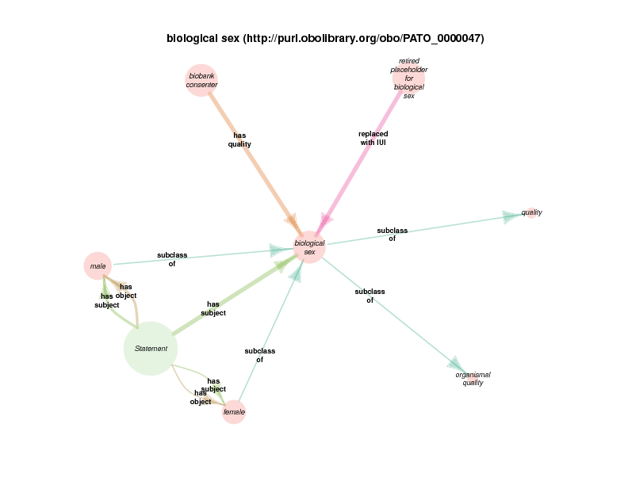](i2i2c2c_pngs/PATO_0000047_biological_sex.png)

The diagram in which `statement` appears as the hub does show all of the instantiated statement predicates, although which statements, predicated and objects go together is not formally shown.  A forced manual layout of the diagram has been used to hint that statements taking a class as their object are likely to use rdf:type as their predicate.

As mentioned above, when a `rdf:Statement` is a satellite, its relations with other satellites may or may not be illustrative with respect to the hub.  The next diagram shows that a statement can take `female gender identity datum` (the hub in this case) as the supporting data.  Statements of this type are the same as those in the `biological sex` diagram above:  statements that assert the type of some` biological sex`, which is the quality of some person known to the Biobank, can take a subclass of `gender identity datum`, possibly self-reported by that person, as supporting evidence.

[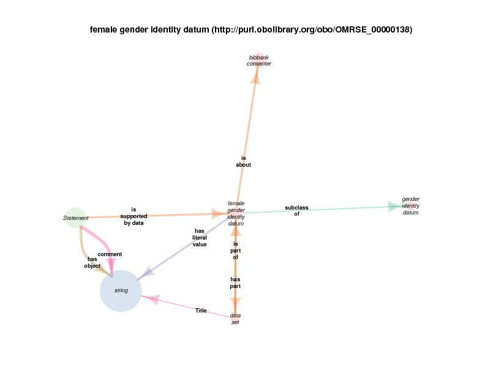](i2i2c2c_pngs/OMRSE_00000138_female_gender_identity_datum.png)

`string` appears as a satellite in this diagram because instances of `gender identity datum`, or any of its subclasses, take a string (like "M" or "F" or even "0" or "1", etc.) as their literal value.

Since `string` and `statement` both appear as satellites of `female gender identity datum`, any relationship between any instance of either is depicted in the diagram.  The fact that there are `statement `s with `string`s as their `comment`s or `object`s probably doesn’t' provide any further understanding of class `female gender identity datum`.  Those relations are included out of consistency and as a consequence of a high-throughput automated diagram generator.

## <a id="literals">Relationships with literal values</a>

As mentioned above, RDF allows relationships between instances and data literals (in addition to instance-to-instance relations).  In some of the Class Relations Diagrams, there are circles that represent particular ***types*** of literals that are allowed as the object of particular properties, such as `string` or `boolean`.   

For example, there are `health care encounter` instances that have mass measurement assays as parts.  A mass measurement assays can have a mass measurement datum as output, which can in turn be linked to scalar value specification, which have a specified value.  The scalar value specification is a thing with a URI, while the actual value is a literal.  The scalar value specification can also have a relationship with a unit.

[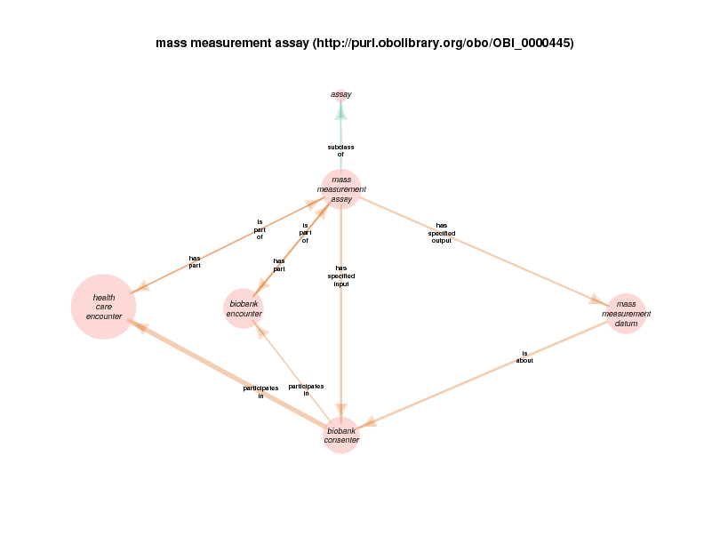](i2i2c2c_pngs/OBI_0000445_mass_measurement_assay.png)

[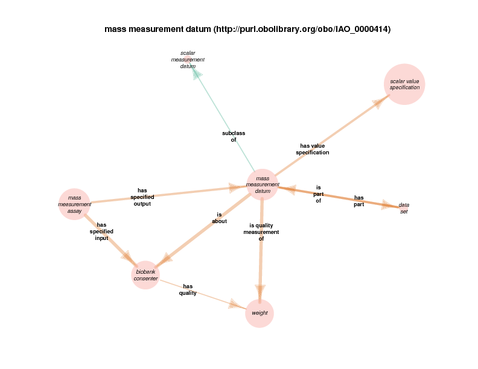](i2i2c2c_pngs/IAO_0000414_mass_measurement_datum.png)

[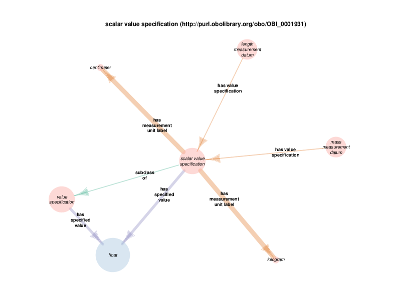](i2i2c2c_pdfs/16_i2i2c2c_20180320_i2i2c2c_layout_nicely.pdf.png)

_When exploring a TURBO repository with [GraphDB's](#graphdb_blurb) <a id="graphviz">graph visualizer</a>, note that literal values are not represented as circular nodes in the visualization.  Rather, one must click on an instance's circle and then click on the ***i*** in the upper right for information about literal values.  Here we see that class `Acetaminophen 500 MG Oral Tablet [Tylenol]` (http://purl.obolibrary.org/obo/DRON_00073395) has a RXNORM value (http://purl.obolibrary.org/obo/DRON_00010000) of "209459"_

[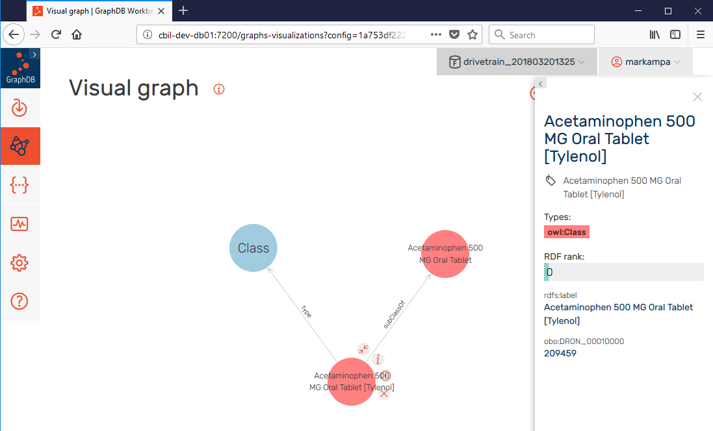](images/graphdb_literals_new_onto.png)

 
## [Shortcut Relations](karma.md#shortcut_rels)

Shortcut relations are an important part of the overall [TURBO](drivetrain.md) workflow.  They are defined as Datatype properties in the TURBO ontology, specifically `subProperties` of `instantiationHybridShortcut`.  Structurally, they link an instance of some class to a literal value (as was seen in the previous section).  However, they are not shown in any of the Relations Diagrams, as they are replaced with other properties and instances of implicit classes during Drivetrain's expansion phase.

The TURBO ontology contains brief `rdf:comment`s about the shortcut properties, but all of the logic for expanding them is implemented within the Drivetrain application code.  The TURBO ontology also contains a small number of chained object properties like `has birth`, which are fully defined within the ontology itself and should not be confused with *TURBO Shortcut Properties*.  For example, `has birth` is defined in the OWL2 language as `'participates in' o inverse (starts)`.  Taking into consideration this property's domain and range, it says that some `Homo sapiens` `participates in` some process that is `start`ed by some `temporal boundary`. 

## <a id="rt_prototype">Prototypical [Referent Tracking](drivetrain.md#referent-tracking) Relations</a>  

The `replaced with IUI` relationship from `retired placeholder for health care encounter` to `health care encounter` indicates that `health care encounter` instances are subject to referent tracking.  The larger size of the `retired placeholder for health care encounter` node, relative to the size of the referent tracked `health care encounter` node, illustrates the typical referent tracking outcome:  many references that are naively asserted to point to unique instances are in reality unique but not singular.  In other words, a referent tracked `health care encounter` instance will frequently be the object of `replaced with IUI` relationships from multiple `retired placeholder for health care encounter` instances.

Referent tracked instances also have a `referent tracked?` relationship with a boolean value, which is always `true`.  At the end of the referent tracking process, the presence of any `health care encounter` instances (or any other referent-trackable instances) lacking a `referent tracked?` `true` relation is considered an error state.  The `referent tracked?` relationship, along with a few related relationships, is omitted from the Class Relations diagrams due to visual clutter.  Another example of a hidden relationship is that all referent tracked instances have an `obsolescence reason specification`, which always takes an instance of class `placeholder removed` as its object (at least at this point in time.)  Note that all of these relations are of the owl:AnnotationProperty type, not the previously discussed object properties between instances or the datatype properties between and instance and a data literal.  TURBO implements referent tracking with owl:AnnotationProperties as they make statements about terms, not about the portions of reality that those terms point to.  These referent tracking relations, including those that are hidden in the Class Relations Diagrams, apply to several other trackable classes and are shown in the diagram below.  

#### Note that the pre-expansion string is the link back to the URI used in the shortcut triples, typically generated by Karma.  Should Karma remain the too for routinely converting tabular data into shortcut triples, it might be beneficial to capture the row and column from which a given data value came.

#### Also note that the "Trackable entity" in the diagram below is not an individual class.  It refers to [any of the classes that are subject to referent tracking.](#addl_ptypes)

[//]: # (doesn’t show the pre-expansion text, which is actually the most useful for linking back to the table)

[//]: # (redraw this in inkscape to match the colors of the existing tables)

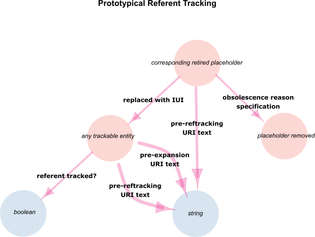](images/prototypical_referent_tracking_diagram.png)

### `pre-reftracking uri text`: a hook into provenance diagnostics

Anyone running the Drivetrain application on their own will notice that, upon completion, there won't be any instances with URIs whose string values are equivalent to the `pre-reftracking uri text` values.  These values are of diagnostic use to the  TURBO development team, as the repository can be explored or dumped in intermediate states over the course of running the application (specifically when running in `Presentation Driver` mode).  They also serve to illustrate the combined effects of shortcut expansion and referent tracking.  The shortcut triples instantiated from a tabular datasource can contain repetitive and contradictory information, and could say something like this (informally) 

    "study participant 1" "has birth date" "2010-11-22"
    "study participant 1" "has birth date" "2011-10-22"
    "study participant 1" "has birth date" "2010-11-22"

During expansion, a distinct instance of class `study participant with biobank donation` will be created for each row in that set of triples, each with its own URI.  If, during referent tracking, it is found that the three instances share a common signature of data items (like patient identifiers), they will be remodeled as three instances of `retired placeholder for 'biobank study participant'` and one single referent tracked instance of `study participant with biobank donation`, all of which will be assigned new URIs.  

In addition to this, three instances each of the classes `date of birth` and `temporal boundary` will also be created during shortcut expansion, again with new URIs, as the whole point of the shortcuts is to spare clinical informaticians from having to create models that say (informally) 

    Human beings have births.  
    The births are temporal boundaries.  
    Dates of birth have date values 
        and are about the temporal boundaries that mark the start of people's lives.

If what initially appeared to be three different study participants is re-modeled as a single study participant during referent tracking, then the `date of birth` and 'temporal boundary` instances will each be remodeled into one instance of each class, with still more new URIs.

All of these various URIs are accounted for with `pre-reftracking uri text`, [among other properties](#addl_ptypes).  Without them, it would be difficult or impossible to reconstruct provenance.
 
## <a id="addl_ptypes">Additional prototypes:</a>  Shortcut Expansion and Conclusionation

Like the `pre-reftracking uri text` property on referent tracked entities, a `pre-expansion uri text` property will be present on the entities that are instantiated by [Karma](karma.md)  and therefore appear as the subjects of shortcut relations.  There is, however, no corresponding "expanded?" Boolean property.  Conversely, any entity that has been conclusionated will have a `conclusionated` property, with a value of **true**, but will not have anything like a "pre-conclusionation uri text" value.  Conclusionated instances may have other literal properties to capture the most frequently observed value, a mean value, or so on.

[//]: # (add something about expansion inputs and outputs in the future?)

|                 class                  | conclusionated? | referent tracked? |
|----------------------------------------|-----------------|-------------------|
| adipose tissue                         |                 | TRUE              |
| biobank consenter                      |                 | TRUE              |
| biobank consenter CRID                 |                 | TRUE              |
| biobank consenter registry denoter     |                 | TRUE              |
| biobank consenter symbol               |                 | TRUE              |
| biobank encounter                      |                 | TRUE              |
| biobank encounter CRID                 |                 | TRUE              |
| biobank encounter registry denoter     |                 | TRUE              |
| biobank encounter start                |                 | TRUE              |
| biobank encounter start date           |                 | TRUE              |
| biobank encounter symbol               |                 | TRUE              |
| biological sex                         |                 | TRUE              |
| body mass index                        | TRUE            |                   |
| date of birth                          | TRUE            |                   |
| female                                 | TRUE            |                   |
| health care encounter                  |                 | TRUE              |
| health care encounter CRID             |                 | TRUE              |
| health care encounter registry denoter |                 | TRUE              |
| health care encounter start            |                 | TRUE              |
| health care encounter start date       |                 | TRUE              |
| health care encounter symbol           |                 | TRUE              |
| height                                 |                 | TRUE              |
| male                                   | TRUE            |                   |
| start of neonate stage                 |                 | TRUE              |
| weight                                 |                 | TRUE              |

## <a id="clrds">TURBO Class Relations Diagrams</a>, in alphabetical order

[//]: # (right now, clicking redirects to the image alone, but it may not look zoomed in.  Therefore removed "_Click to expand._")

[//]: # (would be nice to have a different color for individuals, along with an indication of the class they belong to)

[//]: # (I could swear that both the individual and the class are or were shown in some of the diagrams)

[//]: # (may need to add queries related to individuals in i2i2c2c class in drivetrain)

_There are a few classes that don't have their own diagram, as it would only show one other class and a subClassOf relationship.  Every instantiated class does appear in at least one other diagram, as well as the listing at the end of this document._

[//]: # (list them!)

[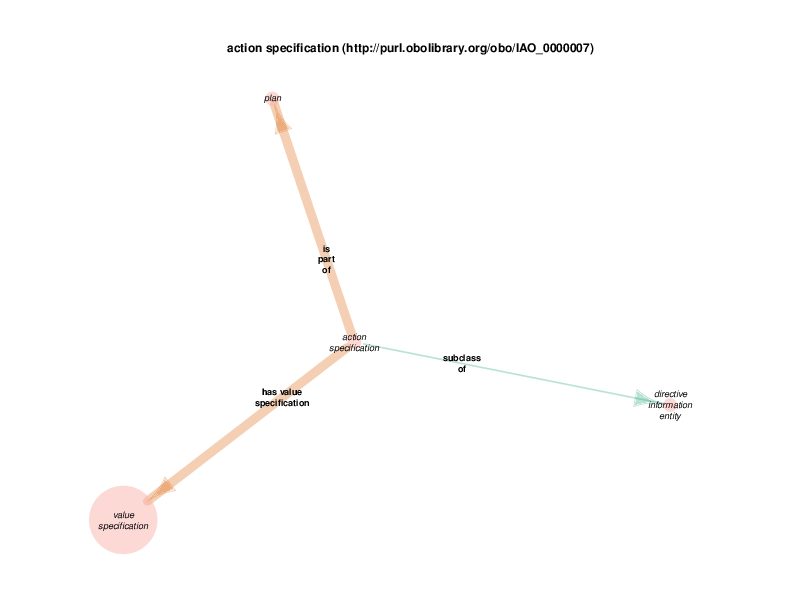](i2i2c2c_pdfs/6_i2i2c2c_20180320_i2i2c2c_layout_nicely.pdf.png)

[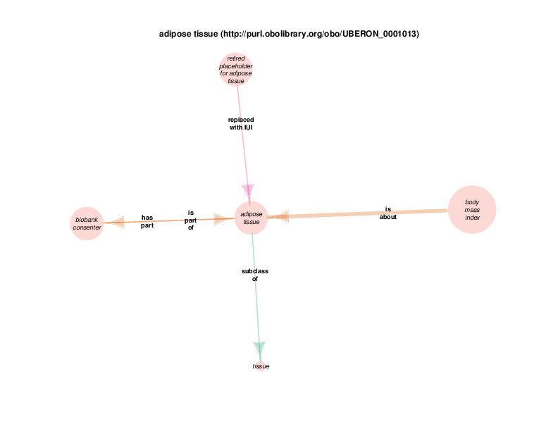](i2i2c2c_pdfs/26_i2i2c2c_20180320_i2i2c2c_layout_nicely.pdf.png)

[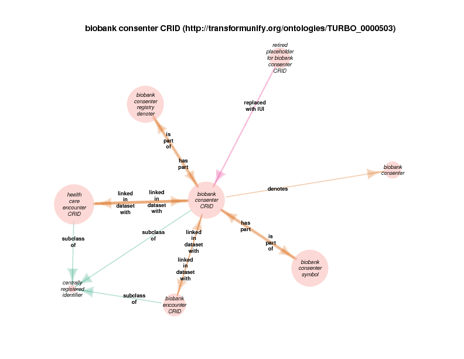](i2i2c2c_pngs/TURBO_0000503_biobank_consenter_CRID.png)

The `linked in data set with` property can be used to describe any structural relationship between two data values found in any type of input data (CSV, XML, JSON, etc.).  Following that, the intention is that some method in Drivetrain would deduce some portion of reality based on this structural relationship.  For example, when a study participant identifier value and an encounter identifier value appear in the same row of a join table, it could be deduced that the denoted participant participated in the denoted encounter.

Deductions like that could theoretically be implemented as OWL axioms, but in practice they are currently hard-coded into the Drivetrain application logic.

[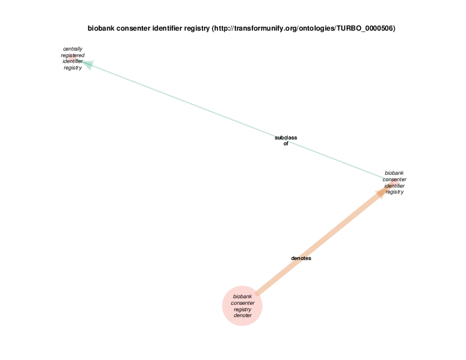](i2i2c2c_pdfs/37_i2i2c2c_20180320_i2i2c2c_layout_nicely.pdf.png)

[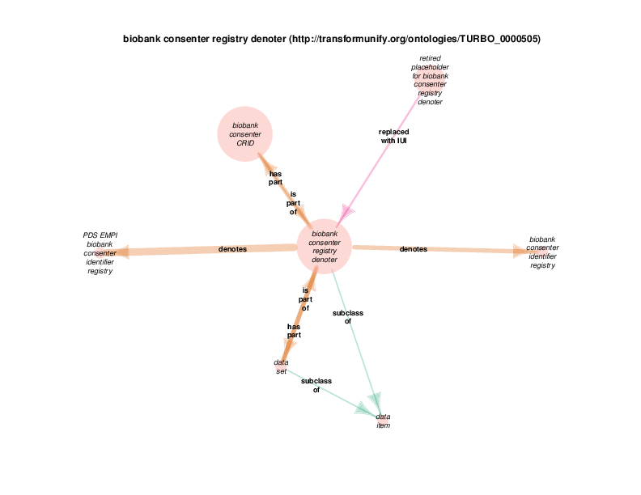](i2i2c2c_pdfs/36_i2i2c2c_20180320_i2i2c2c_layout_nicely.pdf.png)

[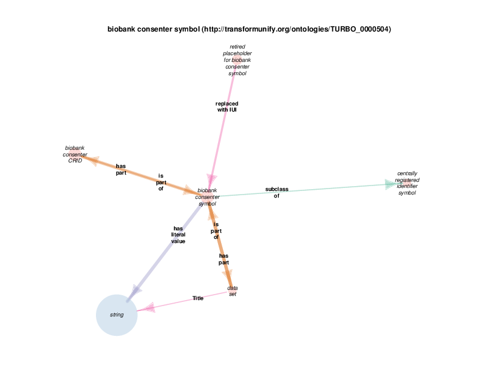](i2i2c2c_pdfs/35_i2i2c2c_20180320_i2i2c2c_layout_nicely.pdf.png)

[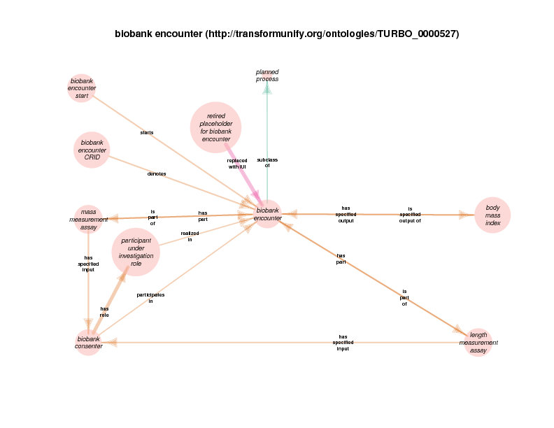](i2i2c2c_pngs/TURBO_0000527_biobank_encounter.png)

[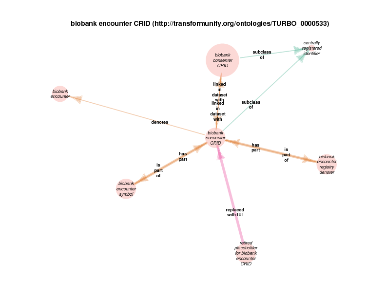](i2i2c2c_pngs/TURBO_0000533_biobank_encounter_CRID.png)

[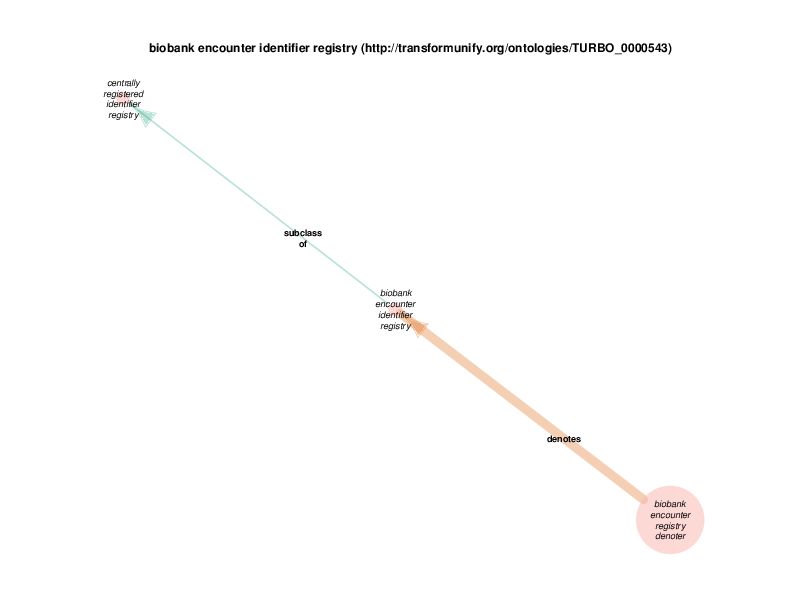](i2i2c2c_pdfs/51_i2i2c2c_20180320_i2i2c2c_layout_nicely.pdf.png)

[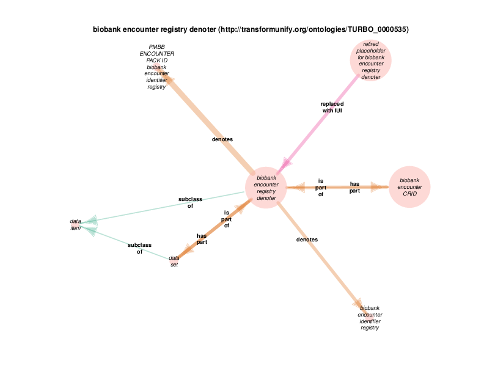](i2i2c2c_pdfs/50_i2i2c2c_20180320_i2i2c2c_layout_nicely.pdf.png)

[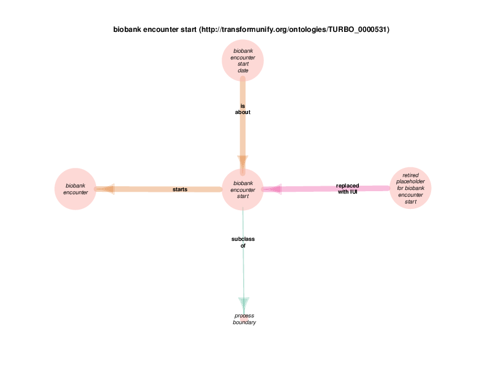](i2i2c2c_pdfs/46_i2i2c2c_20180320_i2i2c2c_layout_nicely.pdf.png)

[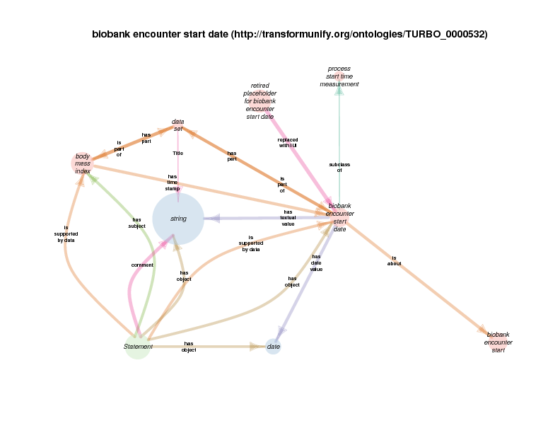](i2i2c2c_pngs/TURBO_0000532_biobank_encounter_start_date.png)

[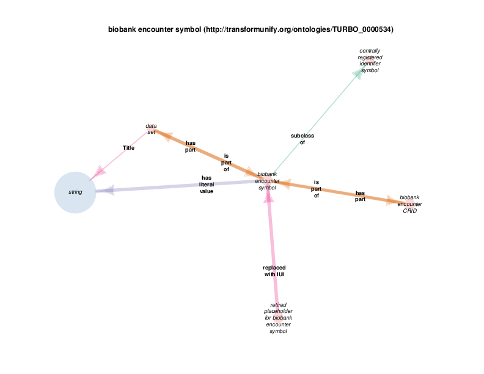](i2i2c2c_pdfs/49_i2i2c2c_20180320_i2i2c2c_layout_nicely.pdf.png)

[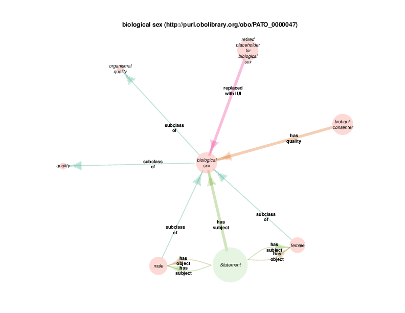](i2i2c2c_pdfs/22_i2i2c2c_20180320_i2i2c2c_layout_nicely.pdf.png)

[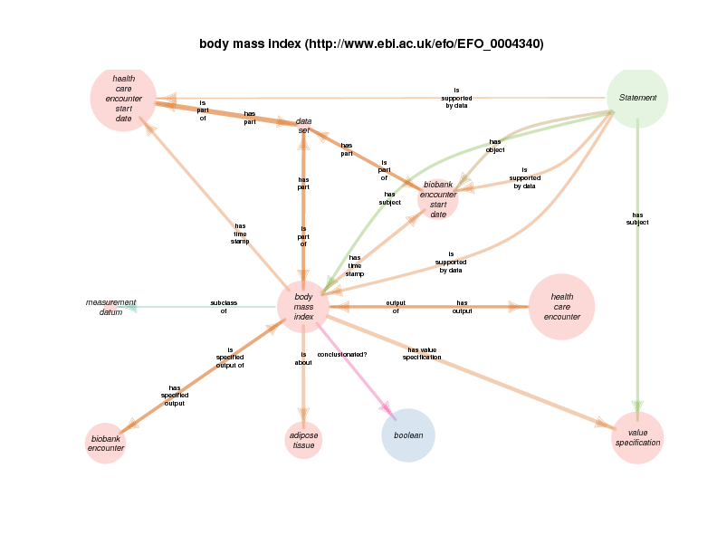](i2i2c2c_pngs/EFO_0004340_body_mass_index.png)

_This diagram should not be misinterpreted to mean that the supporting data for a `rdf:Statement` about `body mass index` instance `BMI1` is necessarily itself.  Rather, there are `rdf:Statement`s about `body mass index` instances which take, as their supporting data, **some** `body mass index` instance.  In the current implementation, a `body mass index` which is the output of a healthcare encounter is frequently the supporting data for a statement about a `body mass index` that is associated with a biobank encounter_

_Furthermore, when a conclusionation process generates `rdf:Statement`s, direct triples with the same semantics are also generated.  The direct triples, as well as the `rdf:Statement` instances, are generated in a named graph to isolate them from ground truths and data instantiated out of tabular inputs._

A `health care encounter start` can serve as the time stamp for a BMI that is conclusionated to be related to a `biobank encounter`.  This relationship documents the time at which a measured (on conclusionated) BMI measurement holds true.  One could argue that this is a *slight* departure from OBI usage, in which `has time stamp` typically describes the time at which a measurement was recorded, like the height of a plant is serially *recorded* at multiple times.

[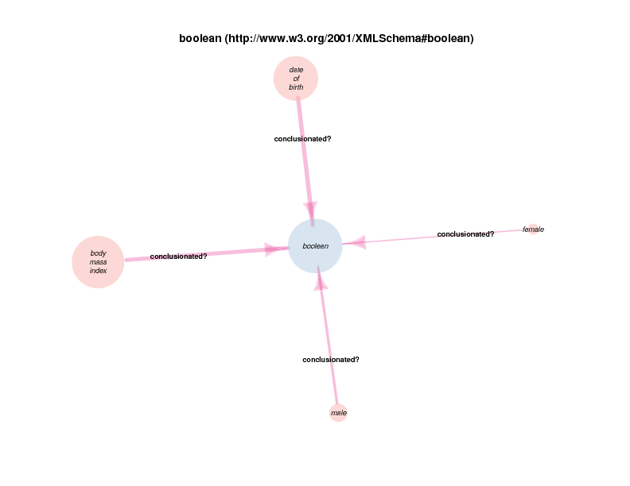](i2i2c2c_pngs/XMLSchema_boolean_boolean.png)

[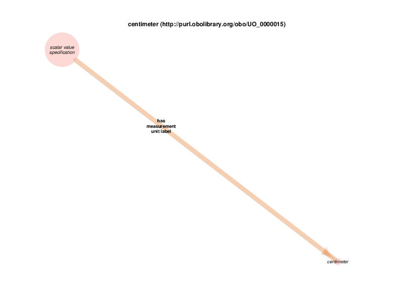](i2i2c2c_pdfs/29_i2i2c2c_20180320_i2i2c2c_layout_nicely.pdf.png)

[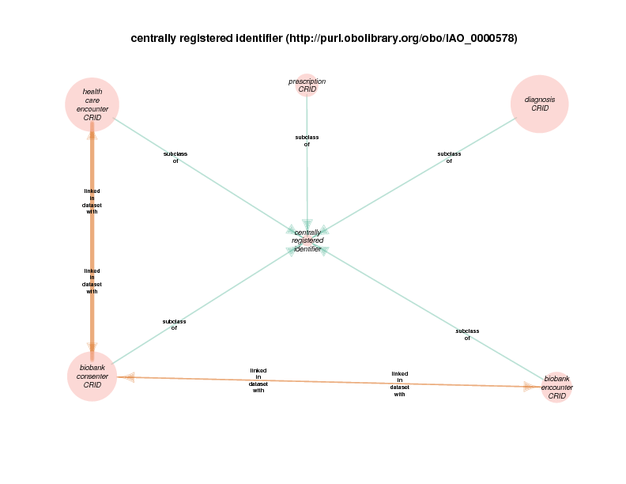](i2i2c2c_pngs/IAO_0000578_centrally_registered_identifier.png)

[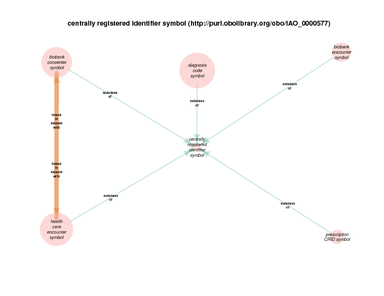](i2i2c2c_pngs/IAO_0000577_centrally_registered_identifier_symbol.png)

[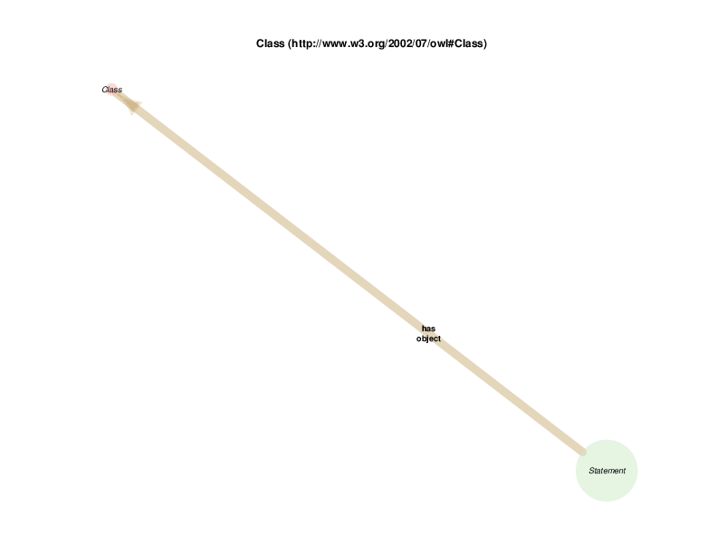](i2i2c2c_pdfs/91_i2i2c2c_20180320_i2i2c2c_layout_nicely.pdf.png)

[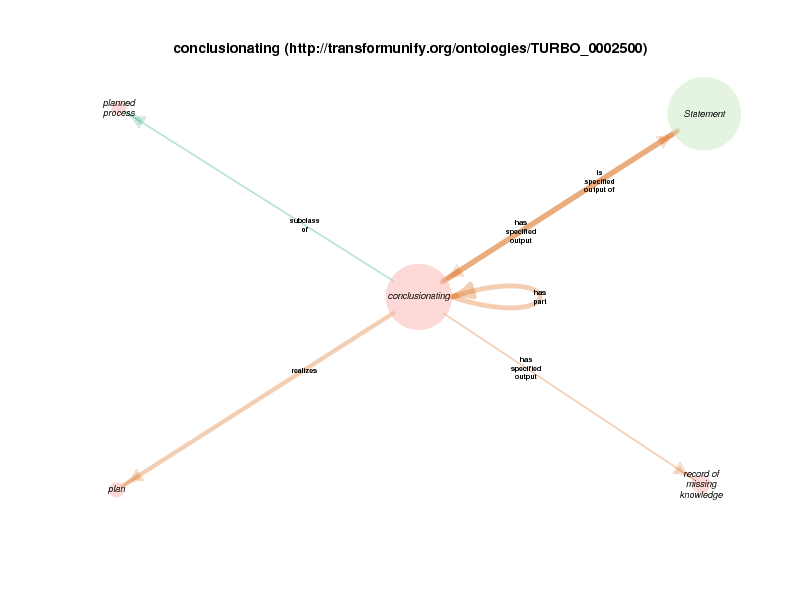](i2i2c2c_pngs/TURBO_0002500_conclusionating.png)

_Conclusionation processes can have multiple nested sub-parts.  This is represented in the Class Relations Diagram with `has_part`/`part_of` loops._

_Instances of `record of missing knowledge` are used to communicate one possible outcome of conclusionating, for example, a study participant’s BMI at the time of a biobank encounter.  If the conclusionator was unable to identify a trustworthy BMI numerical value at the date of the biobank encounter, a `record of missing knowledge` is generated.  Otherwise, an instance of `rdf:Statement` is generated_

The illustrated `conclusionating 'has specified output' 'record of missing knowledge'` and any potential `'record of missing knowledge' about 'biobank encounter'` relationships are among a handful of non-canonical relationships illustrated in this document.  They are not meant to say that every `conclusionating` process has a `record of missing knowledge` as output, or that a TURBO repository is wrong or incomplete if the `'record of missing knowledge' about 'biobank encounter'` relationship doesn't appear.

[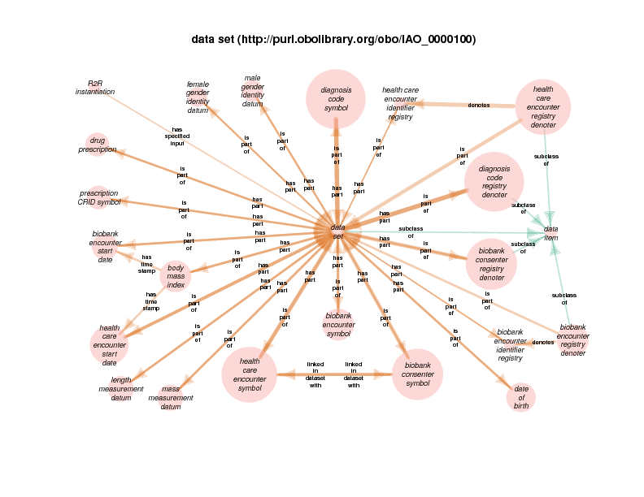](i2i2c2c_pngs/IAO_0000100_data_set.png)

The `'data set' subClassOf 'data item'` relationship is asserted in [The Information Artifact Ontology](http://www.ontobee.org/ontology/IAO?iri=http://purl.obolibrary.org/obo/IAO_0000100), the ontology in which those two terms are originally defined within the OBO foundry. 

Data sets have strings as their titles.  This relationship has been omitted for the sake of the visual layout.

[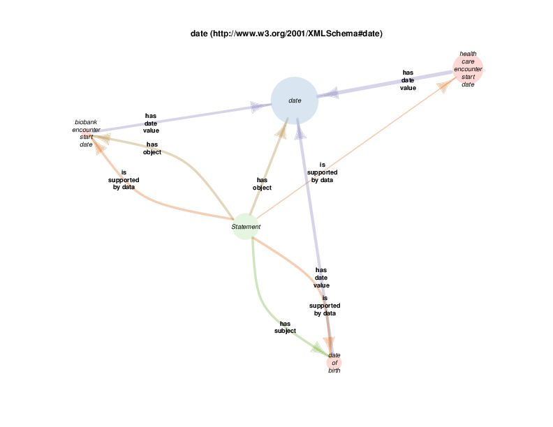](i2i2c2c_pdfs/87_i2i2c2c_20180320_i2i2c2c_layout_nicely.pdf.png)

[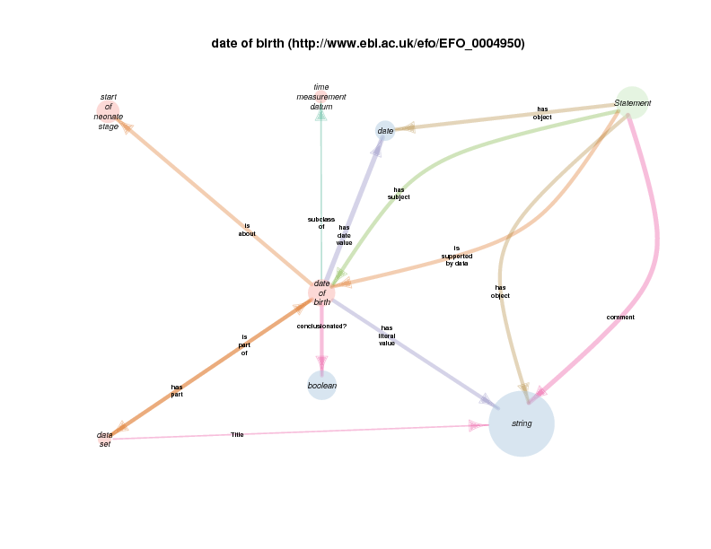](i2i2c2c_pngs/EFO_0004950_date_of_birth.png)

[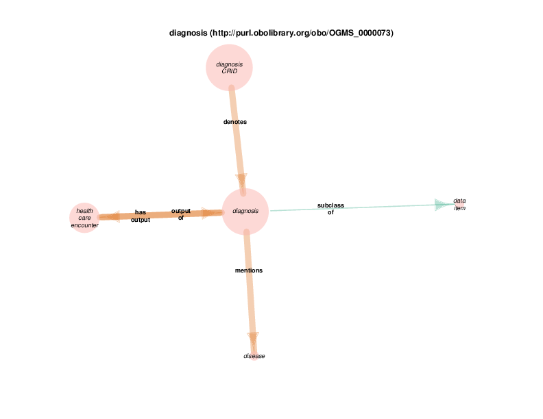](i2i2c2c_pdfs/18_i2i2c2c_20180320_i2i2c2c_layout_nicely.pdf.png)

Actually, diagnosis instances don't mention instances of class disease.  That relationship is manually added to the class-to-class transformation of the instance-to-instance data in the TURBO ontology.  

This is motivated by the ontology and RDF data sets that TURBO has chosen for modeling diagnosis codes and diseases:

- http://obofoundry.org/ontology/mondo.html
- https://bioportal.bioontology.org/ontologies/ICD9CM
- https://bioportal.bioontology.org/ontologies/ICD10CM

Those datasets represent each disease or diagnosis as a subclass of a more general disease or diagnosis class, up to very general statements like `neoplastic disease` (http://purl.obolibrary.org/obo/MONDO_0023370) is a subclass of `disease` (http://purl.obolibrary.org/obo/MONDO_0000001)

The data that TURBO uses as input has not, as of this point, actually mentioned the URIs of diseases or diagnoses.  Rather, they include textual values like ICD-10:I21.02, which is a cross reference to class `ST elevation (STEMI) myocardial infarction involving left anterior descending coronary artery` in MONDO.  In other words, liking form these diagnosis code strings to the URI for a disease requires adding a source of knowledge about disease classes, such as the above mentioned Monarch Disease Ontology (MONDO), to the TURBO repository, followed by running conditional SPARQL insert triples to build the links. 

The TURBO team takes a conservative approach to modelling the ICD codes that can appear as the output of a healthcare encounter. Specifically, the intention is to avoid asserting that a study participant suffered from any particular disease solely because a particular code was recorded. Updates to the ontology may use language like "icd code assignment" and/or "billing/diagnosis code".

The benefit of linking diagnosis code data to a hierarchy of diseases is the ability to make broad queries, enabled by OWL2 reasoning. Some study participant may have participated in a healthcare encounter in which the code ICD-10:I21.02 ("ST elevation (STEMI) myocardial infarction involving left anterior descending coronary artery") was recorded. Given the appropriate triple patterns, this study participant could be discovered with a query that mentions http://purl.obolibrary.org/obo/DOID_5844, "myocardial infarction" in general.

[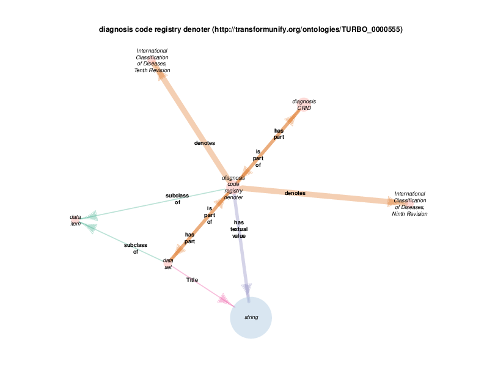](i2i2c2c_pdfs/54_i2i2c2c_20180320_i2i2c2c_layout_nicely.pdf.png)

_`international classification of diseases, ninth revision` (http://ncicb.nci.nih.gov/xml/owl/EVS/Thesaurus.owl#C71890) and `international classification of diseases, tenth revision` (http://ncicb.nci.nih.gov/xml/owl/EVS/Thesaurus.owl#C71892) are defined by the TURBO ontology as individuals from class `international classification of diseases` (http://ncicb.nci.nih.gov/xml/owl/EVS/Thesaurus.owl#C49474), not classes themselves.  That should be distinguished from individuals who are instantiated, based on input data, within the TURBO repository._

_Those are currently the only individual of that class in the TURBO ontology There is no reason that other registries of diagnosis and/or billing codes couldn't be added to the TURBO ontology._

[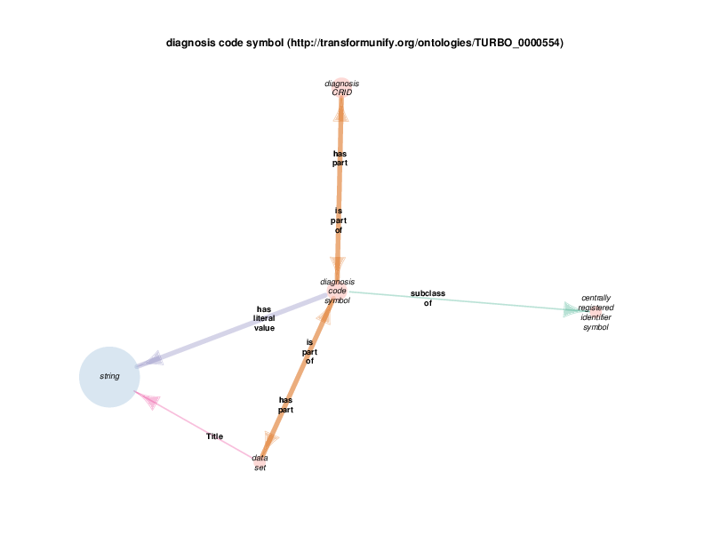](i2i2c2c_pdfs/53_i2i2c2c_20180320_i2i2c2c_layout_nicely.pdf.png)

[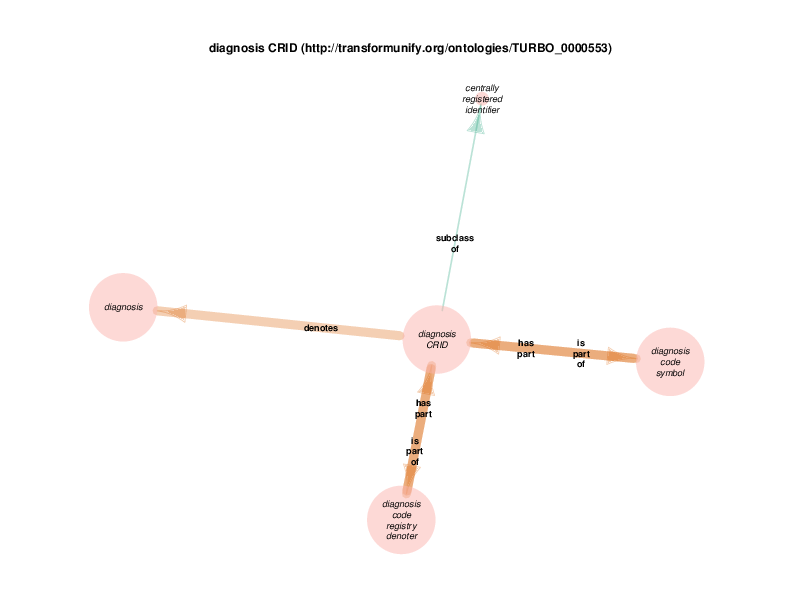](i2i2c2c_pdfs/52_i2i2c2c_20180320_i2i2c2c_layout_nicely.pdf.png)

[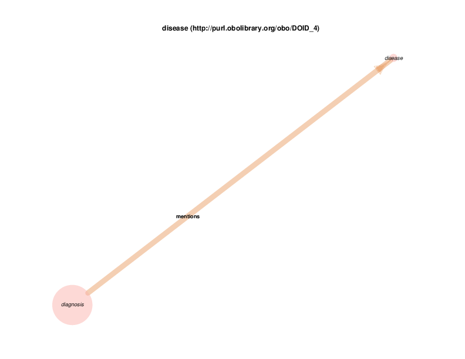](i2i2c2c_pdfs/4_i2i2c2c_20180320_i2i2c2c_layout_nicely.pdf.png)

[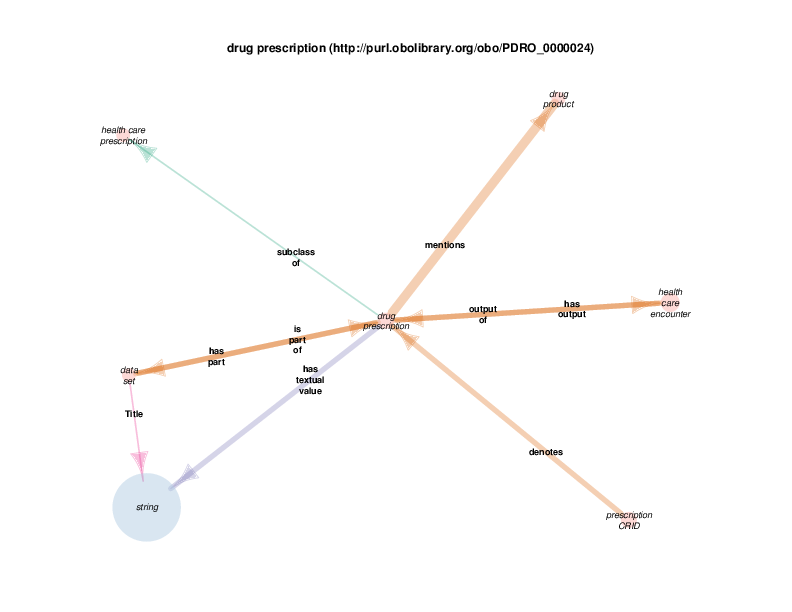](i2i2c2c_pdfs/25_i2i2c2c_20180320_i2i2c2c_layout_nicely.pdf.png)

[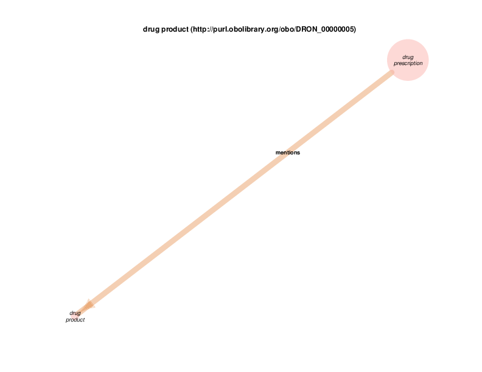](i2i2c2c_pdfs/5_i2i2c2c_20180320_i2i2c2c_layout_nicely.pdf.png)

[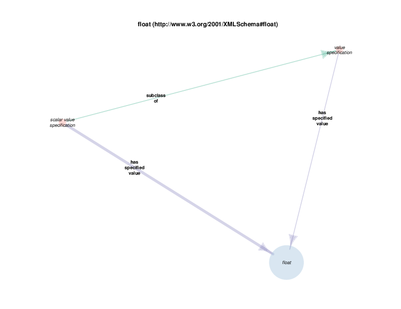](i2i2c2c_pdfs/88_i2i2c2c_20180320_i2i2c2c_layout_nicely.pdf.png)

[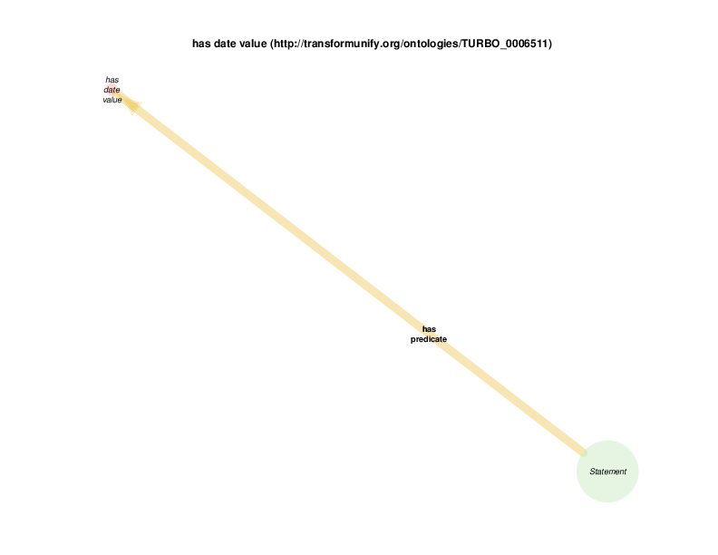](i2i2c2c_pdfs/80_i2i2c2c_20180320_i2i2c2c_layout_nicely.pdf.png)

[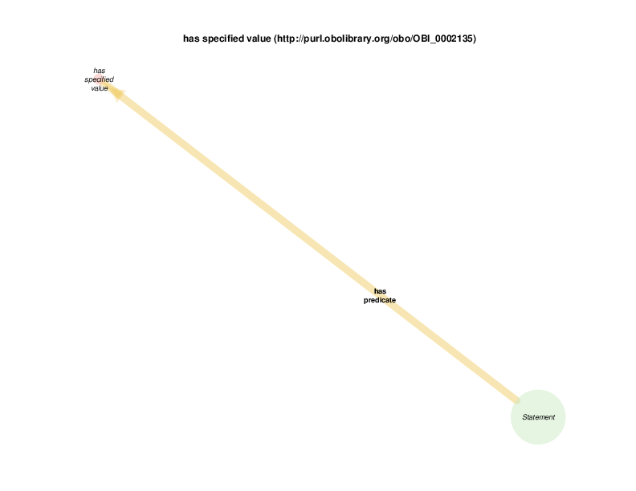](i2i2c2c_pdfs/17_i2i2c2c_20180320_i2i2c2c_layout_nicely.pdf.png)

[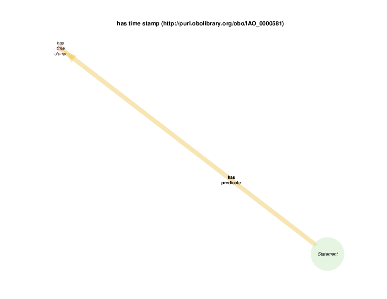](i2i2c2c_pdfs/12_i2i2c2c_20180320_i2i2c2c_layout_nicely.pdf.png)

[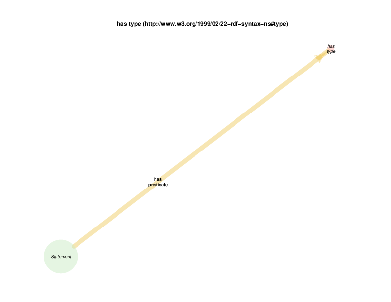](i2i2c2c_pdfs/84_i2i2c2c_20180320_i2i2c2c_layout_nicely.pdf.png)

[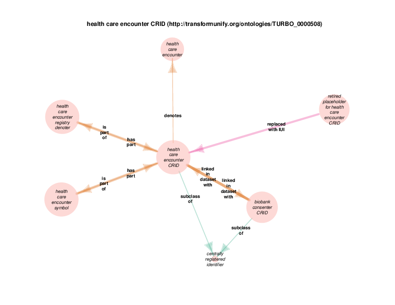](i2i2c2c_pdfs/38_i2i2c2c_20180320_i2i2c2c_layout_nicely.pdf.png)

[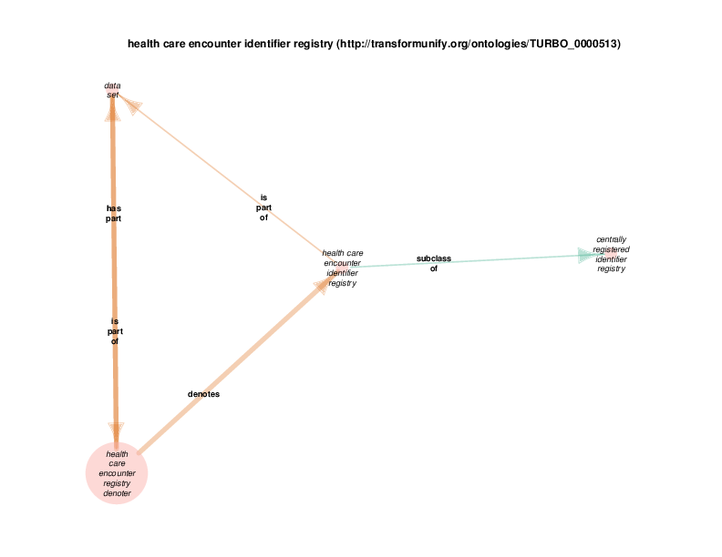](i2i2c2c_pdfs/43_i2i2c2c_20180320_i2i2c2c_layout_nicely.pdf.png)

[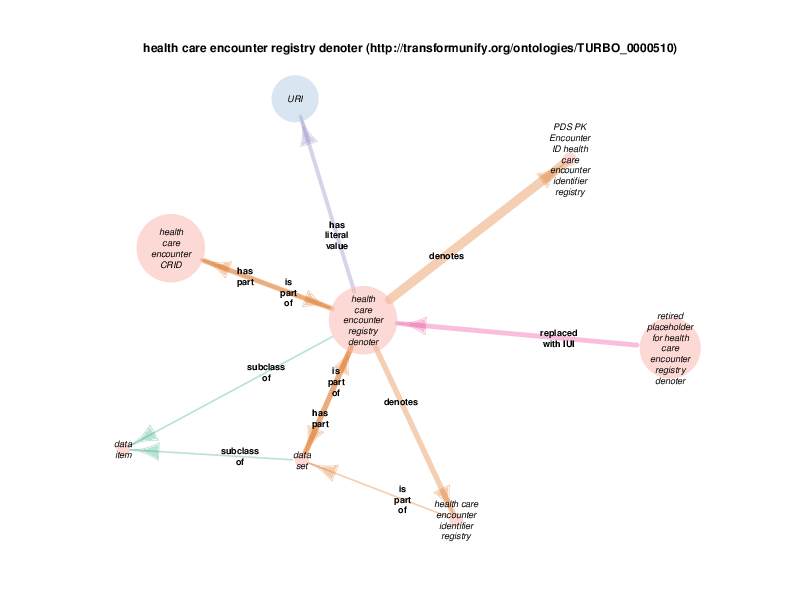](i2i2c2c_pdfs/40_i2i2c2c_20180320_i2i2c2c_layout_nicely.pdf.png)

[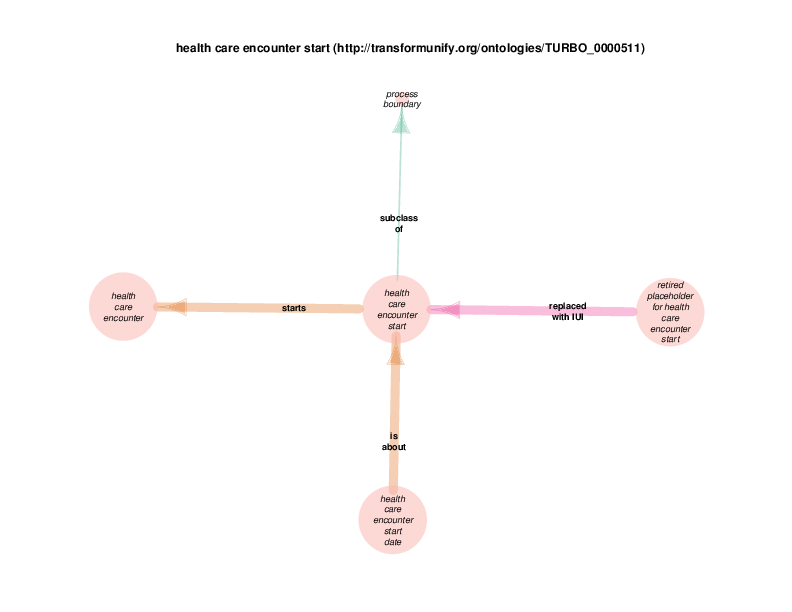](i2i2c2c_pdfs/41_i2i2c2c_20180320_i2i2c2c_layout_nicely.pdf.png)

[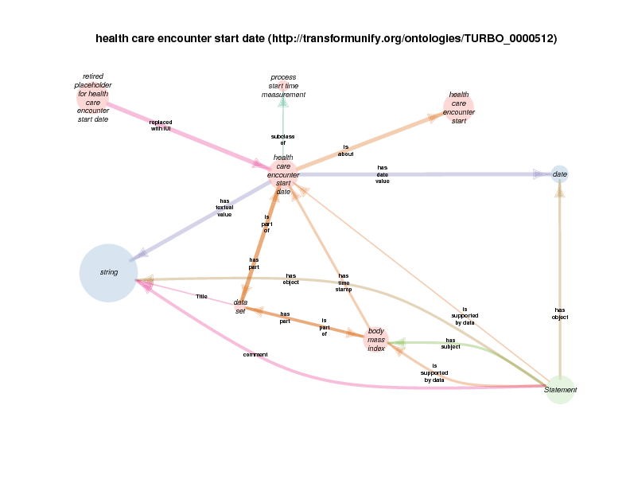](i2i2c2c_pngs/TURBO_0000512_health_care_encounter_start_date.png)

[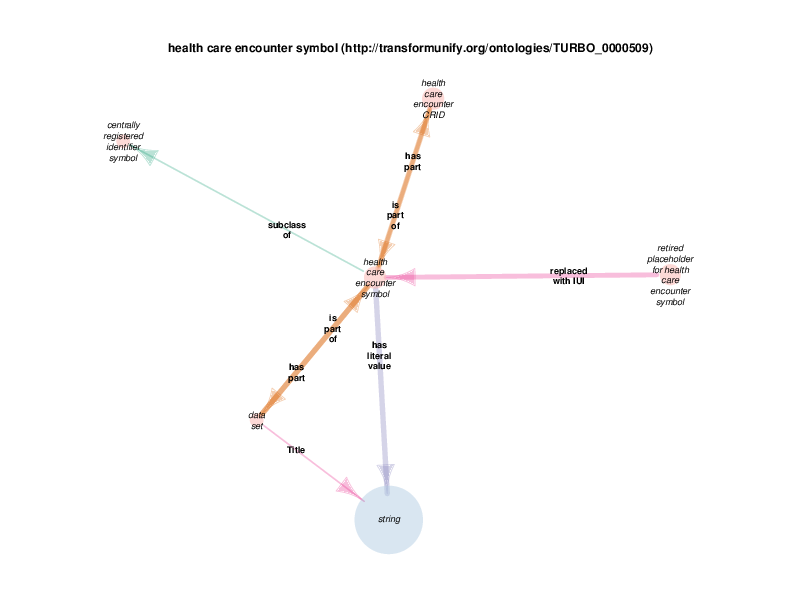](i2i2c2c_pdfs/39_i2i2c2c_20180320_i2i2c2c_layout_nicely.pdf.png)

[](i2i2c2c_pdfs/23_i2i2c2c_20180320_i2i2c2c_layout_nicely.pdf.png)

[](i2i2c2c_pngs/nci_C71890_icd9_diagram.png)

[](i2i2c2c_pdfs/3_i2i2c2c_20180320_i2i2c2c_layout_nicely.pdf.png)

[](i2i2c2c_pdfs/28_i2i2c2c_20180320_i2i2c2c_layout_nicely.pdf.png)

[](i2i2c2c_pngs/TURBO_0001511_length_measurement_assay.png)

[](i2i2c2c_pdfs/9_i2i2c2c_20180320_i2i2c2c_layout_nicely.pdf.png)

[](i2i2c2c_pdfs/21_i2i2c2c_20180320_i2i2c2c_layout_nicely.pdf.png)

[](i2i2c2c_pdfs/15_i2i2c2c_20180320_i2i2c2c_layout_nicely.pdf.png)

[](i2i2c2c_pdfs/10_i2i2c2c_20180320_i2i2c2c_layout_nicely.pdf.png)

[](i2i2c2c_pdfs/13_i2i2c2c_20180320_i2i2c2c_layout_nicely.pdf.png)

[](i2i2c2c_pdfs/30_i2i2c2c_20180320_i2i2c2c_layout_nicely.pdf.png)

[](i2i2c2c_pdfs/32_i2i2c2c_20180320_i2i2c2c_layout_nicely.pdf.png)

[](i2i2c2c_pdfs/14_i2i2c2c_20180320_i2i2c2c_layout_nicely.pdf.png)

[](i2i2c2c_pdfs/8_i2i2c2c_20180320_i2i2c2c_layout_nicely.pdf.png)

[](i2i2c2c_pdfs/31_i2i2c2c_20180320_i2i2c2c_layout_nicely.pdf.png)

[](i2i2c2c_pdfs/55_i2i2c2c_20180320_i2i2c2c_layout_nicely.pdf.png)

[](i2i2c2c_pdfs/56_i2i2c2c_20180320_i2i2c2c_layout_nicely.pdf.png)

[](i2i2c2c_pdfs/44_i2i2c2c_20180320_i2i2c2c_layout_nicely.pdf.png)

[](i2i2c2c_pdfs/89_i2i2c2c_20180320_i2i2c2c_layout_nicely.pdf.png)

[](i2i2c2c_pdfs/74_i2i2c2c_20180320_i2i2c2c_layout_nicely.pdf.png)

[](i2i2c2c_pdfs/57_i2i2c2c_20180320_i2i2c2c_layout_nicely.pdf.png)

[](i2i2c2c_pdfs/58_i2i2c2c_20180320_i2i2c2c_layout_nicely.pdf.png)

[](i2i2c2c_pdfs/60_i2i2c2c_20180320_i2i2c2c_layout_nicely.pdf.png)

[](i2i2c2c_pdfs/59_i2i2c2c_20180320_i2i2c2c_layout_nicely.pdf.png)

[](i2i2c2c_pdfs/67_i2i2c2c_20180320_i2i2c2c_layout_nicely.pdf.png)

[](i2i2c2c_pdfs/70_i2i2c2c_20180320_i2i2c2c_layout_nicely.pdf.png)

[](i2i2c2c_pdfs/72_i2i2c2c_20180320_i2i2c2c_layout_nicely.pdf.png)

[](i2i2c2c_pdfs/68_i2i2c2c_20180320_i2i2c2c_layout_nicely.pdf.png)

[](i2i2c2c_pdfs/69_i2i2c2c_20180320_i2i2c2c_layout_nicely.pdf.png)

[](i2i2c2c_pdfs/71_i2i2c2c_20180320_i2i2c2c_layout_nicely.pdf.png)

[](i2i2c2c_pdfs/75_i2i2c2c_20180320_i2i2c2c_layout_nicely.pdf.png)

[](i2i2c2c_pdfs/61_i2i2c2c_20180320_i2i2c2c_layout_nicely.pdf.png)

[](i2i2c2c_pdfs/62_i2i2c2c_20180320_i2i2c2c_layout_nicely.pdf.png)

[](i2i2c2c_pdfs/64_i2i2c2c_20180320_i2i2c2c_layout_nicely.pdf.png)

[](i2i2c2c_pdfs/65_i2i2c2c_20180320_i2i2c2c_layout_nicely.pdf.png)

[](i2i2c2c_pdfs/66_i2i2c2c_20180320_i2i2c2c_layout_nicely.pdf.png)

[](i2i2c2c_pdfs/63_i2i2c2c_20180320_i2i2c2c_layout_nicely.pdf.png)

[](i2i2c2c_pdfs/77_i2i2c2c_20180320_i2i2c2c_layout_nicely.pdf.png)

[](i2i2c2c_pdfs/27_i2i2c2c_20180320_i2i2c2c_layout_nicely.pdf.png)

_This diagram is non-canonical in that it aggregates all of the classes that serve as the subject or object of all `rdf:Statement` instances in the TURBO repository, along with all utilized predicate properties.  Information about which subjects, predicates and objects go together can be found in other diagrams in this section._

[](i2i2c2c_pdfs/XMLSchema_string_string.png)

Data sets have strings as their titles.  This relationship has been omitted for the sake of the visual layout.

[](i2i2c2c_pdfs/85_i2i2c2c_20180320_i2i2c2c_layout_nicely.pdf.png)

[](i2i2c2c_pdfs/24_i2i2c2c_20180320_i2i2c2c_layout_nicely.pdf.png)

## <a id="termTable2">URIs and all labels of terms instantiated in the current TURBO semantic repository</a>

_Clicking terms from ontologies from OBO and the EBI will navigate to a page with their definitions. No web-based term-resolver has been configured for the TURBO native terms yet, so clicking them will lead to an error page._

|                           term                            |                               labels                               |   type   |
|-----------------------------------------------------------|--------------------------------------------------------------------|----------|
| http://purl.obolibrary.org/obo/IAO_0000007                | action specification                                               | class    |
| http://purl.obolibrary.org/obo/UBERON_0001013             | adipose tissue                                                     | class    |
| http://purl.obolibrary.org/obo/OBI_0000070                | assay                                                              | class    |
| http://transformunify.org/ontologies/TURBO_0000502        | biobank consenter                                                  | class    |
| http://transformunify.org/ontologies/TURBO_0000503        | biobank consenter CRID                                             | class    |
| http://transformunify.org/ontologies/TURBO_0000506        | biobank consenter identifier registry                              | class    |
| http://transformunify.org/ontologies/TURBO_0000505        | biobank consenter registry denoter                                 | class    |
| http://transformunify.org/ontologies/TURBO_0000504        | biobank consenter symbol                                           | class    |
| http://transformunify.org/ontologies/TURBO_0000527        | biobank encounter                                                  | class    |
| http://transformunify.org/ontologies/TURBO_0000533        | biobank encounter CRID                                             | class    |
| http://transformunify.org/ontologies/TURBO_0000543        | biobank encounter identifier registry                              | class    |
| http://transformunify.org/ontologies/TURBO_0000535        | biobank encounter registry denoter                                 | class    |
| http://transformunify.org/ontologies/TURBO_0000531        | biobank encounter start                                            | class    |
| http://transformunify.org/ontologies/TURBO_0000532        | biobank encounter start date                                       | class    |
| http://transformunify.org/ontologies/TURBO_0000534        | biobank encounter symbol                                           | class    |
| http://purl.obolibrary.org/obo/PATO_0000047               | biological sex                                                     | class    |
| http://www.ebi.ac.uk/efo/EFO_0004340                      | body mass index                                                    | class    |
| http://purl.obolibrary.org/obo/UO_0000015                 | centimeter                                                         | class    |
| http://purl.obolibrary.org/obo/IAO_0000578                | centrally registered identifier                                    | class    |
| http://purl.obolibrary.org/obo/IAO_0000579                | centrally registered identifier registry                           | class    |
| http://purl.obolibrary.org/obo/IAO_0000577                | centrally registered identifier symbol                             | class    |
| http://transformunify.org/ontologies/TURBO_0002500        | conclusionating                                                    | class    |
| http://purl.obolibrary.org/obo/IAO_0000027                | data item                                                          | class    |
| http://purl.obolibrary.org/obo/IAO_0000100                | data set                                                           | class    |
| http://purl.obolibrary.org/obo/OBI_0200000                | data transformation                                                | class    |
| http://www.ebi.ac.uk/efo/EFO_0004950                      | date of birth                                                      | class    |
| http://purl.obolibrary.org/obo/OGMS_0000073               | diagnosis                                                          | class    |
| http://transformunify.org/ontologies/TURBO_0000555        | diagnosis code registry denoter                                    | class    |
| http://transformunify.org/ontologies/TURBO_0000554        | diagnosis code symbol                                              | class    |
| http://transformunify.org/ontologies/TURBO_0000553        | diagnosis CRID                                                     | class    |
| http://purl.obolibrary.org/obo/IAO_0000033                | directive information content entity; directive information entity | class    |
| http://purl.obolibrary.org/obo/DOID_4                     | disease                                                            | class    |
| http://purl.obolibrary.org/obo/PDRO_0000024               | drug prescription; prescription de médicaments                    | class    |
| http://purl.obolibrary.org/obo/DRON_00000005              | drug product                                                       | class    |
| http://purl.obolibrary.org/obo/PATO_0000383               | female                                                             | class    |
| http://purl.obolibrary.org/obo/OMRSE_00000138             | female gender identity datum                                       | class    |
| http://purl.obolibrary.org/obo/OMRSE_00000133             | gender identity datum                                              | class    |
| http://transformunify.org/ontologies/TURBO_0006511        | has date value                                                     | class    |
| http://purl.obolibrary.org/obo/OBI_0002135                | has specified value                                                | class    |
| http://purl.obolibrary.org/obo/IAO_0000581                | has time stamp                                                     | class    |
| http://purl.obolibrary.org/obo/OGMS_0000097               | health care encounter                                              | class    |
| http://transformunify.org/ontologies/TURBO_0000508        | health care encounter CRID                                         | class    |
| http://transformunify.org/ontologies/TURBO_0000513        | health care encounter identifier registry                          | class    |
| http://transformunify.org/ontologies/TURBO_0000510        | health care encounter registry denoter                             | class    |
| http://transformunify.org/ontologies/TURBO_0000511        | health care encounter start                                        | class    |
| http://transformunify.org/ontologies/TURBO_0000512        | health care encounter start date                                   | class    |
| http://transformunify.org/ontologies/TURBO_0000509        | health care encounter symbol                                       | class    |
| http://purl.obolibrary.org/obo/PDRO_0000001               | health care prescription; prescription de santé                   | class    |
| http://purl.obolibrary.org/obo/PATO_0000119               | height                                                             | class    |
| http://purl.obolibrary.org/obo/NCBITaxon_9606             | Homo sapiens                                                       | class    |
| http://purl.obolibrary.org/obo/IAO_0000030                | information content entity                                         | class    |
| http://ncicb.nci.nih.gov/xml/owl/EVS/Thesaurus.owl#C71890 | International Classification of Diseases, Ninth Revision           | class    |
| http://ncicb.nci.nih.gov/xml/owl/EVS/Thesaurus.owl#C71892 | International Classification of Diseases, Tenth Revision           | class    |
| http://purl.obolibrary.org/obo/UO_0000009                 | kilogram                                                           | class    |
| http://transformunify.org/ontologies/TURBO_0001511        | length measurement assay                                           | class    |
| http://purl.obolibrary.org/obo/IAO_0000408                | length measurement datum                                           | class    |
| http://purl.obolibrary.org/obo/UBERON_0035943             | life cycle temporal boundary                                       | class    |
| http://purl.obolibrary.org/obo/PATO_0000384               | male                                                               | class    |
| http://purl.obolibrary.org/obo/OMRSE_00000141             | male gender identity datum                                         | class    |
| http://purl.obolibrary.org/obo/OBI_0000445                | mass measurement assay                                             | class    |
| http://purl.obolibrary.org/obo/IAO_0000414                | mass measurement datum                                             | class    |
| http://purl.obolibrary.org/obo/UO_0000002                 | mass unit                                                          | class    |
| http://purl.obolibrary.org/obo/IAO_0000109                | measurement datum                                                  | class    |
| http://purl.obolibrary.org/obo/IAO_0000003                | measurement unit label                                             | class    |
| http://purl.obolibrary.org/obo/PATO_0001995               | organismal quality                                                 | class    |
| http://purl.obolibrary.org/obo/OBI_0000097                | participant under investigation role                               | class    |
| http://transformunify.org/ontologies/TURBO_0000402        | PDS EMPI biobank consenter identifier registry                     | class    |
| http://transformunify.org/ontologies/TURBO_0000440        | PDS PK_Encounter_ID health care encounter identifier registry      | class    |
| http://purl.obolibrary.org/obo/PATO_0001018               | physical quality                                                   | class    |
| http://purl.obolibrary.org/obo/IAO_0000226                | placeholder removed                                                | class    |
| http://purl.obolibrary.org/obo/OBI_0000260                | plan                                                               | class    |
| http://purl.obolibrary.org/obo/IAO_0000104                | plan specification                                                 | class    |
| http://purl.obolibrary.org/obo/OBI_0000011                | planned process                                                    | class    |
| http://transformunify.org/ontologies/TURBO_0000421        | PMBB ENCOUNTER_PACK_ID biobank encounter identifier registry       | class    |
| http://transformunify.org/ontologies/TURBO_0000561        | prescription CRID                                                  | class    |
| http://transformunify.org/ontologies/TURBO_0000562        | prescription CRID symbol                                           | class    |
| http://purl.obolibrary.org/obo/BFO_0000015                | process                                                            | class    |
| http://purl.obolibrary.org/obo/BFO_0000035                | process boundary                                                   | class    |
| http://transformunify.org/ontologies/TURBO_0000530        | process start time measurement                                     | class    |
| http://purl.obolibrary.org/obo/BFO_0000019                | quality                                                            | class    |
| http://transformunify.org/ontologies/TURBO_0000522        | R2R instantiation                                                  | class    |
| http://purl.obolibrary.org/obo/BFO_0000017                | realizable entity                                                  | class    |
| http://purl.obolibrary.org/obo/OBI_0000852                | record of missing knowledge                                        | class    |
| http://transformunify.org/ontologies/TURBO_0001900        | retired placeholder                                                | class    |
| http://transformunify.org/ontologies/TURBO_0001901        | retired placeholder for adipose tissue                             | class    |
| http://transformunify.org/ontologies/TURBO_0000902        | retired placeholder for biobank consenter                          | class    |
| http://transformunify.org/ontologies/TURBO_0000903        | retired placeholder for biobank consenter CRID                     | class    |
| http://transformunify.org/ontologies/TURBO_0000905        | retired placeholder for biobank consenter registry denoter         | class    |
| http://transformunify.org/ontologies/TURBO_0000904        | retired placeholder for biobank consenter symbol                   | class    |
| http://transformunify.org/ontologies/TURBO_0000927        | retired placeholder for biobank encounter                          | class    |
| http://transformunify.org/ontologies/TURBO_0000933        | retired placeholder for biobank encounter CRID                     | class    |
| http://transformunify.org/ontologies/TURBO_0000935        | retired placeholder for biobank encounter registry denoter         | class    |
| http://transformunify.org/ontologies/TURBO_0000931        | retired placeholder for biobank encounter start                    | class    |
| http://transformunify.org/ontologies/TURBO_0000932        | retired placeholder for biobank encounter start date               | class    |
| http://transformunify.org/ontologies/TURBO_0000934        | retired placeholder for biobank encounter symbol                   | class    |
| http://transformunify.org/ontologies/TURBO_0001902        | retired placeholder for biological sex                             | class    |
| http://transformunify.org/ontologies/TURBO_0000907        | retired placeholder for health care encounter                      | class    |
| http://transformunify.org/ontologies/TURBO_0000908        | retired placeholder for health care encounter CRID                 | class    |
| http://transformunify.org/ontologies/TURBO_0000910        | retired placeholder for health care encounter registry denoter     | class    |
| http://transformunify.org/ontologies/TURBO_0000911        | retired placeholder for health care encounter start                | class    |
| http://transformunify.org/ontologies/TURBO_0000912        | retired placeholder for health care encounter start date           | class    |
| http://transformunify.org/ontologies/TURBO_0000909        | retired placeholder for health care encounter symbol               | class    |
| http://transformunify.org/ontologies/TURBO_0001905        | retired placeholder for height quality                             | class    |
| http://transformunify.org/ontologies/TURBO_0001906        | retired placeholder for process boundary                           | class    |
| http://transformunify.org/ontologies/TURBO_0001908        | retired placeholder for weight quality                             | class    |
| http://purl.obolibrary.org/obo/BFO_0000023                | role                                                               | class    |
| http://purl.obolibrary.org/obo/IAO_0000032                | scalar measurement datum                                           | class    |
| http://purl.obolibrary.org/obo/OBI_0001931                | scalar value specification                                         | class    |
| http://purl.obolibrary.org/obo/PATO_0000117               | size                                                               | class    |
| http://purl.obolibrary.org/obo/UBERON_0035946             | start of neonate stage                                             | class    |
| http://purl.obolibrary.org/obo/IAO_0000416                | time measurement datum                                             | class    |
| http://purl.obolibrary.org/obo/UBERON_0000479             | tissue                                                             | class    |
| http://purl.obolibrary.org/obo/OBI_0001933                | value specification                                                | class    |
| http://purl.obolibrary.org/obo/PATO_0000128               | weight                                                             | class    |
| http://transformunify.org/ontologies/TURBO_0006501        | conclusionated?                                                    | property |
| http://purl.obolibrary.org/obo/RO_0000059                 | concretizes                                                        | property |
| http://purl.obolibrary.org/obo/IAO_0000219                | denotes                                                            | property |
| http://transformunify.org/ontologies/TURBO_0000303        | has birth                                                          | property |
| http://transformunify.org/ontologies/TURBO_0006511        | has date value                                                     | property |
| http://transformunify.org/ontologies/TURBO_0006510        | has literal value                                                  | property |
| http://purl.obolibrary.org/obo/IAO_0000039                | has measurement unit label                                         | property |
| http://purl.obolibrary.org/obo/RO_0002234                 | has output                                                         | property |
| http://purl.obolibrary.org/obo/BFO_0000051                | has part                                                           | property |
| http://purl.obolibrary.org/obo/RO_0000086                 | has quality                                                        | property |
| http://purl.obolibrary.org/obo/RO_0000087                 | has role                                                           | property |
| http://purl.obolibrary.org/obo/OBI_0001937                | has specified numeric value                                        | property |
| http://purl.obolibrary.org/obo/OBI_0002135                | has specified value                                                | property |
| http://transformunify.org/ontologies/TURBO_0006512        | has textual value                                                  | property |
| http://purl.obolibrary.org/obo/IAO_0000581                | has time stamp                                                     | property |
| http://purl.obolibrary.org/obo/OBI_0001938                | has value specification                                            | property |
| http://purl.obolibrary.org/obo/OBI_0000293                | has_specified_input                                                | property |
| http://purl.obolibrary.org/obo/OBI_0000299                | has_specified_output                                               | property |
| http://purl.obolibrary.org/obo/IAO_0000136                | is about; is_about                                                 | property |
| http://purl.obolibrary.org/obo/BFO_0000050                | is part of; part of                                                | property |
| http://purl.obolibrary.org/obo/IAO_0000221                | is quality measurement of                                          | property |
| http://purl.obolibrary.org/obo/OBI_0000312                | is_specified_output_of                                             | property |
| http://purl.obolibrary.org/obo/OBI_0000124                | is_supported_by_data                                               | property |
| http://transformunify.org/ontologies/TURBO_0000302        | linked in dataset with                                             | property |
| http://purl.obolibrary.org/obo/IAO_0000142                | mentions                                                           | property |
| http://purl.obolibrary.org/obo/IAO_0000225                | obsolescence reason specification                                  | property |
| http://purl.obolibrary.org/obo/RO_0002353                 | output of                                                          | property |
| http://purl.obolibrary.org/obo/RO_0000056                 | participates in                                                    | property |
| http://transformunify.org/ontologies/TURBO_0006601        | pre-expansion URI text                                             | property |
| http://transformunify.org/ontologies/TURBO_0006602        | pre-reftracking URI text                                           | property |
| http://purl.obolibrary.org/obo/BFO_0000054                | realized in                                                        | property |
| http://purl.obolibrary.org/obo/BFO_0000055                | realizes                                                           | property |
| http://transformunify.org/ontologies/TURBO_0006500        | referent tracked?                                                  | property |
| http://transformunify.org/ontologies/TURBO_0001700        | replaced with IUI                                                  | property |
| http://purl.obolibrary.org/obo/RO_0002223                 | starts                                                             | property |
| http://purl.org/dc/elements/1.1/title                     | Title                                                              | property |

