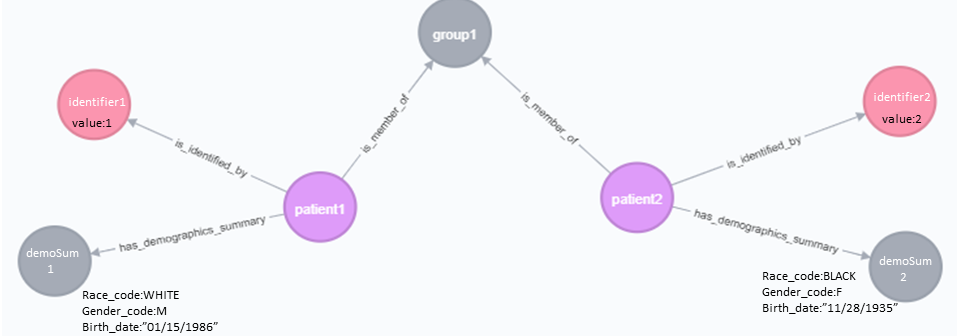
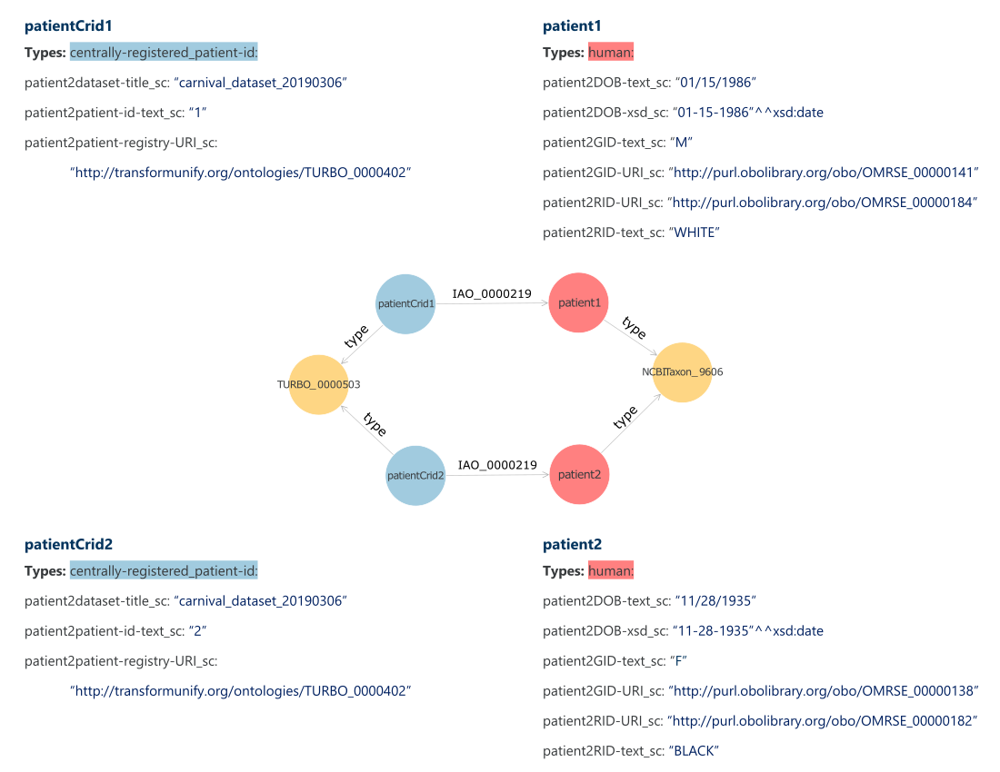
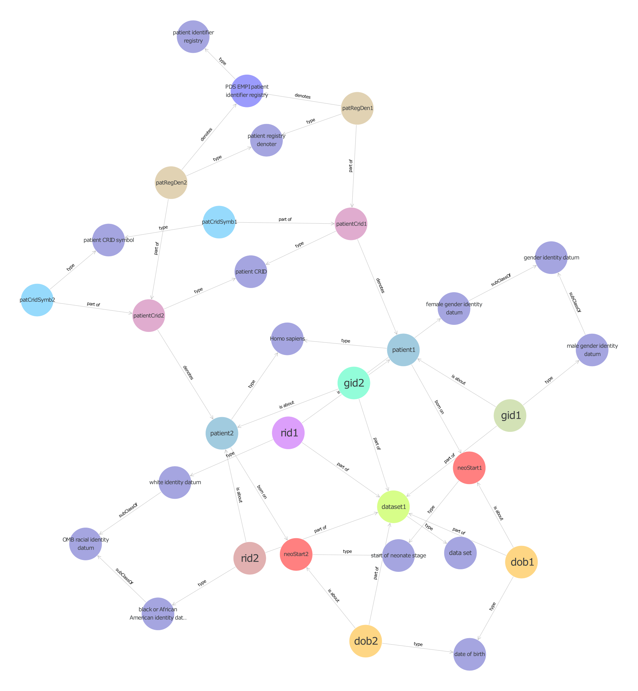

# Semantic Axioms in Electronic Health Records, as Instantiated by the TURBO Cohort Pipeline in PennTURBO

## Introduction

"PennTURBO" refers to a solution for the semantic modeling of biomedical information, especially electronic healthcare records.  This initiative takes its name from the underlying principle:  *Transforming and Unifying Research with Biomedical Ontologies*.  The same name is used for the supporting ontology itself:  `turbo_merged.owl`.  The TURBO ontology, written in the [OWL2 language](https://www.w3.org/TR/owl2-primer/), follows the principles of the [Open Biological and Biomedical Ontology Foundry](http://www.obofoundry.org/) including the use of [BFO](http://basic-formal-ontology.org/) as an upper ontology, and therefore adherence to ontological realism.  In addition to terms that were developed for the TURBO ontology *per se*, many other classes (like [`healthcare encounter`](http://purl.obolibrary.org/obo/OGMS_0000097)) and properties (like [`has specified output`](http://purl.obolibrary.org/obo/OBI_0000299)) were imported from other OBO foundry ontologies.  The TURBO ontology has a [GitHub repository](https://github.com/PennTURBO/turbo-ontology).

This whitepaper describes the axiom patterns (or types of semantic triples) that the TURBO Cohort pipeline generates to populate the TURBO Semantic repository, an RDF triplestore, specifically:
- How are the axioms created or "instantiated"?
- What do the patterns mean?
- What is the relative abundance of each axiom pattern?

The TURBO Cohort pipeline is described, and a distinction is drawn between shortcut semantics and expanded (or reality-based) semantics.

These topic will be illustrated with a minimal synthetic dataset about patient demographics:


| Enterprise_Master_Patient_ID | Gender_code | Birth_Date | Race_code |
|------------------------|-------------|------------|-----------|
| 1                      | M           | 1/15/1986  | WHITE     |
| 2                      | F           | 11/28/1935 | BLACK     |


## Background and Types of Data Ingested by the TURBO Cohort pipeline

PennTURBO uses multiple computational technologies to transform data into realism-based RDF triples.  The TURBO team envisions supporting multiple data sources with various levels of structure, but there is currently one predominant use case.  It's expected that most of what is found in the TURBO Semantic repository will come from a clinical data warehouse, presumably implemented as a relational database.  The TURBO Cohort pipeline starts with the TURBO Carnival server (employing the Carnival system built for the Penn Medicine BioBank), moving data from a clinical data warehouse (and related systems) into a shallow property graph. Related systems include [RedCap](https://redcap.med.upenn.edu/) (e.g. biobank records, like case report forms) and CSV files (e.g. loss-of-function calls based on whole exome sequencing).

## Steps involved in transforming relational EHR data into realism-based axioms

### Step 1: From the Penn Data Store to the TURBO Carnival server.

[*Carnival*](https://carnival-data.github.io/carnival/) is a data aggregation and unification technology stack, written in Groovy, and using a Neo4J property graph back-end.  Among other things, it integrates and further normalizes data from sources like thse described above.  Carnival implements *vines* that tunnel data from the tabular or relational sources into a consistent and intuitive model.  Convenience features include chunking of large SQL queries, resumption of failed queries, local caching of query results, and more.  

A Carnival command line interface is available for users who do not wish to interact directly with the Neo4J graph.  This interface uses the TURBO API server to identify patients with user-specified characteristics, by comparing data values form the EHR against semantic resources like the Drug Ontology, ChEBI, RxNORM and the Monarch Disease Ontology.  The TURBO Carnival server also uses set arithmetic to assemble the patients into stratified test/control cohorts.

Future plans for the TURBO Carnival server:

- While Carnival is not bound by a realism-based semantic artifact like the TURBO ontology, the Carnival and TURBO teams are tightly integrated and strive for a reasonable (and potentially growing) alignment between the two models.
- The Carnival codebase has not yet been released to the pubic, but the intention is to make it open-source in the near future.
- The Carnival and TURBO teams are both considering opportunities to build web-based user interfaces.

#### A Carnival Vine into a Clinical Data Warehouse

The TURBO Carnival server uses SQL queries to gather data from a clinical data warehouse and populate the property graph.  Portions of reality already modeled by Carnival and PennTURBO include demographic and  anthropometric data about patients, medication orders, and assigned diagnosis codes.  The table in the introduction of this paper illustrates representative patient demographics.

Once loaded into TURBO Carnival's property graph, the data are modeled as two patient *nodes*, with an `is_member_of` relationship to a patient *group* node, an `is_identified_by` relationship with an *identifier* node, and a `has_demographics_summary` relationship with a *demographics summary* node. The demographic values themselves are implemented as properties of each demographics summary. 




### Step 2: From the TURBO Carnival server to Shortcut Triples in the TURBO Semantic repository

Clinical data warehouses and the TURBO Carnival server are key to the TURBO Cohort pipeline.  Nonetheless, the TURBO Cohort pipeline has been designed to ingest data from other sources and in other forms.  If a system can write terse *shortcut* triples using classes and predicates form the TURBO ontology, then a Scala application in the TURBO Cohort pipeline will expand those shortcuts into statements about reality.  The expanded statements can even include rule-based conclusions.  Furthermore, if the data (like "1" and "WHITE") come from a trusted source like the TURBO Carnival server, then *the TURBO Cohort pipeline will even write the shortcut triples.*  

The TURBO Cohort pipeline uses the SPARQL language, plus methods from the [RDF4J](http://rdf4j.org/) library to write and expand shortcuts in a triplestore like [Ontotext GraphDB](http://graphdb.ontotext.com/).

The TURBO Semantic repository component of the TURBO Cohort pipeline was previously referred to as Drivetrain [GitHUb repository](https://github.com/PennTURBO/Drivetrain).

#### Shortcut Relations in the TURBO Ontology

TURBO shortcuts enable statements that have weak semantics and only imply some portion of reality.  For example `turbo:TURBO_0000607` is a shortcut from a patient to a registry of patient identifiers, like MRNs or EMPIs.  The presence of this shortcut implies that

- there is some patient
- there is some composite identifier that denotes the patient
- one part of the identifier is a pointer to the central registry that assigned the identifier

In other words, the relationship isn't really between the patient and the registry.  The TURBO Cohort pipeline uses shortcuts to lessen the semantic burden on cooperating systems and teams.

In contrast with OWL2 [object property chains](https://www.w3.org/TR/owl2-primer/#Property_Chains), the current generation of TURBO shortcuts are implicit chains of object properties between two or more things, terminating in a data property.  When a shortcut needs to connect one (subject) entity to another (object) entity, the [URI](https://en.wikipedia.org/wiki/Uniform_Resource_Identifier) for the object is wrapped in a string, like `"http://transformunify.org/ontologies/TURBO_0000440"^^xsd:anyURI`.  Without this design, it would be difficult or impossible to assert that the identifier itself has a *value* of `1`.

*A separate branch of pure property-chain shortcuts is under development.*

#### Shortcuts Written by the TURBO Cohort pipeline

The TURBO Cohort pipeline vine pulls data out of the TURBO Carnival property graph and re-writes it with class and property terms from the TURBO ontology.  As a collection of shortcut triples, the two-patient demographic dataset would look like this:

    prefix xsd:                             <http://www.w3.org/2001/XMLSchema#> 
    prefix pmbb:                            <http://www.itmat.upenn.edu/biobank/>
    prefix human:                           <http://purl.obolibrary.org/obo/NCBITaxon_9606> 
    prefix patient2DOB-text_sc:             <http://transformunify.org/ontologies/TURBO_0000604> 
    prefix patient2DOB-xsd_sc:              <http://transformunify.org/ontologies/TURBO_0000605> 
    prefix patient2GID-text_sc:             <http://transformunify.org/ontologies/TURBO_0000606> 
    prefix patient2GID-URI_sc:              <http://transformunify.org/ontologies/TURBO_0000607> 
    prefix patient2RID-URI_sc:              <http://transformunify.org/ontologies/TURBO_0000614> 
    prefix patient2RID-text_sc:             <http://transformunify.org/ontologies/TURBO_0000615> 
    prefix centrally-registered_patient-id: <http://transformunify.org/ontologies/TURBO_0000503> 
    prefix denotes:                         <http://purl.obolibrary.org/obo/IAO_0000219> 
    prefix patient2dataset-title_sc:        <http://transformunify.org/ontologies/TURBO_0003603> 
    prefix patient2patient-id-text_sc:      <http://transformunify.org/ontologies/TURBO_0003608> 
    prefix patient2patient-registry-URI_sc: <http://transformunify.org/ontologies/TURBO_0003610> 
    
    
    pmbb:patient1 a human: ;
    	patient2DOB-text_sc: "01/15/1986";
    	patient2DOB-xsd_sc:  "1986-01-15"^^xsd:Date;
    	patient2GID-text_sc: "M";
    	patient2GID-URI_sc:  "http://purl.obolibrary.org/obo/OMRSE_00000141"^^xsd:anyURI;
    	patient2RID-URI_sc:  "http://purl.obolibrary.org/obo/OMRSE_00000184"^^xsd:anyURI;
    	patient2RID-text_sc: "WHITE" .
    pmbb:patientCrid1 a centrally-registered_patient-id: ;
    	denotes: pmbb:patient1;
    	patient2dataset-title_sc:        "carnival_dataset_20190306";
    	patient2patient-id-text_sc:      "1";
    	patient2patient-registry-URI_sc: "http://transformunify.org/ontologies/TURBO_0000402"^^xsd:anyURI .
    pmbb:patient2 a human: ;
    	patient2DOB-text_sc: "11/28/1935";
    	patient2DOB-xsd_sc:  "1935-11-28"^^xsd:Date;
    	patient2GID-text_sc: "F";
    	patient2GID-URI_sc:  "http://purl.obolibrary.org/obo/OMRSE_00000138"^^xsd:anyURI;
    	patient2RID-URI_sc:  "http://purl.obolibrary.org/obo/OMRSE_00000182"^^xsd:anyURI;
    	patient2RID-text_sc: "BLACK" .
    pmbb:patientCrid2 a centrally-registered_patient-id: ;
    	denotes: pmbb:patient2;
    	patient2dataset-title_sc:        "carnival_dataset_20190306";
    	patient2patient-id-text_sc:      "2";
    	patient2patient-registry-URI_sc: "http://transformunify.org/ontologies/TURBO_0000402"^^xsd:anyURI .

Here, [Turtle prefixes](https://www.w3.org/TR/turtle/#prefixed-name) have been used not just to abbreviate the base portion of terms:

`prefix xsd: <http://www.w3.org/2001/XMLSchema#> `

but also to provide human-readable substitutes for terms in their entirety:

`prefix human: <http://purl.obolibrary.org/obo/NCBITaxon_9606>`

Therefore, readers who aren't interested in the URI representation of TURBO terms can ignore the entire `prefix` block

| abbreviation | meaning                                                                      |
|--------------|------------------------------------------------------------------------------|
| DOB          | date of birth datum (as opposed to the actual day on which someone was born) |
| GID          | gender identity datum                                                        |
| RID          | racial identity datum                                                        |


These shortcut triples illustrate that the TURBO Cohort pipeline doesn't just rewrite the tabular data in a different format.  It also starts the process of asserting what entities the data are about, even though that might be done in an indirect fashion.  For example, a date of birth datum can only exist (in good faith) if it is about some human or other organism that exists (or existed) in reality.  Furthermore, the TURBO Cohort pipeline recodes data values that have a discrete but implicit meaning into explicit and discrete ontology terms.  In order to do this, the TURBO Cohort pipeline must must be configured with some basic source- and domain-specific knowledge. For example `Race_code` column values of `BLACK` and `WHITE` are retained for provenance, but also represented with string-wrapped semantic terms from the [Ontology for Medically Relevant Social Entities](https://github.com/ufbmi/OMRSE/wiki/OMRSE-Overview):  http://purl.obolibrary.org/obo/OMRSE_00000182 for a "black or African American identity datum" and http://purl.obolibrary.org/obo/OMRSE_00000184 for a "white identity datum."  The gender identity "datums" are processed in a similar manner.

The TURBO Cohort pipeline has also asserted the registry which assigned the two identifiers that denote the two patients:  `http://transformunify.org/ontologies/TURBO_0000402` or 'PDS EMPI patient identifier registry'. This was driven by an understanding of the source of the file and the column header (Enterprise_Master_Patient_ID), not by values present in the database.

Finally, the TURBO Cohort pipeline understands that different sources my express dates in different formats, like MM/DD/YYYY, MM/DD/YY, YYYY-MM-DD etc. Therefore, the TURBO Cohort pipeline retains the original textual representations of dates but also rewrites them, based on knowledge of the sources.

In summary, this step has instantiated two individuals each from the classes for `Homo sapiens` and `patient identifier`.  Upon loading the TURBO ontology, the labels, superclass assertions and other reality-oriented axiomatic knowledge about humans and patient identifiers will be accessible.  The fact that the identifiers denote the humans has been stated explicitly with ad object property, but all additional knowledge about the humans the identifiers is still in a shortcutted, data-only realm, using data properties.

Once inserted into the TURBO Semnatic repository, a visualization like the following can be easily generated.  Note that the textual panels next to each entity are not intrinsic parts of the visualization.  They have to be opened one at a time in a right-hand panel by clicking on the entity of interest and further clicking on a nearby "i" icon.



### Step 3: : Reality-Based Expansion of Shortcut Triples, via Drivetrain
The TURBO Cohort pipeline expands shortcut patterns like these into BFO-compliant statements about reality.  The rules for the expansions currently consist of parameterized SPARQL, hard coded into the the TURBO Cohort pipeline source code.  Opportunities for expressing the rules in some kind of graph structure (in Neo4J, raw RDF, or as part of the TURBO ontology itself) are under evaluation.

#### Expanded Triples about Patient1 and Patient2

```
@prefix owl: <http://www.w3.org/2002/07/owl#> .
@prefix dc11: <http://purl.org/dc/elements/1.1/> .
@prefix ns0: <http://purl.obolibrary.org/obo/> .
@prefix ns1: <http://transformunify.org/ontologies/> .

<http://example.org/hand_expanded#dob1>
  a <http://www.ebi.ac.uk/efo/EFO_0004950> ;
  ns0:BFO_0000050 <http://example.org/hand_expanded#dataset1> ;
  ns0:IAO_0000136 <http://example.org/hand_expanded#neoStart1> ;
  ns1:TURBO_0010095 "01/15/1986" ;
  ns1:TURBO_0010096 "1986-01-15" .

<http://example.org/hand_expanded#dob2>
  a <http://www.ebi.ac.uk/efo/EFO_0004950> ;
  ns0:BFO_0000050 <http://example.org/hand_expanded#dataset1> ;
  ns0:IAO_0000136 <http://example.org/hand_expanded#neoStart2> ;
  ns1:TURBO_0010095 "11/28/1935" ;
  ns1:TURBO_0010096 "1935-11-28" .

<http://example.org/hand_expanded#gid1>
  a ns0:OMRSE_00000141 ;
  ns0:BFO_0000050 <http://example.org/hand_expanded#dataset1> ;
  ns0:IAO_0000136 <http://example.org/hand_expanded#patient1> ;
  ns1:TURBO_0010095 "M" .

<http://example.org/hand_expanded#gid2>
  a ns0:OMRSE_00000138 ;
  ns0:BFO_0000050 <http://example.org/hand_expanded#dataset1> ;
  ns0:IAO_0000136 <http://example.org/hand_expanded#patient2> ;
  ns1:TURBO_0010095 "F" .

<http://example.org/hand_expanded#neoStart1> a ns0:UBERON_0035946 .
<http://example.org/hand_expanded#neoStart2> a ns0:UBERON_0035946 .
<http://example.org/hand_expanded#patCridSymb1>
  a ns1:TURBO_0010093 ;
  ns0:BFO_0000050 <http://example.org/hand_expanded#patientCrid1> ;
  ns1:TURBO_0010094 "1" .

<http://example.org/hand_expanded#patCridSymb2>
  a ns1:TURBO_0010093 ;
  ns0:BFO_0000050 <http://example.org/hand_expanded#patientCrid2> ;
  ns1:TURBO_0010094 "2" .

<http://example.org/hand_expanded#patRegDen1>
  a ns1:TURBO_0000505 ;
  ns0:BFO_0000050 <http://example.org/hand_expanded#patientCrid1> ;
  ns0:IAO_0000219 ns1:TURBO_0000402 .

<http://example.org/hand_expanded#patRegDen2>
  a ns1:TURBO_0000505 ;
  ns0:BFO_0000050 <http://example.org/hand_expanded#patientCrid2> ;
  ns0:IAO_0000219 ns1:TURBO_0000402 .

<http://example.org/hand_expanded#patient1>
  a ns0:NCBITaxon_9606 ;
  ns1:TURBO_0000303 <http://example.org/hand_expanded#neoStart1> .

<http://example.org/hand_expanded#patient2>
  a ns0:NCBITaxon_9606 ;
  ns1:TURBO_0000303 <http://example.org/hand_expanded#neoStart2> .

<http://example.org/hand_expanded#patientCrid1>
  a ns1:TURBO_0010092 ;
  ns0:IAO_0000219 <http://example.org/hand_expanded#patient1> .

<http://example.org/hand_expanded#patientCrid2>
  a ns1:TURBO_0010092 ;
  ns0:IAO_0000219 <http://example.org/hand_expanded#patient2> .

<http://example.org/hand_expanded#rid1>
  a ns0:OMRSE_00000184 ;
  ns0:BFO_0000050 <http://example.org/hand_expanded#dataset1> ;
  ns0:IAO_0000136 <http://example.org/hand_expanded#patient1> ;
  ns1:TURBO_0010095 "WHITE" .

<http://example.org/hand_expanded#rid2>
  a ns0:OMRSE_00000182 ;
  ns0:BFO_0000050 <http://example.org/hand_expanded#dataset1> ;
  ns0:IAO_0000136 <http://example.org/hand_expanded#patient2> .
```

#### Expanded Visualization of Patient1 and Patient2



## Appendices

### Accounting of instances appearing in a production TURBO Semantic repository 

The visualization above shows a general pattern for describing some patient knowledge from a realism perspective.  However, it omits several other important patterns, and it doesn't provide any quantitative information.

The following tables provide counts, not for the two-patient, demographics-only case, but for roughly 11,300 patients and additional data types like loss-of-function predictions, prescriptions, diagnoses and more.

Textual and axiomatic definitions for most of these terms can be found in the [TURBO ontology](https://raw.githubusercontent.com/PennTURBO/Turbo-Ontology/master/ontologies/turbo_merged.owl).

*These counts are specifically from the graph `pmbb:expanded` in GraphDB repository `turbo_20181214_carnivalShortcuts` in mid March, 2019.*

For example, there are 5,515,042 instances of class `efo:OBI_0001352` ("allele information") in this graph.  That's because this graph models roughly 11,300 patients, each of which have predicted loss of function in an average of 500 genes.


| subjType           | subjTypeLab                                                    | triplesCount |
|--------------------|----------------------------------------------------------------|-------------:|
| efo:OBI_0001352    | allele information                                             | 5515042      |
| efo:OGMS_0000073   | diagnosis                                                      | 274741       |
| efo:PDRO_0000001   | health care prescription; prescription de santé               | 202011       |
| efo:TURBO_0000561  | prescription crid                                              | 202011       |
| efo:TURBO_0000562  | prescription crid symbol                                       | 202011       |
| efo:OBI_0000097    | participant under investigation role                           | 121693       |
| efo:OGMS_0000097   | health care encounter                                          | 107293       |
| efo:TURBO_0000508  | health care encounter crid                                     | 107293       |
| efo:TURBO_0000509  | health care encounter crid symbol                              | 107293       |
| efo:TURBO_0000510  | health care encounter registry denoter                         | 107293       |
| efo:TURBO_0000511  | health care encounter start                                    | 107293       |
| efo:TURBO_0000512  | health care encounter start date                               | 107293       |
| efo:TURBO_0000907  | retired placeholder for health care encounter                  | 107293       |
| efo:TURBO_0000908  | retired placeholder for health care encounter crid             | 107293       |
| efo:TURBO_0000909  | retired placeholder for health care encounter symbol           | 107293       |
| efo:TURBO_0000910  | retired placeholder for health care encounter registry denoter | 107293       |
| efo:TURBO_0000911  | retired placeholder for health care encounter start            | 107293       |
| efo:TURBO_0000912  | retired placeholder for health care encounter start date       | 107293       |
| efo:OBI_0001931    | scalar value specification                                     | 53926        |
| efo:IAO_0000414    | mass measurement datum                                         | 27165        |
| efo:OBI_0000445    | mass measurement assay                                         | 27165        |
| efo:IAO_0000408    | length measurement datum                                       | 26761        |
| efo:TURBO_0001511  | length measurement assay                                       | 26761        |
| efo:OBI_0001933    | value specification                                            | 26573        |
| efo:TURBO_0001903  | retired placeholder for bmi datum                              | 26573        |
| efo:TURBO_0001904  | retired placeholder for value specification                    | 26573        |
| efo:EFO_0004340    | body mass index                                                | 26573        |
| efo:TURBO_0000527  | biobank encounter                                              | 14400        |
| efo:TURBO_0000531  | biobank encounter start                                        | 14400        |
| efo:TURBO_0000532  | biobank encounter start date                                   | 14400        |
| efo:TURBO_0000533  | biobank encounter crid                                         | 14400        |
| efo:TURBO_0000534  | biobank encounter crid symbol                                  | 14400        |
| efo:TURBO_0000535  | biobank encounter registry denoter                             | 14400        |
| efo:TURBO_0000927  | retired placeholder for biobank encounter                      | 14400        |
| efo:TURBO_0000931  | retired placeholder for biobank encounter start                | 14400        |
| efo:TURBO_0000932  | retired placeholder for biobank encounter start date           | 14400        |
| efo:TURBO_0000933  | retired placeholder for biobank encounter crid                 | 14400        |
| efo:TURBO_0000934  | retired placeholder for biobank encounter symbol               | 14400        |
| efo:TURBO_0000935  | retired placeholder for biobank encounter registry denoter     | 14400        |
| efo:OMRSE_00000099 | racial identification process                                  | 11084        |
| efo:PATO_0000047   | biological sex                                                 | 11084        |
| efo:PATO_0000119   | height                                                         | 11084        |
| efo:PATO_0000128   | weight                                                         | 11084        |
| efo:UBERON_0001013 | adipose tissue                                                 | 11084        |
| efo:UBERON_0035946 | start of neonate stage                                         | 11084        |
| efo:TURBO_0000502  | biobank consenter                                              | 11084        |
| efo:TURBO_0000503  | biobank consenter crid                                         | 11084        |
| efo:TURBO_0000504  | biobank consenter crid symbol                                  | 11084        |
| efo:TURBO_0000505  | patient registry denoter                                       | 11084        |
| efo:TURBO_0000902  | retired placeholder for biobank consenter                      | 11084        |
| efo:TURBO_0000903  | retired placeholder for biobank consenter crid                 | 11084        |
| efo:TURBO_0000904  | retired placeholder for biobank consenter symbol               | 11084        |
| efo:TURBO_0000905  | retired placeholder for biobank consenter registry denoter     | 11084        |
| efo:TURBO_0001901  | retired placeholder for adipose tissue                         | 11084        |
| efo:TURBO_0001902  | retired placeholder for biological sex                         | 11084        |
| efo:TURBO_0001905  | retired placeholder for height quality                         | 11084        |
| efo:TURBO_0001906  | retired placeholder for process boundary                       | 11084        |
| efo:TURBO_0001908  | retired placeholder for weight quality                         | 11084        |
| efo:EFO_0004950    | date of birth                                                  | 11084        |
| efo:OBI_0000257    | dna extraction                                                 | 10950        |
| efo:OBI_0001051    | dna extract                                                    | 10950        |
| efo:OBI_0001479    | specimen from organism                                         | 10950        |
| efo:OBI_0001573    | dna sequence data                                              | 10950        |
| efo:OBI_0002118    | exome sequencing assay                                         | 10950        |
| efo:OBI_0200000    | data transformation                                            | 10950        |
| efo:OBI_0600005    | collecting specimen from organism                              | 10950        |
| efo:TURBO_0000566  | genotype crid                                                  | 10950        |
| efo:TURBO_0000567  | genotype identifier registry denoter                           | 10950        |
| efo:TURBO_0000568  | genotype crid symbol                                           | 10950        |
| efo:OBI_0001868    | genetic material                                               | 10868        |
| efo:OMRSE_00000184 | white identity datum                                           | 8054         |
| efo:OMRSE_00000141 | male gender identity datum                                     | 6568         |
| efo:OMRSE_00000138 | female gender identity datum                                   | 4516         |
| efo:OMRSE_00000182 | black or african american identity datum                       | 2060         |
| efo:OBI_0000852    | record of missing knowledge                                    | 428          |
| efo:OMRSE_00000098 | racial identity datum                                          | 391          |
| efo:OMRSE_00000181 | asian identity datum                                           | 141          |
| efo:OMRSE_00000183 | native hawaiian or other pacific islander identity datum       | 8            |
| efo:IAO_0000100    | data set                                                       | 6            |
| efo:TURBO_0000543  | biobank encounter identifier registry                          | 3            |
| efo:OMRSE_00000180 | american indian or alaska native identity datum                | 2            |
| efo:TURBO_0000571  | zygosity value specification                                   | 2            |
| efo:TURBO_0000506  | patient identifier registry                                    | 1            |
| efo:TURBO_0000513  | health care encounter identifier registry                      | 1            |
| efo:TURBO_0000522  | r2r instantiation                                              | 1            |

### Frequency of object-property statement styles in the `pmbb:expanded graph`

There are 5,515,042 triples in which an instance of class `obo:OBI_0001352` ("allele information") is asserted to have a particular zygosty level:  heterozygous, or homozygous LOF.  The zygosity level is represented with an instance of class `turbo:TURBO_0000571`, ("zygosity value specification.)

*In this graph, assertions about homozygous wild-type genes have not been made.*

| subjType            | subjTypeLab                                                    | predicate           | predLab                   | objType             | objTypeLab                                               | triplesCount |
|---------------------|----------------------------------------------------------------|---------------------|---------------------------|---------------------|----------------------------------------------------------|-------------:|
| obo:OBI_0001352     | allele information                                             | obo:OBI_0001938     | has value specification   | turbo:TURBO_0000571 | zygosity value specification                             | 5515042      |
| obo:OBI_0001352     | allele information                                             | obo:IAO_0000136     | is about                  | obo:OBI_0001868     | genetic material                                         | 5515042      |
| obo:OBI_0001352     | allele information                                             | obo:BFO_0000050     | is part of; part of       | obo:IAO_0000100     | data set                                                 | 5515042      |
| obo:OGMS_0000073    | diagnosis                                                      | obo:BFO_0000050     | is part of; part of       | obo:IAO_0000100     | data set                                                 | 274741       |
| obo:PDRO_0000001    | health care prescription; prescription de santé               | obo:BFO_0000050     | is part of; part of       | obo:IAO_0000100     | data set                                                 | 202011       |
| turbo:TURBO_0000561 | prescription crid                                              | obo:IAO_0000219     | denotes                   | obo:PDRO_0000001    | health care prescription; prescription de santé         | 202011       |
| turbo:TURBO_0000561 | prescription crid                                              | obo:BFO_0000051     | has part; has_part        | turbo:TURBO_0000562 | prescription crid symbol                                 | 202011       |
| turbo:TURBO_0000562 | prescription crid symbol                                       | obo:BFO_0000050     | is part of; part of       | obo:IAO_0000100     | data set                                                 | 202011       |
| turbo:TURBO_0000562 | prescription crid symbol                                       | obo:BFO_0000050     | is part of; part of       | turbo:TURBO_0000561 | prescription crid                                        | 202011       |
| turbo:TURBO_0000508 | health care encounter crid                                     | obo:IAO_0000219     | denotes                   | obo:OGMS_0000097    | health care encounter                                    | 107293       |
| turbo:TURBO_0000508 | health care encounter crid                                     | obo:BFO_0000051     | has part; has_part        | turbo:TURBO_0000509 | health care encounter crid symbol                        | 107293       |
| turbo:TURBO_0000508 | health care encounter crid                                     | obo:BFO_0000051     | has part; has_part        | turbo:TURBO_0000510 | health care encounter registry denoter                   | 107293       |
| turbo:TURBO_0000508 | health care encounter crid                                     | turbo:TURBO_0000302 | linked in dataset with    | turbo:TURBO_0000503 | biobank consenter crid                                   | 107293       |
| turbo:TURBO_0000509 | health care encounter crid symbol                              | obo:BFO_0000050     | is part of; part of       | obo:IAO_0000100     | data set                                                 | 107293       |
| turbo:TURBO_0000509 | health care encounter crid symbol                              | obo:BFO_0000050     | is part of; part of       | turbo:TURBO_0000508 | health care encounter crid                               | 107293       |
| turbo:TURBO_0000510 | health care encounter registry denoter                         | obo:IAO_0000219     | denotes                   | turbo:TURBO_0000513 | health care encounter identifier registry                | 107293       |
| turbo:TURBO_0000510 | health care encounter registry denoter                         | obo:BFO_0000050     | is part of; part of       | obo:IAO_0000100     | data set                                                 | 107293       |
| turbo:TURBO_0000510 | health care encounter registry denoter                         | obo:BFO_0000050     | is part of; part of       | turbo:TURBO_0000508 | health care encounter crid                               | 107293       |
| turbo:TURBO_0000511 | health care encounter start                                    | obo:RO_0002223      | starts                    | obo:OGMS_0000097    | health care encounter                                    | 107293       |
| turbo:TURBO_0000512 | health care encounter start date                               | obo:IAO_0000136     | is about                  | turbo:TURBO_0000511 | health care encounter start                              | 107293       |
| turbo:TURBO_0000512 | health care encounter start date                               | obo:BFO_0000050     | is part of; part of       | obo:IAO_0000100     | data set                                                 | 107293       |
| obo:OBI_0000097     | participant under investigation role                           | obo:BFO_0000054     | realized in               | obo:OGMS_0000097    | health care encounter                                    | 107293       |
| turbo:TURBO_0000907 | retired placeholder for health care encounter                  | turbo:TURBO_0001700 | replaced with iui         | obo:OGMS_0000097    | health care encounter                                    | 107293       |
| turbo:TURBO_0000908 | retired placeholder for health care encounter crid             | turbo:TURBO_0001700 | replaced with iui         | turbo:TURBO_0000508 | health care encounter crid                               | 107293       |
| turbo:TURBO_0000910 | retired placeholder for health care encounter registry denoter | turbo:TURBO_0001700 | replaced with iui         | turbo:TURBO_0000510 | health care encounter registry denoter                   | 107293       |
| turbo:TURBO_0000911 | retired placeholder for health care encounter start            | turbo:TURBO_0001700 | replaced with iui         | turbo:TURBO_0000511 | health care encounter start                              | 107293       |
| turbo:TURBO_0000912 | retired placeholder for health care encounter start date       | turbo:TURBO_0001700 | replaced with iui         | turbo:TURBO_0000512 | health care encounter start date                         | 107293       |
| turbo:TURBO_0000909 | retired placeholder for health care encounter symbol           | turbo:TURBO_0001700 | replaced with iui         | turbo:TURBO_0000509 | health care encounter crid symbol                        | 107293       |
| obo:OGMS_0000097    | health care encounter                                          | obo:RO_0002234      | has output                | obo:OGMS_0000073    | diagnosis                                                | 67137        |
| obo:OBI_0000445     | mass measurement assay                                         | obo:OBI_0000293     | has_specified_input       | turbo:TURBO_0000502 | biobank consenter                                        | 27165        |
| obo:OBI_0000445     | mass measurement assay                                         | obo:OBI_0000299     | has_specified_output      | obo:IAO_0000414     | mass measurement datum                                   | 27165        |
| obo:IAO_0000414     | mass measurement datum                                         | obo:OBI_0001938     | has value specification   | obo:OBI_0001931     | scalar value specification                               | 27165        |
| obo:IAO_0000414     | mass measurement datum                                         | obo:IAO_0000136     | is about                  | turbo:TURBO_0000502 | biobank consenter                                        | 27165        |
| obo:IAO_0000414     | mass measurement datum                                         | obo:BFO_0000050     | is part of; part of       | obo:IAO_0000100     | data set                                                 | 27165        |
| obo:IAO_0000414     | mass measurement datum                                         | obo:IAO_0000221     | is quality measurement of | obo:PATO_0000128    | weight                                                   | 27165        |
| turbo:TURBO_0001511 | length measurement assay                                       | obo:OBI_0000293     | has_specified_input       | turbo:TURBO_0000502 | biobank consenter                                        | 26761        |
| turbo:TURBO_0001511 | length measurement assay                                       | obo:OBI_0000299     | has_specified_output      | obo:IAO_0000408     | length measurement datum                                 | 26761        |
| obo:IAO_0000408     | length measurement datum                                       | obo:OBI_0001938     | has value specification   | obo:OBI_0001931     | scalar value specification                               | 26761        |
| obo:IAO_0000408     | length measurement datum                                       | obo:IAO_0000136     | is about                  | turbo:TURBO_0000502 | biobank consenter                                        | 26761        |
| obo:IAO_0000408     | length measurement datum                                       | obo:BFO_0000050     | is part of; part of       | obo:IAO_0000100     | data set                                                 | 26761        |
| obo:IAO_0000408     | length measurement datum                                       | obo:IAO_0000221     | is quality measurement of | obo:PATO_0000119    | height                                                   | 26761        |
| efo:EFO_0004340     | body mass index                                                | obo:OBI_0001938     | has value specification   | obo:OBI_0001933     | value specification                                      | 26573        |
| efo:EFO_0004340     | body mass index                                                | obo:IAO_0000136     | is about                  | obo:UBERON_0001013  | adipose tissue                                           | 26573        |
| efo:EFO_0004340     | body mass index                                                | obo:BFO_0000050     | is part of; part of       | obo:IAO_0000100     | data set                                                 | 26573        |
| turbo:TURBO_0001903 | retired placeholder for bmi datum                              | turbo:TURBO_0001700 | replaced with iui         | efo:EFO_0004340     | body mass index                                          | 26573        |
| turbo:TURBO_0001904 | retired placeholder for value specification                    | turbo:TURBO_0001700 | replaced with iui         | obo:OBI_0001933     | value specification                                      | 26573        |
| turbo:TURBO_0000533 | biobank encounter crid                                         | obo:IAO_0000219     | denotes                   | turbo:TURBO_0000527 | biobank encounter                                        | 14400        |
| turbo:TURBO_0000533 | biobank encounter crid                                         | obo:BFO_0000051     | has part; has_part        | turbo:TURBO_0000534 | biobank encounter crid symbol                            | 14400        |
| turbo:TURBO_0000533 | biobank encounter crid                                         | obo:BFO_0000051     | has part; has_part        | turbo:TURBO_0000535 | biobank encounter registry denoter                       | 14400        |
| turbo:TURBO_0000533 | biobank encounter crid                                         | turbo:TURBO_0000302 | linked in dataset with    | turbo:TURBO_0000503 | biobank consenter crid                                   | 14400        |
| turbo:TURBO_0000534 | biobank encounter crid symbol                                  | obo:BFO_0000050     | is part of; part of       | turbo:TURBO_0000533 | biobank encounter crid                                   | 14400        |
| turbo:TURBO_0000534 | biobank encounter crid symbol                                  | obo:BFO_0000050     | is part of; part of       | obo:IAO_0000100     | data set                                                 | 14400        |
| turbo:TURBO_0000535 | biobank encounter registry denoter                             | obo:IAO_0000219     | denotes                   | turbo:TURBO_0000543 | biobank encounter identifier registry                    | 14400        |
| turbo:TURBO_0000535 | biobank encounter registry denoter                             | obo:BFO_0000050     | is part of; part of       | turbo:TURBO_0000533 | biobank encounter crid                                   | 14400        |
| turbo:TURBO_0000535 | biobank encounter registry denoter                             | obo:BFO_0000050     | is part of; part of       | obo:IAO_0000100     | data set                                                 | 14400        |
| turbo:TURBO_0000531 | biobank encounter start                                        | obo:RO_0002223      | starts                    | turbo:TURBO_0000527 | biobank encounter                                        | 14400        |
| turbo:TURBO_0000532 | biobank encounter start date                                   | obo:IAO_0000136     | is about                  | turbo:TURBO_0000531 | biobank encounter start                                  | 14400        |
| obo:OBI_0000097     | participant under investigation role                           | obo:BFO_0000054     | realized in               | turbo:TURBO_0000527 | biobank encounter                                        | 14400        |
| turbo:TURBO_0000927 | retired placeholder for biobank encounter                      | turbo:TURBO_0001700 | replaced with iui         | turbo:TURBO_0000527 | biobank encounter                                        | 14400        |
| turbo:TURBO_0000933 | retired placeholder for biobank encounter crid                 | turbo:TURBO_0001700 | replaced with iui         | turbo:TURBO_0000533 | biobank encounter crid                                   | 14400        |
| turbo:TURBO_0000935 | retired placeholder for biobank encounter registry denoter     | turbo:TURBO_0001700 | replaced with iui         | turbo:TURBO_0000535 | biobank encounter registry denoter                       | 14400        |
| turbo:TURBO_0000931 | retired placeholder for biobank encounter start                | turbo:TURBO_0001700 | replaced with iui         | turbo:TURBO_0000531 | biobank encounter start                                  | 14400        |
| turbo:TURBO_0000932 | retired placeholder for biobank encounter start date           | turbo:TURBO_0001700 | replaced with iui         | turbo:TURBO_0000532 | biobank encounter start date                             | 14400        |
| turbo:TURBO_0000934 | retired placeholder for biobank encounter symbol               | turbo:TURBO_0001700 | replaced with iui         | turbo:TURBO_0000534 | biobank encounter crid symbol                            | 14400        |
| turbo:TURBO_0000532 | biobank encounter start date                                   | obo:BFO_0000050     | is part of; part of       | obo:IAO_0000100     | data set                                                 | 14294        |
| obo:OGMS_0000097    | health care encounter                                          | obo:BFO_0000051     | has part; has_part        | obo:OBI_0000445     | mass measurement assay                                   | 14171        |
| obo:OBI_0000445     | mass measurement assay                                         | obo:BFO_0000050     | is part of; part of       | obo:OGMS_0000097    | health care encounter                                    | 14171        |
| obo:OGMS_0000097    | health care encounter                                          | obo:BFO_0000051     | has part; has_part        | turbo:TURBO_0001511 | length measurement assay                                 | 13809        |
| turbo:TURBO_0001511 | length measurement assay                                       | obo:BFO_0000050     | is part of; part of       | obo:OGMS_0000097    | health care encounter                                    | 13809        |
| efo:EFO_0004340     | body mass index                                                | obo:IAO_0000581     | has time stamp            | turbo:TURBO_0000512 | health care encounter start date                         | 13640        |
| obo:OGMS_0000097    | health care encounter                                          | obo:RO_0002234      | has output                | efo:EFO_0004340     | body mass index                                          | 13640        |
| turbo:TURBO_0000527 | biobank encounter                                              | obo:BFO_0000051     | has part; has_part        | obo:OBI_0000445     | mass measurement assay                                   | 12994        |
| obo:OBI_0000445     | mass measurement assay                                         | obo:BFO_0000050     | is part of; part of       | turbo:TURBO_0000527 | biobank encounter                                        | 12994        |
| turbo:TURBO_0000527 | biobank encounter                                              | obo:BFO_0000051     | has part; has_part        | turbo:TURBO_0001511 | length measurement assay                                 | 12952        |
| turbo:TURBO_0001511 | length measurement assay                                       | obo:BFO_0000050     | is part of; part of       | turbo:TURBO_0000527 | biobank encounter                                        | 12952        |
| turbo:TURBO_0000527 | biobank encounter                                              | obo:OBI_0000299     | has_specified_output      | efo:EFO_0004340     | body mass index                                          | 12933        |
| efo:EFO_0004340     | body mass index                                                | obo:IAO_0000581     | has time stamp            | turbo:TURBO_0000532 | biobank encounter start date                             | 12933        |
| obo:OGMS_0000097    | health care encounter                                          | obo:RO_0002234      | has output                | obo:PDRO_0000001    | health care prescription; prescription de santé         | 12721        |
| obo:UBERON_0001013  | adipose tissue                                                 | obo:BFO_0000050     | is part of; part of       | turbo:TURBO_0000502 | biobank consenter                                        | 11084        |
| turbo:TURBO_0000502 | biobank consenter                                              | turbo:TURBO_0000303 | born at                   | obo:UBERON_0035946  | start of neonate stage                                   | 11084        |
| turbo:TURBO_0000502 | biobank consenter                                              | obo:BFO_0000051     | has part; has_part        | obo:UBERON_0001013  | adipose tissue                                           | 11084        |
| turbo:TURBO_0000502 | biobank consenter                                              | obo:RO_0000086      | has quality               | obo:PATO_0000047    | biological sex                                           | 11084        |
| turbo:TURBO_0000502 | biobank consenter                                              | obo:RO_0000086      | has quality               | obo:PATO_0000119    | height                                                   | 11084        |
| turbo:TURBO_0000502 | biobank consenter                                              | obo:RO_0000086      | has quality               | obo:PATO_0000128    | weight                                                   | 11084        |
| turbo:TURBO_0000502 | biobank consenter                                              | obo:RO_0000087      | has role                  | obo:OBI_0000097     | participant under investigation role                     | 11084        |
| turbo:TURBO_0000502 | biobank consenter                                              | obo:RO_0000056      | participates in           | turbo:TURBO_0000527 | biobank encounter                                        | 11084        |
| turbo:TURBO_0000503 | biobank consenter crid                                         | obo:IAO_0000219     | denotes                   | turbo:TURBO_0000502 | biobank consenter                                        | 11084        |
| turbo:TURBO_0000503 | biobank consenter crid                                         | obo:BFO_0000051     | has part; has_part        | turbo:TURBO_0000504 | biobank consenter crid symbol                            | 11084        |
| turbo:TURBO_0000503 | biobank consenter crid                                         | obo:BFO_0000051     | has part; has_part        | turbo:TURBO_0000505 | patient registry denoter                                 | 11084        |
| turbo:TURBO_0000503 | biobank consenter crid                                         | turbo:TURBO_0000302 | linked in dataset with    | turbo:TURBO_0000533 | biobank encounter crid                                   | 11084        |
| turbo:TURBO_0000504 | biobank consenter crid symbol                                  | obo:BFO_0000050     | is part of; part of       | turbo:TURBO_0000503 | biobank consenter crid                                   | 11084        |
| turbo:TURBO_0000504 | biobank consenter crid symbol                                  | obo:BFO_0000050     | is part of; part of       | obo:IAO_0000100     | data set                                                 | 11084        |
| efo:EFO_0004950     | date of birth                                                  | obo:IAO_0000136     | is about                  | obo:UBERON_0035946  | start of neonate stage                                   | 11084        |
| efo:EFO_0004950     | date of birth                                                  | obo:BFO_0000050     | is part of; part of       | obo:IAO_0000100     | data set                                                 | 11084        |
| turbo:TURBO_0000505 | patient registry denoter                                       | obo:IAO_0000219     | denotes                   | turbo:TURBO_0000506 | patient identifier registry                              | 11084        |
| turbo:TURBO_0000505 | patient registry denoter                                       | obo:BFO_0000050     | is part of; part of       | turbo:TURBO_0000503 | biobank consenter crid                                   | 11084        |
| turbo:TURBO_0000505 | patient registry denoter                                       | obo:BFO_0000050     | is part of; part of       | obo:IAO_0000100     | data set                                                 | 11084        |
| turbo:TURBO_0001901 | retired placeholder for adipose tissue                         | turbo:TURBO_0001700 | replaced with iui         | obo:UBERON_0001013  | adipose tissue                                           | 11084        |
| turbo:TURBO_0000902 | retired placeholder for biobank consenter                      | turbo:TURBO_0001700 | replaced with iui         | turbo:TURBO_0000502 | biobank consenter                                        | 11084        |
| turbo:TURBO_0000903 | retired placeholder for biobank consenter crid                 | turbo:TURBO_0001700 | replaced with iui         | turbo:TURBO_0000503 | biobank consenter crid                                   | 11084        |
| turbo:TURBO_0000905 | retired placeholder for biobank consenter registry denoter     | turbo:TURBO_0001700 | replaced with iui         | turbo:TURBO_0000505 | patient registry denoter                                 | 11084        |
| turbo:TURBO_0000904 | retired placeholder for biobank consenter symbol               | turbo:TURBO_0001700 | replaced with iui         | turbo:TURBO_0000504 | biobank consenter crid symbol                            | 11084        |
| turbo:TURBO_0001902 | retired placeholder for biological sex                         | turbo:TURBO_0001700 | replaced with iui         | obo:PATO_0000047    | biological sex                                           | 11084        |
| turbo:TURBO_0001905 | retired placeholder for height quality                         | turbo:TURBO_0001700 | replaced with iui         | obo:PATO_0000119    | height                                                   | 11084        |
| turbo:TURBO_0001906 | retired placeholder for process boundary                       | turbo:TURBO_0001700 | replaced with iui         | obo:UBERON_0035946  | start of neonate stage                                   | 11084        |
| turbo:TURBO_0001908 | retired placeholder for weight quality                         | turbo:TURBO_0001700 | replaced with iui         | obo:PATO_0000128    | weight                                                   | 11084        |
| obo:OBI_0600005     | collecting specimen from organism                              | obo:OBI_0000293     | has_specified_input       | turbo:TURBO_0000502 | biobank consenter                                        | 10950        |
| obo:OBI_0600005     | collecting specimen from organism                              | obo:OBI_0000299     | has_specified_output      | obo:OBI_0001479     | specimen from organism                                   | 10950        |
| obo:OBI_0600005     | collecting specimen from organism                              | obo:BFO_0000050     | is part of; part of       | turbo:TURBO_0000527 | biobank encounter                                        | 10950        |
| obo:OBI_0200000     | data transformation                                            | obo:OBI_0000293     | has_specified_input       | obo:OBI_0001573     | dna sequence data                                        | 10950        |
| obo:OBI_0200000     | data transformation                                            | obo:OBI_0000299     | has_specified_output      | obo:OBI_0001352     | allele information                                       | 10950        |
| obo:OBI_0000257     | dna extraction                                                 | obo:OBI_0000293     | has_specified_input       | obo:OBI_0001479     | specimen from organism                                   | 10950        |
| obo:OBI_0000257     | dna extraction                                                 | obo:OBI_0000299     | has_specified_output      | obo:OBI_0001051     | dna extract                                              | 10950        |
| obo:OBI_0002118     | exome sequencing assay                                         | obo:OBI_0000293     | has_specified_input       | obo:OBI_0001051     | dna extract                                              | 10950        |
| obo:OBI_0002118     | exome sequencing assay                                         | obo:OBI_0000299     | has_specified_output      | obo:OBI_0001573     | dna sequence data                                        | 10950        |
| turbo:TURBO_0000566 | genotype crid                                                  | obo:IAO_0000219     | denotes                   | obo:OBI_0001479     | specimen from organism                                   | 10950        |
| turbo:TURBO_0000566 | genotype crid                                                  | obo:BFO_0000051     | has part; has_part        | turbo:TURBO_0000568 | genotype crid symbol                                     | 10950        |
| turbo:TURBO_0000566 | genotype crid                                                  | obo:BFO_0000051     | has part; has_part        | turbo:TURBO_0000567 | genotype identifier registry denoter                     | 10950        |
| turbo:TURBO_0000568 | genotype crid symbol                                           | obo:BFO_0000050     | is part of; part of       | obo:IAO_0000100     | data set                                                 | 10950        |
| turbo:TURBO_0000568 | genotype crid symbol                                           | obo:BFO_0000050     | is part of; part of       | turbo:TURBO_0000566 | genotype crid                                            | 10950        |
| turbo:TURBO_0000567 | genotype identifier registry denoter                           | obo:BFO_0000050     | is part of; part of       | turbo:TURBO_0000566 | genotype crid                                            | 10950        |
| turbo:TURBO_0000527 | biobank encounter                                              | obo:BFO_0000051     | has part; has_part        | obo:OBI_0600005     | collecting specimen from organism                        | 10949        |
| obo:OBI_0001868     | genetic material                                               | obo:OBI_0000643     | has grain                 | obo:OBI_0001051     | dna extract                                              | 10868        |
| obo:OBI_0001868     | genetic material                                               | obo:OGG_0000000014  | is genome of organism     | turbo:TURBO_0000502 | biobank consenter                                        | 10868        |
| turbo:TURBO_0000502 | biobank consenter                                              | obo:RO_0000056      | participates in           | obo:OGMS_0000097    | health care encounter                                    | 8132         |
| turbo:TURBO_0000503 | biobank consenter crid                                         | turbo:TURBO_0000302 | linked in dataset with    | turbo:TURBO_0000508 | health care encounter crid                               | 8132         |
| obo:OMRSE_00000099  | racial identification process                                  | obo:OBI_0000299     | has_specified_output      | obo:OMRSE_00000184  | white identity datum                                     | 8054         |
| obo:OMRSE_00000184  | white identity datum                                           | obo:IAO_0000136     | is about                  | turbo:TURBO_0000502 | biobank consenter                                        | 8054         |
| obo:OMRSE_00000184  | white identity datum                                           | obo:BFO_0000050     | is part of; part of       | obo:IAO_0000100     | data set                                                 | 8054         |
| obo:OMRSE_00000141  | male gender identity datum                                     | obo:IAO_0000136     | is about                  | turbo:TURBO_0000502 | biobank consenter                                        | 6568         |
| obo:OMRSE_00000141  | male gender identity datum                                     | obo:BFO_0000050     | is part of; part of       | obo:IAO_0000100     | data set                                                 | 6568         |
| obo:OMRSE_00000138  | female gender identity datum                                   | obo:IAO_0000136     | is about                  | turbo:TURBO_0000502 | biobank consenter                                        | 4516         |
| obo:OMRSE_00000138  | female gender identity datum                                   | obo:BFO_0000050     | is part of; part of       | obo:IAO_0000100     | data set                                                 | 4516         |
| obo:OMRSE_00000182  | black or african american identity datum                       | obo:IAO_0000136     | is about                  | turbo:TURBO_0000502 | biobank consenter                                        | 2060         |
| obo:OMRSE_00000182  | black or african american identity datum                       | obo:BFO_0000050     | is part of; part of       | obo:IAO_0000100     | data set                                                 | 2060         |
| obo:OMRSE_00000099  | racial identification process                                  | obo:OBI_0000299     | has_specified_output      | obo:OMRSE_00000182  | black or african american identity datum                 | 2060         |
| obo:OMRSE_00000099  | racial identification process                                  | obo:OBI_0000299     | has_specified_output      | obo:OBI_0000852     | record of missing knowledge                              | 428          |
| obo:OBI_0000852     | record of missing knowledge                                    | obo:IAO_0000136     | is about                  | turbo:TURBO_0000502 | biobank consenter                                        | 428          |
| obo:OBI_0000852     | record of missing knowledge                                    | obo:BFO_0000050     | is part of; part of       | obo:IAO_0000100     | data set                                                 | 428          |
| obo:OMRSE_00000099  | racial identification process                                  | obo:OBI_0000299     | has_specified_output      | obo:OMRSE_00000098  | racial identity datum                                    | 391          |
| obo:OMRSE_00000098  | racial identity datum                                          | obo:IAO_0000136     | is about                  | turbo:TURBO_0000502 | biobank consenter                                        | 391          |
| obo:OMRSE_00000098  | racial identity datum                                          | obo:BFO_0000050     | is part of; part of       | obo:IAO_0000100     | data set                                                 | 391          |
| obo:OMRSE_00000181  | asian identity datum                                           | obo:IAO_0000136     | is about                  | turbo:TURBO_0000502 | biobank consenter                                        | 141          |
| obo:OMRSE_00000181  | asian identity datum                                           | obo:BFO_0000050     | is part of; part of       | obo:IAO_0000100     | data set                                                 | 141          |
| obo:OMRSE_00000099  | racial identification process                                  | obo:OBI_0000299     | has_specified_output      | obo:OMRSE_00000181  | asian identity datum                                     | 141          |
| obo:OMRSE_00000183  | native hawaiian or other pacific islander identity datum       | obo:IAO_0000136     | is about                  | turbo:TURBO_0000502 | biobank consenter                                        | 8            |
| obo:OMRSE_00000183  | native hawaiian or other pacific islander identity datum       | obo:BFO_0000050     | is part of; part of       | obo:IAO_0000100     | data set                                                 | 8            |
| obo:OMRSE_00000099  | racial identification process                                  | obo:OBI_0000299     | has_specified_output      | obo:OMRSE_00000183  | native hawaiian or other pacific islander identity datum | 8            |
| obo:IAO_0000100     | data set                                                       | obo:BFO_0000051     | has part; has_part        | turbo:TURBO_0000509 | health care encounter crid symbol                        | 3            |
| obo:IAO_0000100     | data set                                                       | obo:BFO_0000051     | has part; has_part        | turbo:TURBO_0000510 | health care encounter registry denoter                   | 3            |
| obo:OMRSE_00000180  | american indian or alaska native identity datum                | obo:IAO_0000136     | is about                  | turbo:TURBO_0000502 | biobank consenter                                        | 2            |
| obo:OMRSE_00000180  | american indian or alaska native identity datum                | obo:BFO_0000050     | is part of; part of       | obo:IAO_0000100     | data set                                                 | 2            |
| obo:IAO_0000100     | data set                                                       | obo:BFO_0000051     | has part; has_part        | turbo:TURBO_0000534 | biobank encounter crid symbol                            | 2            |
| obo:IAO_0000100     | data set                                                       | obo:BFO_0000051     | has part; has_part        | efo:EFO_0004340     | body mass index                                          | 2            |
| obo:IAO_0000100     | data set                                                       | obo:BFO_0000051     | has part; has_part        | obo:IAO_0000408     | length measurement datum                                 | 2            |
| obo:IAO_0000100     | data set                                                       | obo:BFO_0000051     | has part; has_part        | obo:IAO_0000414     | mass measurement datum                                   | 2            |
| obo:OMRSE_00000099  | racial identification process                                  | obo:OBI_0000299     | has_specified_output      | obo:OMRSE_00000180  | american indian or alaska native identity datum          | 2            |
| obo:IAO_0000100     | data set                                                       | obo:BFO_0000051     | has part; has_part        | obo:OBI_0001352     | allele information                                       | 1            |
| obo:IAO_0000100     | data set                                                       | obo:BFO_0000051     | has part; has_part        | obo:OMRSE_00000180  | american indian or alaska native identity datum          | 1            |
| obo:IAO_0000100     | data set                                                       | obo:BFO_0000051     | has part; has_part        | obo:OMRSE_00000181  | asian identity datum                                     | 1            |
| obo:IAO_0000100     | data set                                                       | obo:BFO_0000051     | has part; has_part        | turbo:TURBO_0000504 | biobank consenter crid symbol                            | 1            |
| obo:IAO_0000100     | data set                                                       | obo:BFO_0000051     | has part; has_part        | turbo:TURBO_0000535 | biobank encounter registry denoter                       | 1            |
| obo:IAO_0000100     | data set                                                       | obo:BFO_0000051     | has part; has_part        | turbo:TURBO_0000532 | biobank encounter start date                             | 1            |
| obo:IAO_0000100     | data set                                                       | obo:BFO_0000051     | has part; has_part        | obo:OMRSE_00000182  | black or african american identity datum                 | 1            |
| obo:IAO_0000100     | data set                                                       | obo:BFO_0000051     | has part; has_part        | efo:EFO_0004950     | date of birth                                            | 1            |
| obo:IAO_0000100     | data set                                                       | obo:BFO_0000051     | has part; has_part        | obo:OGMS_0000073    | diagnosis                                                | 1            |
| obo:IAO_0000100     | data set                                                       | obo:BFO_0000051     | has part; has_part        | obo:OMRSE_00000138  | female gender identity datum                             | 1            |
| obo:IAO_0000100     | data set                                                       | obo:BFO_0000051     | has part; has_part        | turbo:TURBO_0000568 | genotype crid symbol                                     | 1            |
| obo:IAO_0000100     | data set                                                       | obo:BFO_0000051     | has part; has_part        | turbo:TURBO_0000512 | health care encounter start date                         | 1            |
| obo:IAO_0000100     | data set                                                       | obo:BFO_0000051     | has part; has_part        | obo:PDRO_0000001    | health care prescription; prescription de santé         | 1            |
| obo:IAO_0000100     | data set                                                       | obo:BFO_0000051     | has part; has_part        | obo:OMRSE_00000141  | male gender identity datum                               | 1            |
| obo:IAO_0000100     | data set                                                       | obo:BFO_0000051     | has part; has_part        | obo:OMRSE_00000183  | native hawaiian or other pacific islander identity datum | 1            |
| obo:IAO_0000100     | data set                                                       | obo:BFO_0000051     | has part; has_part        | turbo:TURBO_0000505 | patient registry denoter                                 | 1            |
| obo:IAO_0000100     | data set                                                       | obo:BFO_0000051     | has part; has_part        | turbo:TURBO_0000562 | prescription crid symbol                                 | 1            |
| obo:IAO_0000100     | data set                                                       | obo:BFO_0000051     | has part; has_part        | obo:OMRSE_00000098  | racial identity datum                                    | 1            |
| obo:IAO_0000100     | data set                                                       | obo:BFO_0000051     | has part; has_part        | obo:OBI_0000852     | record of missing knowledge                              | 1            |
| obo:IAO_0000100     | data set                                                       | obo:BFO_0000051     | has part; has_part        | obo:OMRSE_00000184  | white identity datum                                     | 1            |
| turbo:TURBO_0000522 | r2r instantiation                                              | obo:OBI_0000293     | has_specified_input       | obo:IAO_0000100     | data set                                                 | 1            |


### Frequency of data-property statement styles in the `pmbb:expanded` graph

There are 5,515,042 triples in which a instance of class `obo:OBI_0001352` ("allele information") is asserted to have some string as it textual value (via property `turbo:TURBO_0006512`.)  The textual values are taken verbatim form the source.  For example:  "gene:SETBP1(ENSG00000152217);zygosity:2" mean that some patient is predicted to be homozygous LOF for SET Binding Protein 1.

| subjType            | subjTypeLab                                                    | predicate                             | predLab                     | dataType    | triplesCount |
|---------------------|----------------------------------------------------------------|---------------------------------------|-----------------------------|-------------|-------------:|
| obo:OBI_0001352     | allele information                                             | turbo:TURBO_0006512                   | has textual value           | xsd:string  | 5515042      |
| obo:OGMS_0000073    | diagnosis                                                      | turbo:TURBO_0006512                   | has textual value           | xsd:string  | 274741       |
| obo:OGMS_0000073    | diagnosis                                                      | turbo:TURBO_0006515                   | has namespace textual value | xsd:string  | 274741       |
| obo:OGMS_0000073    | diagnosis                                                      | turbo:TURBO_0010013                   | primary diagnoisis          | xsd:boolean | 274691       |
| obo:OGMS_0000073    | diagnosis                                                      | turbo:TURBO_0010014                   | order in diagnosis sequence | xsd:integer | 269645       |
| turbo:TURBO_0000562 | prescription crid symbol                                       | turbo:TURBO_0006510                   | has literal value           | xsd:string  | 202011       |
| obo:PDRO_0000001    | health care prescription; prescription de santé                | turbo:TURBO_0006512                   | has textual value           | xsd:string  | 201978       |
| obo:OGMS_0000097    | health care encounter                                          | turbo:TURBO_0006500                   | referent tracked?           | xsd:boolean | 107293       |
| turbo:TURBO_0000508 | health care encounter crid                                     | turbo:TURBO_0006500                   | referent tracked?           | xsd:boolean | 107293       |
| turbo:TURBO_0000509 | health care encounter crid symbol                              | turbo:TURBO_0006500                   | referent tracked?           | xsd:boolean | 107293       |
| turbo:TURBO_0000510 | health care encounter registry denoter                         | turbo:TURBO_0006500                   | referent tracked?           | xsd:boolean | 107293       |
| turbo:TURBO_0000511 | health care encounter start                                    | turbo:TURBO_0006500                   | referent tracked?           | xsd:boolean | 107293       |
| turbo:TURBO_0000512 | health care encounter start date                               | turbo:TURBO_0006500                   | referent tracked?           | xsd:boolean | 107293       |
| turbo:TURBO_0000512 | health care encounter start date                               | turbo:TURBO_0006511                   | has date value              | xsd:date    | 107293       |
| turbo:TURBO_0000509 | health care encounter crid symbol                              | turbo:TURBO_0006510                   | has literal value           | xsd:string  | 107293       |
| turbo:TURBO_0000512 | health care encounter start date                               | turbo:TURBO_0006512                   | has textual value           | xsd:string  | 107293       |
| obo:OGMS_0000097    | health care encounter                                          | turbo:TURBO_0006601                   | pre-expansion uri text      | xsd:string  | 107293       |
| obo:OGMS_0000097    | health care encounter                                          | turbo:TURBO_0006602                   | pre-reftracking uri text    | xsd:string  | 107293       |
| turbo:TURBO_0000508 | health care encounter crid                                     | turbo:TURBO_0006602                   | pre-reftracking uri text    | xsd:string  | 107293       |
| turbo:TURBO_0000509 | health care encounter crid symbol                              | turbo:TURBO_0006602                   | pre-reftracking uri text    | xsd:string  | 107293       |
| turbo:TURBO_0000510 | health care encounter registry denoter                         | turbo:TURBO_0006602                   | pre-reftracking uri text    | xsd:string  | 107293       |
| turbo:TURBO_0000511 | health care encounter start                                    | turbo:TURBO_0006602                   | pre-reftracking uri text    | xsd:string  | 107293       |
| turbo:TURBO_0000512 | health care encounter start date                               | turbo:TURBO_0006602                   | pre-reftracking uri text    | xsd:string  | 107293       |
| turbo:TURBO_0000907 | retired placeholder for health care encounter                  | turbo:TURBO_0006602                   | pre-reftracking uri text    | xsd:string  | 107293       |
| turbo:TURBO_0000908 | retired placeholder for health care encounter crid             | turbo:TURBO_0006602                   | pre-reftracking uri text    | xsd:string  | 107293       |
| turbo:TURBO_0000909 | retired placeholder for health care encounter symbol           | turbo:TURBO_0006602                   | pre-reftracking uri text    | xsd:string  | 107293       |
| turbo:TURBO_0000910 | retired placeholder for health care encounter registry denoter | turbo:TURBO_0006602                   | pre-reftracking uri text    | xsd:string  | 107293       |
| turbo:TURBO_0000911 | retired placeholder for health care encounter start            | turbo:TURBO_0006602                   | pre-reftracking uri text    | xsd:string  | 107293       |
| turbo:TURBO_0000912 | retired placeholder for health care encounter start date       | turbo:TURBO_0006602                   | pre-reftracking uri text    | xsd:string  | 107293       |
| obo:OBI_0001931     | scalar value specification                                     | obo:OBI_0002135                       | has specified value         | xsd:string  | 27980        |
| obo:OBI_0001933     | value specification                                            | turbo:TURBO_0006500                   | referent tracked?           | xsd:boolean | 26573        |
| efo:EFO_0004340     | body mass index                                                | turbo:TURBO_0006500                   | referent tracked?           | xsd:boolean | 26573        |
| obo:OBI_0001933     | value specification                                            | turbo:TURBO_0006602                   | pre-reftracking uri text    | xsd:string  | 26573        |
| turbo:TURBO_0001903 | retired placeholder for bmi datum                              | turbo:TURBO_0006602                   | pre-reftracking uri text    | xsd:string  | 26573        |
| turbo:TURBO_0001904 | retired placeholder for value specification                    | turbo:TURBO_0006602                   | pre-reftracking uri text    | xsd:string  | 26573        |
| efo:EFO_0004340     | body mass index                                                | turbo:TURBO_0006602                   | pre-reftracking uri text    | xsd:string  | 26573        |
| turbo:TURBO_0000527 | biobank encounter                                              | turbo:TURBO_0006500                   | referent tracked?           | xsd:boolean | 14400        |
| turbo:TURBO_0000531 | biobank encounter start                                        | turbo:TURBO_0006500                   | referent tracked?           | xsd:boolean | 14400        |
| turbo:TURBO_0000532 | biobank encounter start date                                   | turbo:TURBO_0006500                   | referent tracked?           | xsd:boolean | 14400        |
| turbo:TURBO_0000533 | biobank encounter crid                                         | turbo:TURBO_0006500                   | referent tracked?           | xsd:boolean | 14400        |
| turbo:TURBO_0000534 | biobank encounter crid symbol                                  | turbo:TURBO_0006500                   | referent tracked?           | xsd:boolean | 14400        |
| turbo:TURBO_0000535 | biobank encounter registry denoter                             | turbo:TURBO_0006500                   | referent tracked?           | xsd:boolean | 14400        |
| turbo:TURBO_0000534 | biobank encounter crid symbol                                  | turbo:TURBO_0006510                   | has literal value           | xsd:string  | 14400        |
| turbo:TURBO_0000527 | biobank encounter                                              | turbo:TURBO_0006601                   | pre-expansion uri text      | xsd:string  | 14400        |
| turbo:TURBO_0000527 | biobank encounter                                              | turbo:TURBO_0006602                   | pre-reftracking uri text    | xsd:string  | 14400        |
| turbo:TURBO_0000531 | biobank encounter start                                        | turbo:TURBO_0006602                   | pre-reftracking uri text    | xsd:string  | 14400        |
| turbo:TURBO_0000532 | biobank encounter start date                                   | turbo:TURBO_0006602                   | pre-reftracking uri text    | xsd:string  | 14400        |
| turbo:TURBO_0000533 | biobank encounter crid                                         | turbo:TURBO_0006602                   | pre-reftracking uri text    | xsd:string  | 14400        |
| turbo:TURBO_0000534 | biobank encounter crid symbol                                  | turbo:TURBO_0006602                   | pre-reftracking uri text    | xsd:string  | 14400        |
| turbo:TURBO_0000535 | biobank encounter registry denoter                             | turbo:TURBO_0006602                   | pre-reftracking uri text    | xsd:string  | 14400        |
| turbo:TURBO_0000927 | retired placeholder for biobank encounter                      | turbo:TURBO_0006602                   | pre-reftracking uri text    | xsd:string  | 14400        |
| turbo:TURBO_0000931 | retired placeholder for biobank encounter start                | turbo:TURBO_0006602                   | pre-reftracking uri text    | xsd:string  | 14400        |
| turbo:TURBO_0000932 | retired placeholder for biobank encounter start date           | turbo:TURBO_0006602                   | pre-reftracking uri text    | xsd:string  | 14400        |
| turbo:TURBO_0000933 | retired placeholder for biobank encounter crid                 | turbo:TURBO_0006602                   | pre-reftracking uri text    | xsd:string  | 14400        |
| turbo:TURBO_0000934 | retired placeholder for biobank encounter symbol               | turbo:TURBO_0006602                   | pre-reftracking uri text    | xsd:string  | 14400        |
| turbo:TURBO_0000935 | retired placeholder for biobank encounter registry denoter     | turbo:TURBO_0006602                   | pre-reftracking uri text    | xsd:string  | 14400        |
| turbo:TURBO_0000532 | biobank encounter start date                                   | turbo:TURBO_0006511                   | has date value              | xsd:date    | 14294        |
| turbo:TURBO_0000532 | biobank encounter start date                                   | turbo:TURBO_0006512                   | has textual value           | xsd:string  | 14294        |
| obo:OBI_0001933     | value specification                                            | obo:OBI_0002135                       | has specified value         | xsd:string  | 13640        |
| obo:OBI_0001931     | scalar value specification                                     | obo:OBI_0002135                       | has specified value         | xsd:float   | 13033        |
| obo:OBI_0001933     | value specification                                            | obo:OBI_0002135                       | has specified value         | xsd:double  | 12933        |
| obo:OBI_0001931     | scalar value specification                                     | obo:OBI_0002135                       | has specified value         | xsd:double  | 12913        |
| obo:PATO_0000047    | biological sex                                                 | turbo:TURBO_0006500                   | referent tracked?           | xsd:boolean | 11084        |
| obo:PATO_0000119    | height                                                         | turbo:TURBO_0006500                   | referent tracked?           | xsd:boolean | 11084        |
| obo:PATO_0000128    | weight                                                         | turbo:TURBO_0006500                   | referent tracked?           | xsd:boolean | 11084        |
| obo:UBERON_0001013  | adipose tissue                                                 | turbo:TURBO_0006500                   | referent tracked?           | xsd:boolean | 11084        |
| obo:UBERON_0035946  | start of neonate stage                                         | turbo:TURBO_0006500                   | referent tracked?           | xsd:boolean | 11084        |
| turbo:TURBO_0000502 | biobank consenter                                              | turbo:TURBO_0006500                   | referent tracked?           | xsd:boolean | 11084        |
| turbo:TURBO_0000503 | biobank consenter crid                                         | turbo:TURBO_0006500                   | referent tracked?           | xsd:boolean | 11084        |
| turbo:TURBO_0000504 | biobank consenter crid symbol                                  | turbo:TURBO_0006500                   | referent tracked?           | xsd:boolean | 11084        |
| turbo:TURBO_0000505 | patient registry denoter                                       | turbo:TURBO_0006500                   | referent tracked?           | xsd:boolean | 11084        |
| efo:EFO_0004950     | date of birth                                                  | turbo:TURBO_0006511                   | has date value              | xsd:date    | 11084        |
| turbo:TURBO_0000504 | biobank consenter crid symbol                                  | turbo:TURBO_0006510                   | has literal value           | xsd:string  | 11084        |
| efo:EFO_0004950     | date of birth                                                  | turbo:TURBO_0006510                   | has literal value           | xsd:string  | 11084        |
| turbo:TURBO_0000502 | biobank consenter                                              | turbo:TURBO_0006601                   | pre-expansion uri text      | xsd:string  | 11084        |
| obo:PATO_0000047    | biological sex                                                 | turbo:TURBO_0006602                   | pre-reftracking uri text    | xsd:string  | 11084        |
| obo:PATO_0000119    | height                                                         | turbo:TURBO_0006602                   | pre-reftracking uri text    | xsd:string  | 11084        |
| obo:PATO_0000128    | weight                                                         | turbo:TURBO_0006602                   | pre-reftracking uri text    | xsd:string  | 11084        |
| obo:UBERON_0001013  | adipose tissue                                                 | turbo:TURBO_0006602                   | pre-reftracking uri text    | xsd:string  | 11084        |
| obo:UBERON_0035946  | start of neonate stage                                         | turbo:TURBO_0006602                   | pre-reftracking uri text    | xsd:string  | 11084        |
| turbo:TURBO_0000502 | biobank consenter                                              | turbo:TURBO_0006602                   | pre-reftracking uri text    | xsd:string  | 11084        |
| turbo:TURBO_0000503 | biobank consenter crid                                         | turbo:TURBO_0006602                   | pre-reftracking uri text    | xsd:string  | 11084        |
| turbo:TURBO_0000504 | biobank consenter crid symbol                                  | turbo:TURBO_0006602                   | pre-reftracking uri text    | xsd:string  | 11084        |
| turbo:TURBO_0000505 | patient registry denoter                                       | turbo:TURBO_0006602                   | pre-reftracking uri text    | xsd:string  | 11084        |
| turbo:TURBO_0000902 | retired placeholder for biobank consenter                      | turbo:TURBO_0006602                   | pre-reftracking uri text    | xsd:string  | 11084        |
| turbo:TURBO_0000903 | retired placeholder for biobank consenter crid                 | turbo:TURBO_0006602                   | pre-reftracking uri text    | xsd:string  | 11084        |
| turbo:TURBO_0000904 | retired placeholder for biobank consenter symbol               | turbo:TURBO_0006602                   | pre-reftracking uri text    | xsd:string  | 11084        |
| turbo:TURBO_0000905 | retired placeholder for biobank consenter registry denoter     | turbo:TURBO_0006602                   | pre-reftracking uri text    | xsd:string  | 11084        |
| turbo:TURBO_0001901 | retired placeholder for adipose tissue                         | turbo:TURBO_0006602                   | pre-reftracking uri text    | xsd:string  | 11084        |
| turbo:TURBO_0001902 | retired placeholder for biological sex                         | turbo:TURBO_0006602                   | pre-reftracking uri text    | xsd:string  | 11084        |
| turbo:TURBO_0001905 | retired placeholder for height quality                         | turbo:TURBO_0006602                   | pre-reftracking uri text    | xsd:string  | 11084        |
| turbo:TURBO_0001906 | retired placeholder for process boundary                       | turbo:TURBO_0006602                   | pre-reftracking uri text    | xsd:string  | 11084        |
| turbo:TURBO_0001908 | retired placeholder for weight quality                         | turbo:TURBO_0006602                   | pre-reftracking uri text    | xsd:string  | 11084        |
| turbo:TURBO_0000568 | genotype crid symbol                                           | turbo:TURBO_0006510                   | has literal value           | xsd:string  | 10950        |
| obo:OMRSE_00000184  | white identity datum                                           | turbo:TURBO_0006512                   | has textual value           | xsd:string  | 8054         |
| obo:OMRSE_00000141  | male gender identity datum                                     | turbo:TURBO_0006510                   | has literal value           | xsd:string  | 6568         |
| obo:OMRSE_00000138  | female gender identity datum                                   | turbo:TURBO_0006510                   | has literal value           | xsd:string  | 4516         |
| obo:OMRSE_00000182  | black or african american identity datum                       | turbo:TURBO_0006512                   | has textual value           | xsd:string  | 2060         |
| obo:OBI_0000852     | record of missing knowledge                                    | turbo:TURBO_0006512                   | has textual value           | xsd:string  | 428          |
| obo:OMRSE_00000098  | racial identity datum                                          | turbo:TURBO_0006512                   | has textual value           | xsd:string  | 391          |
| obo:OMRSE_00000181  | asian identity datum                                           | turbo:TURBO_0006512                   | has textual value           | xsd:string  | 141          |
| obo:OMRSE_00000183  | native hawaiian or other pacific islander identity datum       | turbo:TURBO_0006512                   | has textual value           | xsd:string  | 8            |
| obo:IAO_0000100     | data set                                                       | http://purl.org/dc/elements/1.1/title | title                       | xsd:string  | 6            |
| obo:OMRSE_00000180  | american indian or alaska native identity datum                | turbo:TURBO_0006512                   | has textual value           | xsd:string  | 2            |

### Styles of statements appearing in the `pmbb:expanded` graph, where the object is classified in some other graph, eg. `pmbb:ontology`

*See also [notes](https://github.com/pennbiobank/turbo/blob/master/docs/turbo_axiomization.md#notes-about-objects-that-are-classified-in-the-turbo-ontology-not-pmbbexpanded) below.*

| subjType            | subjTypeLab                                                    | predicate           | predLab                           | triplesCount |
|---------------------|----------------------------------------------------------------|---------------------|-----------------------------------|--------------|
| obo:OGMS_0000073    | diagnosis                                                      | turbo:TURBO_0000306 | has matching icd term             | 274741       |
| obo:OGMS_0000073    | diagnosis                                                      | turbo:TURBO_0000703 | has namespace                     | 274741       |
| turbo:TURBO_0000907 | retired placeholder for health care encounter                  | obo:IAO_0000225     | obsolescence reason specification | 107293       |
| turbo:TURBO_0000908 | retired placeholder for health care encounter crid             | obo:IAO_0000225     | obsolescence reason specification | 107293       |
| turbo:TURBO_0000909 | retired placeholder for health care encounter symbol           | obo:IAO_0000225     | obsolescence reason specification | 107293       |
| turbo:TURBO_0000910 | retired placeholder for health care encounter registry denoter | obo:IAO_0000225     | obsolescence reason specification | 107293       |
| turbo:TURBO_0000911 | retired placeholder for health care encounter start            | obo:IAO_0000225     | obsolescence reason specification | 107293       |
| turbo:TURBO_0000912 | retired placeholder for health care encounter start date       | obo:IAO_0000225     | obsolescence reason specification | 107293       |
| obo:OBI_0001931     | scalar value specification                                     | obo:IAO_0000039     | has measurement unit label        | 53926        |
| turbo:TURBO_0001903 | retired placeholder for bmi datum                              | obo:IAO_0000225     | obsolescence reason specification | 26573        |
| turbo:TURBO_0001904 | retired placeholder for value specification                    | obo:IAO_0000225     | obsolescence reason specification | 26573        |
| turbo:TURBO_0000927 | retired placeholder for biobank encounter                      | obo:IAO_0000225     | obsolescence reason specification | 14400        |
| turbo:TURBO_0000931 | retired placeholder for biobank encounter start                | obo:IAO_0000225     | obsolescence reason specification | 14400        |
| turbo:TURBO_0000932 | retired placeholder for biobank encounter start date           | obo:IAO_0000225     | obsolescence reason specification | 14400        |
| turbo:TURBO_0000933 | retired placeholder for biobank encounter crid                 | obo:IAO_0000225     | obsolescence reason specification | 14400        |
| turbo:TURBO_0000934 | retired placeholder for biobank encounter symbol               | obo:IAO_0000225     | obsolescence reason specification | 14400        |
| turbo:TURBO_0000935 | retired placeholder for biobank encounter registry denoter     | obo:IAO_0000225     | obsolescence reason specification | 14400        |
| turbo:TURBO_0000902 | retired placeholder for biobank consenter                      | obo:IAO_0000225     | obsolescence reason specification | 11084        |
| turbo:TURBO_0000903 | retired placeholder for biobank consenter crid                 | obo:IAO_0000225     | obsolescence reason specification | 11084        |
| turbo:TURBO_0000904 | retired placeholder for biobank consenter symbol               | obo:IAO_0000225     | obsolescence reason specification | 11084        |
| turbo:TURBO_0000905 | retired placeholder for biobank consenter registry denoter     | obo:IAO_0000225     | obsolescence reason specification | 11084        |
| turbo:TURBO_0001901 | retired placeholder for adipose tissue                         | obo:IAO_0000225     | obsolescence reason specification | 11084        |
| turbo:TURBO_0001902 | retired placeholder for biological sex                         | obo:IAO_0000225     | obsolescence reason specification | 11084        |
| turbo:TURBO_0001905 | retired placeholder for height quality                         | obo:IAO_0000225     | obsolescence reason specification | 11084        |
| turbo:TURBO_0001906 | retired placeholder for process boundary                       | obo:IAO_0000225     | obsolescence reason specification | 11084        |
| turbo:TURBO_0001908 | retired placeholder for weight quality                         | obo:IAO_0000225     | obsolescence reason specification | 11084        |
| turbo:TURBO_0000567 | genotype identifier registry denoter                           | obo:IAO_0000219     | denotes                           | 10950        |

### Notes about [objects that are classified in the TURBO ontology](https://github.com/pennbiobank/turbo/blob/master/docs/turbo_axiomization.md#styles-of-statements-appearing-in-the-pmbbexpanded-graph-where-the-object-is-classified-in-some-other-graph-eg-pmbbontology), not `pmbb:expanded`

| predicate           | predLab                           | Typical statement objects, defined in pmbb:ontology                                                                                                                                                                                                     |
|---------------------|-----------------------------------|-----------------------------------------------------------------------------------------------------------------------------------------------------------------------------------------------------------|
| obo:IAO_0000039     | has measurement unit label        | Measurement unit labels like `obo:UO_0000015` and `obo:UO_0000009`                                  |
| obo:IAO_0000219     | denotes                           | some registry patient registry                                                                                |
| obo:IAO_0000231     | has obsolescence reason  | Obsolescence reason specifications (instances of class `obo:IAO_0000225`)       |
| turbo:TURBO_0000306 | has matching icd term             | the diagnosis outputs of encounters can have matching ICD terms, which would be defined in the ICD9 or ICD10 graphs.                                                          |
| turbo:TURBO_0000703 | has namespace                     | the diagnosis outputs of encounters can clarify the namespace from to which a code belongs (NCIT  71890 or 71890, for ICD9CM and ICD10CM) |

